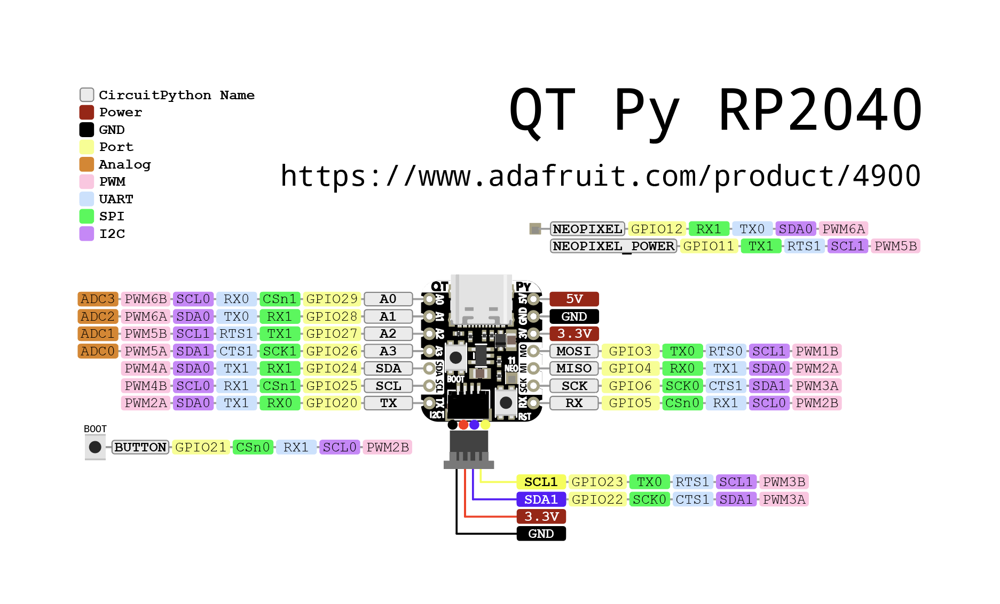

# Adafruit QT Py RP2040

## Details

- **Location**: Cabinet-1, Bin 32
- **Category**: Microcontroller Boards
- **Type**: RP2040 Development Board (QT Py Form Factor)
- **Microcontroller**: RP2040 (Dual ARM Cortex-M0+ @ 125MHz)
- **Brand**: Adafruit
- **Part Number**: 4900
- **Quantity**: 5
- **Product URL**: https://www.adafruit.com/product/4900

## Description

What a cutie pie! Or is it... a QT Py? This diminutive dev board comes with the RP2040 microcontroller and features the innovative chainable STEMMA QT connector for plug-and-play I2C device connections. It's really really small but packs all the power of the RP2040 in a tiny form factor compatible with Seeed Xiao boards.

## Specifications

- **Microcontroller**: RP2040 32-bit Cortex M0+ dual-core @ ~125 MHz
- **Logic/Power**: 3.3V
- **Memory**: 264 KB RAM, 8 MB SPI FLASH, No EEPROM
- **Crystal**: 12 MHz for perfect timing
- **GPIO Pins**: 13 total (11 breakout pads + 2 QT pads)
- **ADC**: Four 12-bit ADCs (one more than Pico)
- **Peripherals**: Two I2C ports, SPI, UART
- **PWM**: PWM outputs on every IO pin
- **USB**: USB Type C connector with native USB support
- **Regulator**: 3.3V with 600mA peak output
- **Special Features**: RGB NeoPixel LED, Boot/Reset buttons

## Dimensions

- **Board Size**: 21.8mm x 17.8mm x 5.8mm (0.9" x 0.7" x 0.2")
- **Weight**: 2.2g (0.1oz)
- **Form Factor**: QT Py / Seeed Xiao compatible

## Image


## Features

- Same size and form-factor as Seeed Xiao with castellated pads
- Plug-and-play STEMMA QT connector for chainable I2C devices
- Compatible with SparkFun Qwiic and Seeed Grove I2C boards
- Built-in RGB NeoPixel with controllable power pin
- Both Reset and Bootloader select buttons
- UF2 bootloader for easy programming
- 6 consecutive GPIO pins for maximum PIO compatibility
- Ultra-compact design perfect for space-constrained projects

## Pinout Diagram



## Basic Wiring Examples

### LED Blink Circuit

```
QT Py Pin A3 → LED Anode (long leg)
LED Cathode (short leg) → 220Ω Resistor → QT Py GND

Note: Built-in NeoPixel LED available on NEOPIXEL pin
```

### Button Input Circuit

```
QT Py 3V → 10kΩ Pull-up Resistor → QT Py Pin A0
QT Py Pin A0 → Button → QT Py GND

Code: digitalRead(A0) returns HIGH when not pressed, LOW when pressed
```

### I2C Device Connection (STEMMA QT)

```
Simply plug STEMMA QT cable between QT Py and I2C device
No wiring required! STEMMA QT provides:
- 3.3V Power
- Ground
- SDA (Pin SDA)
- SCL (Pin SCL)
```

### Manual I2C Connection

```
I2C Device     QT Py RP2040
----------     ------------
VCC       →    3V
GND       →    GND
SDA       →    SDA
SCL       →    SCL

Note: Built-in pull-up resistors included
```

### SPI Device Connection

```
SPI Device     QT Py RP2040
----------     ------------
VCC       →    3V
GND       →    GND
SCK       →    SCK (shared with SCL)
MOSI      →    MOSI (Pin TX)
MISO      →    MISO (Pin RX)
CS        →    Any GPIO pin (e.g., A1)
```

### Analog Sensor Reading

```
Sensor Output → QT Py Pin A0, A1, A2, or A3
Code: analogRead(A0) returns 0-65535 (0-3.3V)
```

## Programming Setup Guide

### CircuitPython Setup (Recommended)

1. Download CircuitPython UF2 from circuitpython.org
2. Hold BOOT button while connecting USB-C
3. Drag UF2 file to RPI-RP2 drive
4. Board reboots as CIRCUITPY drive
5. Edit code.py to program

### Arduino IDE Setup

1. Install Arduino IDE 2.0+
2. Add RP2040 board package URL in preferences
3. Install "Raspberry Pi Pico/RP2040" boards
4. Select "Adafruit QT Py RP2040" from Tools → Board
5. Hold BOOT while connecting for first upload

## Programming Examples

### CircuitPython NeoPixel Example

```python
import board
import neopixel
import time

# Initialize NeoPixel
pixel = neopixel.NeoPixel(board.NEOPIXEL, 1)

# Enable NeoPixel power
import digitalio
pixel_power = digitalio.DigitalInOut(board.NEOPIXEL_POWER)
pixel_power.direction = digitalio.Direction.OUTPUT
pixel_power.value = True

while True:
    pixel[0] = (255, 0, 0)  # Red
    time.sleep(1)
    pixel[0] = (0, 255, 0)  # Green
    time.sleep(1)
    pixel[0] = (0, 0, 255)  # Blue
    time.sleep(1)
```

### Arduino NeoPixel Example

```cpp
#include <Adafruit_NeoPixel.h>

#define NEOPIXEL_PIN PIN_NEOPIXEL
#define NEOPIXEL_POWER PIN_NEOPIXEL_POWER
#define NUM_PIXELS 1

Adafruit_NeoPixel pixels(NUM_PIXELS, NEOPIXEL_PIN, NEO_GRB + NEO_KHZ800);

void setup() {
  pinMode(NEOPIXEL_POWER, OUTPUT);
  digitalWrite(NEOPIXEL_POWER, HIGH);  // Enable NeoPixel power

  pixels.begin();
  pixels.setBrightness(50);
}

void loop() {
  pixels.setPixelColor(0, pixels.Color(255, 0, 0));  // Red
  pixels.show();
  delay(1000);

  pixels.setPixelColor(0, pixels.Color(0, 255, 0));  // Green
  pixels.show();
  delay(1000);

  pixels.setPixelColor(0, pixels.Color(0, 0, 255));  // Blue
  pixels.show();
  delay(1000);
}
```

### CircuitPython I2C Scanner

```python
import board
import busio

i2c = busio.I2C(board.SCL, board.SDA)

while not i2c.try_lock():
    pass

print("I2C addresses found:", [hex(device_address)
      for device_address in i2c.scan()])

i2c.unlock()
```

## STEMMA QT Ecosystem

The QT Py RP2040's STEMMA QT connector makes it incredibly easy to connect I2C sensors and devices:

### Compatible Devices

- All Adafruit STEMMA QT sensors
- SparkFun Qwiic devices
- Seeed Grove I2C devices (with adapter)
- Any I2C device with STEMMA QT connector

### Daisy Chaining

- Connect multiple I2C devices in a chain
- No breadboard or soldering required
- Automatic power and signal distribution
- Up to 127 devices on one I2C bus (address dependent)

## Important Notes

### Power Considerations

- **3.3V Logic**: All GPIO pins are 3.3V logic level
- **USB-C Power**: Can be powered via USB-C or 3V pin
- **Current Limit**: 600mA peak from onboard regulator
- **NeoPixel Power**: Controllable via NEOPIXEL_POWER pin

### Pin Limitations

- **Shared Pins**: SCK/SCL and some other pins are shared
- **ADC Pins**: A0, A1, A2, A3 can be used for analog input
- **PWM**: All GPIO pins support PWM output
- **Boot Pin**: Hold BOOT button for programming mode

## Tags

microcontroller, rp2040, qt-py, stemma-qt, usb-c, adafruit, circuitpython, neopixel, xiao-compatible

## Notes

Perfect for projects requiring minimal space with maximum connectivity. The STEMMA QT connector eliminates the need for soldering when connecting I2C sensors and displays. Supports CircuitPython, MicroPython, and C/C++ development. The Xiao-compatible form factor makes it suitable for existing Xiao-based designs.
