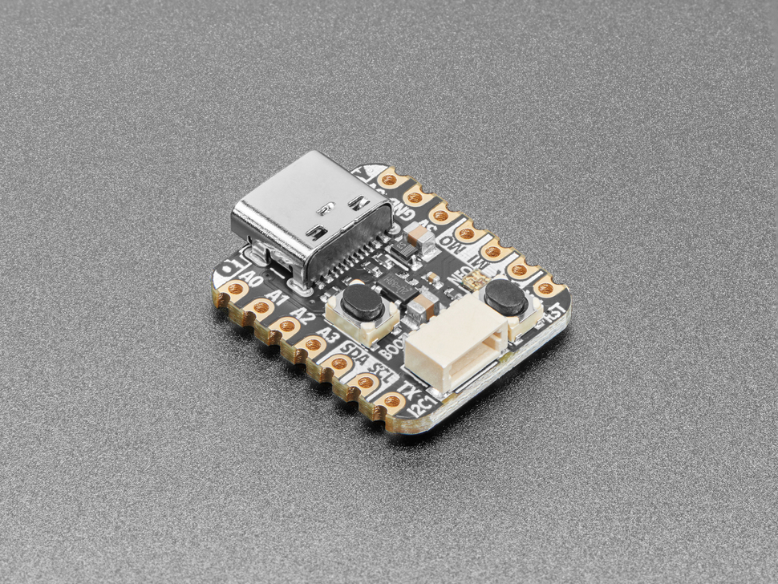

# Adafruit QT Py RP2040

## Details

- **Location**: Cabinet-1, Bin 32
- **Category**: Microcontroller Boards
- **Type**: RP2040 Development Board (QT Py Form Factor)
- **Microcontroller**: RP2040 (Dual ARM Cortex-M0+ @ 125MHz)
- **Brand**: Adafruit
- **Part Number**: 4900
- **Quantity**: 5
- **Product URL**: https://www.adafruit.com/product/4900

## Description

What a cutie pie! Or is it... a QT Py? This diminutive dev board comes with the RP2040 microcontroller and features the innovative chainable STEMMA QT connector for plug-and-play I2C device connections. It's really really small but packs all the power of the RP2040 in a tiny form factor compatible with Seeed Xiao boards.

## Specifications

- **Microcontroller**: RP2040 32-bit Cortex M0+ dual-core @ ~125 MHz
- **Logic/Power**: 3.3V
- **Memory**: 264 KB RAM, 8 MB SPI FLASH, No EEPROM
- **Crystal**: 12 MHz for perfect timing
- **GPIO Pins**: 13 total (11 breakout pads + 2 QT pads)
- **ADC**: Four 12-bit ADCs (one more than Pico)
- **Peripherals**: Two I2C ports, SPI, UART
- **PWM**: PWM outputs on every IO pin
- **USB**: USB Type C connector with native USB support
- **Regulator**: 3.3V with 600mA peak output
- **Special Features**: RGB NeoPixel LED, Boot/Reset buttons

## Dimensions

- **Board Size**: 21.8mm x 17.8mm x 5.8mm (0.9" x 0.7" x 0.2")
- **Weight**: 2.2g (0.1oz)
- **Form Factor**: QT Py / Seeed Xiao compatible

## Image

## Features

- Same size and form-factor as Seeed Xiao with castellated pads
- Plug-and-play STEMMA QT connector for chainable I2C devices
- Compatible with SparkFun Qwiic and Seeed Grove I2C boards
- Built-in RGB NeoPixel with controllable power pin
- Both Reset and Bootloader select buttons
- UF2 bootloader for easy programming
- 6 consecutive GPIO pins for maximum PIO compatibility
- Ultra-compact design perfect for space-constrained projects

## Tags

microcontroller, rp2040, qt-py, stemma-qt, usb-c, adafruit, circuitpython, neopixel, xiao-compatible

## Notes

Perfect for projects requiring minimal space with maximum connectivity. The STEMMA QT connector eliminates the need for soldering when connecting I2C sensors and displays. Supports CircuitPython, MicroPython, and C/C++ development. The Xiao-compatible form factor makes it suitable for existing Xiao-based designs.
