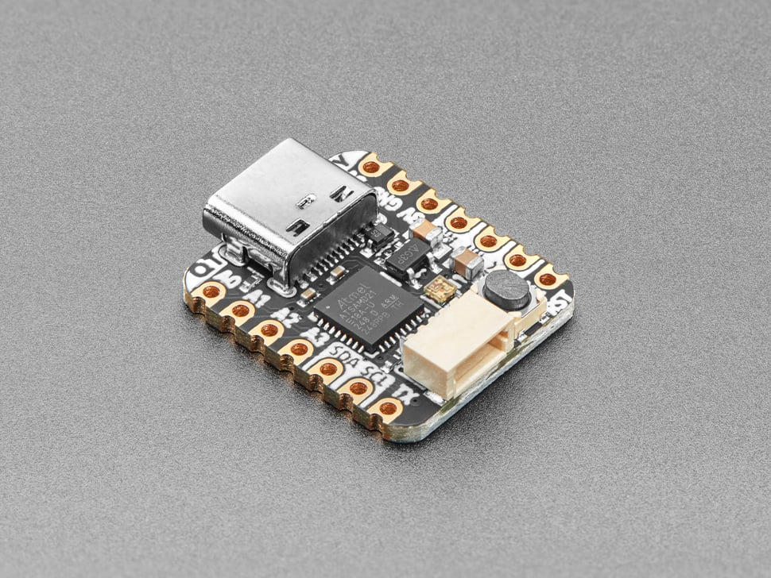

# Adafruit QT Py - SAMD21 Dev Board with STEMMA QT

## Details

- **Location**: Cabinet-1, Bin 26
- **Category**: Microcontroller Boards
- **Type**: ARM Development Board with STEMMA QT
- **Microcontroller**: ATSAMD21E18
- **Brand**: Adafruit
- **Part Number**: 4600
- **Quantity**: 5
- **Product URL**: https://www.adafruit.com/product/4600

## Description

What a cutie pie! Or is it... a QT Py? This diminutive dev board comes with the SAMD21 (as made famous in GEMMA M0 and Trinket M0 boards) and features the innovative chainable STEMMA QT connector for plug-and-play I2C sensor connectivity. Compatible with Seeed Xiao form factor with castellated pads.

## Specifications

- **Part Number**: 4600
- **Microcontroller**: ATSAMD21E18 ARM Cortex-M0+
- **Architecture**: 32-bit ARM Cortex-M0+
- **Clock Speed**: 48MHz
- **Operating Voltage**: 3.3V
- **Flash Memory**: 256KB
- **RAM**: 32KB
- **Dimensions**: 22.0mm x 17.9mm x 5.9mm
- **Weight**: 2.3g

## Image

## Features

- **ARM Cortex-M0+**: Powerful 32-bit processor at 48MHz
- **Native USB**: Built-in USB support - can act as keyboard/mouse, MIDI device, disk drive
- **STEMMA QT Connector**: Plug-and-play I2C sensor connectivity
- **USB-C Connector**: Modern connector for programming and power
- **RGB NeoPixel**: Built-in addressable LED with power control
- **Xiao Compatible**: Same pinout and form factor as Seeed Xiao
- **Castellated Pads**: Can be soldered directly to PCB
- **Reset Button**: Easy programming and debugging
- **Optional SPI Flash**: Footprint for SOIC-8 SPI Flash chip

## Pin Configuration

- **Digital I/O**: 11 GPIO pins
- **Analog Inputs**: 9 pins (12-bit ADC, SDA/SCL do not have analog inputs)
- **Analog Output**: 1 pin (true analog output, 10-bit quality audio)
- **PWM**: 9 pins (A0 is analog out, A1 is not PWM capable)
- **I2C**: Hardware I2C port with STEMMA QT connector
- **SPI**: Hardware SPI
- **UART**: Hardware UART
- **I2S**: Hardware I2S
- **Capacitive Touch**: 6 pins with no additional components

## Power Specifications

- **Operating Voltage**: 3.3V
- **Input Voltage**: 5V (USB-C) or 3.3V (VCC pin)
- **Regulator**: 3.3V with 600mA peak output
- **Current Consumption**: 
  - Active: ~25mA (typical operation)
  - Sleep: Low power modes available
- **Battery Support**: Can be powered from external battery

## Applications

- STEMMA QT sensor networks
- USB HID devices (keyboard, mouse, MIDI)
- Wearable electronics projects
- Arduino projects requiring small form factor
- CircuitPython learning projects
- Portable data loggers
- Interactive art installations
- Educational microcontroller projects

## Programming

- **Arduino IDE**: Full support with SAMD board package
- **CircuitPython**: Native support with USB drive functionality
- **USB Programming**: No external programmer needed
- **Libraries**: Extensive Arduino and CircuitPython libraries
- **Audio**: Can play 10-bit quality audio clips in Arduino

## STEMMA QT Ecosystem

- **Plug-and-Play**: No soldering required for I2C sensors
- **Chainable**: Multiple sensors can be daisy-chained
- **Compatible**: Works with SparkFun Qwiic and Seeed Grove I2C
- **Extensive**: Large ecosystem of compatible sensors and displays

## Advantages

- **Native USB**: Advanced USB functionality built-in
- **Compact Size**: Tiny form factor for space-constrained projects
- **Easy Connectivity**: STEMMA QT eliminates wiring complexity
- **Dual Programming**: Arduino IDE and CircuitPython support
- **Rich I/O**: True analog output and extensive GPIO options
- **Educational**: Perfect for learning ARM microcontrollers

## Hardware Features

- **RGB NeoPixel**: Built-in with controllable power pin for ultra-low power
- **Reset Button**: Convenient for restarting programs or entering bootloader
- **USB-C**: Modern connector, more durable than micro USB
- **Castellated Pads**: Professional PCB mounting capability
- **Optional Flash**: Footprint for additional SPI flash storage

## Comparison with Other Boards

- **vs Arduino Uno**: 32-bit ARM vs 8-bit AVR, native USB, smaller size
- **vs ESP32 variants**: No wireless but native USB, simpler for beginners
- **vs XIAO SAMD21**: Similar specs but different manufacturer and STEMMA QT

## Notes

- Perfect introduction to ARM Cortex-M0+ microcontrollers
- Native USB support enables advanced interfacing capabilities
- STEMMA QT connector makes sensor integration effortless
- Compatible with Xiao ecosystem accessories
- Excellent for educational projects and learning
- CircuitPython support makes it beginner-friendly
- Can be expanded with optional SPI flash for more storage

## Tags

microcontroller, arm, cortex-m0+, samd21, qt-py, stemma-qt, usb-c, adafruit, arduino, circuitpython
