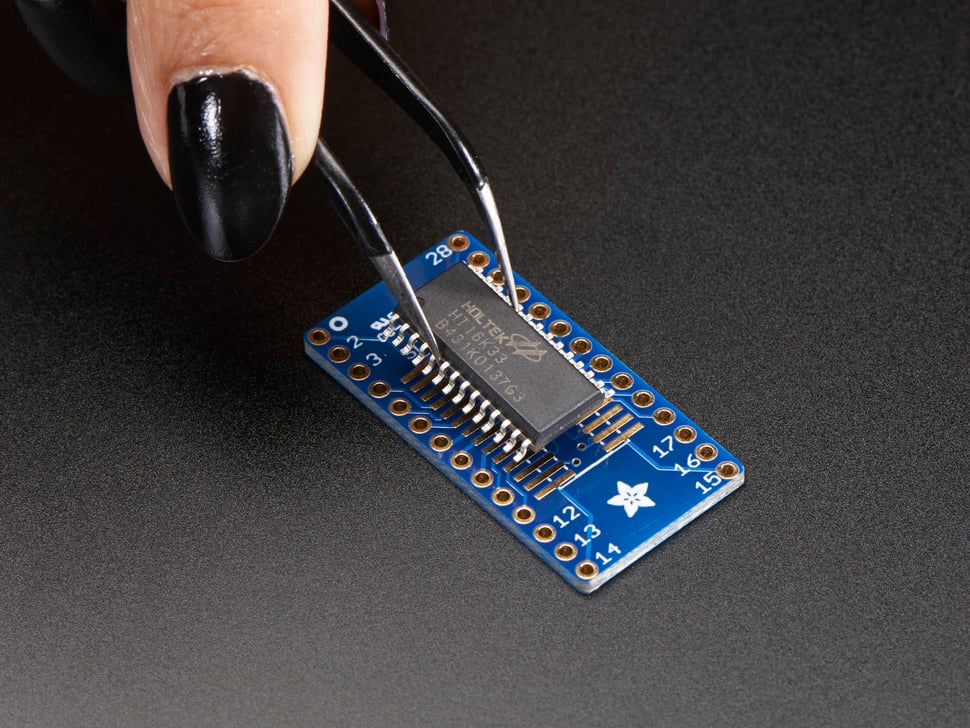
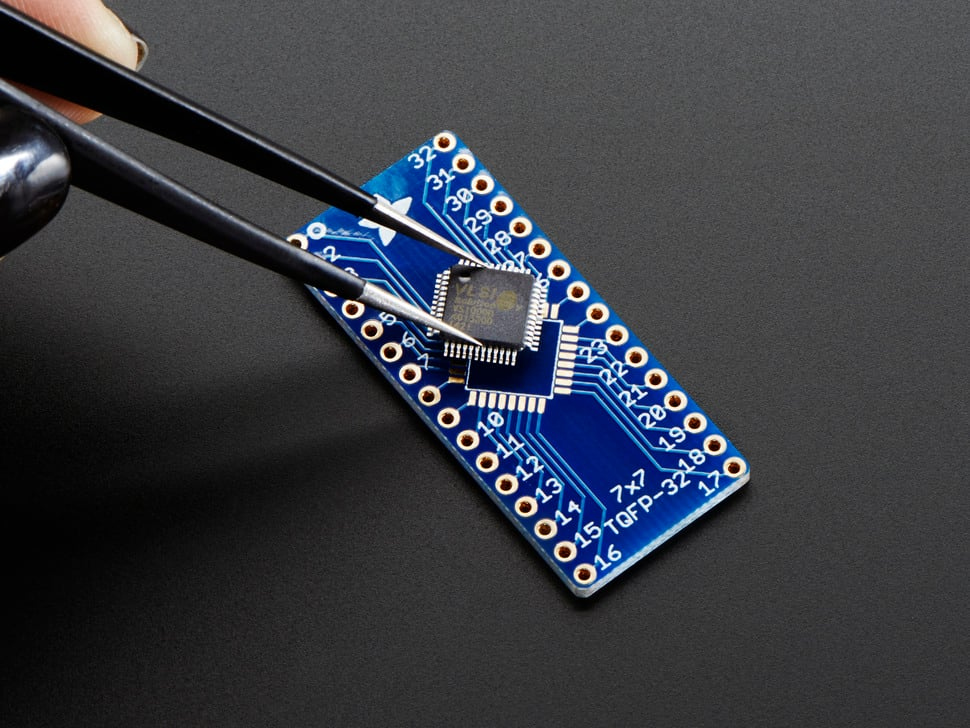
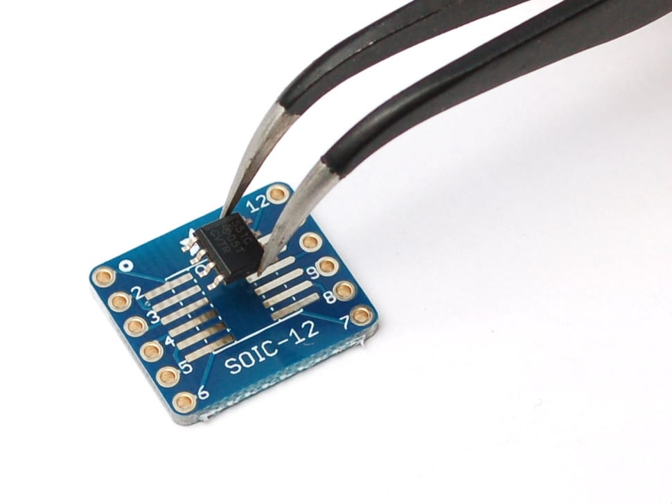

# Adafruit SMT Breakout Board Collection

## Details

- **Location**: Cabinet-5, Bin 16
- **Category**: Prototyping & Development
- **Brand**: Adafruit Industries
- **Part Numbers**: Various (1208, 1163, 1211, and others)
- **Model**: SMT Breakout PCB Collection
- **Package**: PCB Breakout Boards
- **Quantity**: Various types and quantities
- **Status**: Available
- **Price Range**: $4.95-$5.95 per pack
- **GitHub**: https://github.com/adafruit/Adafruit-SMT-Breakout-PCBs

## Description

This collection of Adafruit SMT breakout boards provides essential tools for prototyping with surface-mount components. These breakout boards convert tiny SMT packages into breadboard-friendly 0.1" spaced pins, making it possible to use modern SMT-only chips in traditional prototyping setups. The collection includes various package types commonly found in modern electronics, from small SOIC packages to larger QFN and TQFP chips.

## Breakout Board Types

### SOIC/TSSOP Breakout Boards

**SOIC-28/TSSOP-28 (Product ID: 1208)**
- **Package**: 3-pack for $4.95
- **Supports**: 28-pin SOIC (narrow, medium, wide) and TSSOP packages
- **Pin Spacing**: 0.6" between rows
- **Applications**: Microcontrollers, memory chips, interface ICs

**SOIC-12/TSSOP-12 (Product ID: 1211)**
- **Package**: 6-pack for $4.95
- **Supports**: 12-pin SOIC (narrow, medium, wide) and TSSOP packages
- **Pin Spacing**: 0.6" between rows
- **Applications**: Op-amps, voltage regulators, small logic ICs

### QFN/TQFP Breakout Boards

**32-QFN/32-TQFP (Product ID: 1163)**
- **Package**: 3-pack for $5.95
- **Supports**: 7mm square QFP or 5mm square QFN chips
- **Pin Spacing**: 0.6" between rows
- **Applications**: Microcontrollers, wireless modules, sensor ICs

## Images

## Applications

Common use cases for SMT breakout boards:

- **Prototyping**: Convert SMT-only chips for breadboard use
- **Development**: Test new chips before PCB design
- **Education**: Learn SMT soldering techniques safely
- **Repair**: Replace SMT components in existing circuits
- **Hobby Projects**: Access modern chip features in DIY projects
- **Product Development**: Evaluate chips during design phase
- **Legacy Support**: Use modern chips in older designs
- **Research**: Experiment with cutting-edge components
- **Small Production**: Low-volume production without custom PCBs

## Package Support

### SOIC (Small Outline Integrated Circuit)
- **Pin Count**: 8, 12, 14, 16, 20, 28 pins
- **Widths**: Narrow (150 mil), Medium (200 mil), Wide (300 mil)
- **Pitch**: 1.27mm (50 mil) between pins
- **Applications**: General purpose ICs, memory, microcontrollers

### TSSOP (Thin Shrink Small Outline Package)
- **Pin Count**: 8, 12, 14, 16, 20, 28 pins
- **Width**: 4.4mm standard width
- **Pitch**: 0.65mm (25.6 mil) between pins
- **Applications**: High pin density, modern ICs

### QFN (Quad Flat No-leads)
- **Pin Count**: 16, 20, 24, 28, 32, 44, 48 pins
- **Size**: 3x3mm to 10x10mm square packages
- **Pitch**: 0.4mm to 0.8mm between pins
- **Applications**: Modern microcontrollers, RF chips, sensors

### TQFP (Thin Quad Flat Package)
- **Pin Count**: 32, 44, 48, 64, 100 pins
- **Size**: 7x7mm to 14x14mm square packages
- **Pitch**: 0.4mm to 0.8mm between pins
- **Applications**: Microcontrollers, processors, complex ICs

## Technical Specifications

### PCB Characteristics
- **Thickness**: Standard 1.6mm PCB thickness
- **Material**: FR4 fiberglass
- **Finish**: HASL (Hot Air Solder Leveling)
- **Color**: Adafruit blue solder mask
- **Silkscreen**: White component outlines and pin numbers

### Electrical Characteristics
- **Pin Spacing**: 0.1" (2.54mm) standard breadboard spacing
- **Row Spacing**: 0.6" (15.24mm) between pin rows
- **Trace Width**: Appropriate for signal integrity
- **Via Size**: Standard manufacturing specifications

## Soldering Guidelines

### Tools Required
- **Soldering Iron**: Fine tip, temperature controlled (300-350°C)
- **Solder**: 0.6mm to 0.8mm diameter, 60/40 or 63/37 alloy
- **Flux**: Rosin-based flux for clean joints
- **Tweezers**: Fine-point tweezers for component placement
- **Magnification**: Magnifying glass or microscope for inspection

### Soldering Process
1. **Preparation**: Clean PCB and component pins
2. **Flux Application**: Apply flux to pads and component pins
3. **Component Placement**: Align component carefully with pads
4. **Tack Soldering**: Solder one corner pin to secure component
5. **Complete Soldering**: Solder remaining pins systematically
6. **Inspection**: Check for bridges, cold joints, and alignment
7. **Cleanup**: Remove excess flux with isopropyl alcohol

### Common Issues
- **Solder Bridges**: Use flux and solder wick to remove
- **Cold Joints**: Reheat with proper temperature and time
- **Component Misalignment**: Reheat tack joint and realign
- **Lifted Pads**: Use gentle heat and minimal mechanical stress

## Design Considerations

### PCB Layout
- **Pin Numbering**: Follows standard IC pin numbering conventions
- **Orientation**: Clear pin 1 indicators on both sides
- **Spacing**: 0.6" row spacing fits standard breadboards
- **Mounting**: Through-hole pins for secure breadboard connection

### Component Selection
- **Package Matching**: Verify exact package dimensions before ordering
- **Pin Count**: Ensure breakout board matches IC pin count
- **Thermal Considerations**: Consider heat dissipation for power devices
- **Signal Integrity**: Short traces minimize signal degradation

## Usage Tips

### Best Practices
- **Read Datasheets**: Verify package dimensions and pin assignments
- **Practice First**: Try soldering on practice boards before valuable ICs
- **Use Flux**: Liberal flux application improves solder flow
- **Take Breaks**: Avoid fatigue during precision soldering work
- **Document Work**: Keep notes on successful techniques and settings

### Troubleshooting
- **No Connection**: Check for cold joints or insufficient solder
- **Intermittent Connection**: Look for cracked solder joints
- **Wrong Pin Assignment**: Verify IC orientation and pin numbering
- **Electrical Issues**: Test continuity with multimeter

## Storage and Organization

### Inventory Management
- **Separate by Type**: Organize by package type and pin count
- **Label Clearly**: Mark used vs. unused breakout boards
- **Protect from Damage**: Store in anti-static bags or containers
- **Track Usage**: Monitor inventory levels for reordering

### Workspace Setup
- **Good Lighting**: Bright, even lighting for precision work
- **Stable Surface**: Vibration-free work surface
- **Organization**: Keep tools and materials within easy reach
- **Ventilation**: Adequate ventilation for flux fumes

## Tags

adafruit, smt, breakout, soic, tssop, qfn, tqfp, prototyping, breadboard #cabinet-5 #bin-16 #status-available

## Notes

This collection of Adafruit SMT breakout boards is essential for modern electronics prototyping. As more chips become available only in SMT packages, these breakout boards bridge the gap between surface-mount technology and traditional breadboard prototyping. The variety of package types ensures compatibility with most common SMT chips, while the quality Adafruit construction provides reliable connections. The 0.1" pin spacing makes these boards compatible with standard breadboards and perfboards, enabling rapid prototyping and development work.
