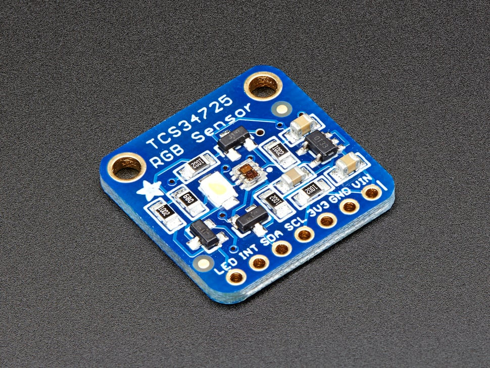

# Adafruit TCS34725 RGB Color Sensor

High-quality RGB color light sensor with integrated IR blocking filter and white LED illumination for accurate color measurements.



_Adafruit TCS34725 RGB Color Sensor - High-quality color detection with IR filter_

## Overview

The TCS34725 is considered one of the best color sensors on the market, featuring RGB and Clear light sensing elements with an integrated IR blocking filter. This sensor provides much more accurate color readings than typical sensors because it filters out infrared light that humans cannot see.

## Key Features

### Advanced Color Sensing

- **RGB + Clear Channels**: Four-channel color detection
- **IR Blocking Filter**: Integrated on-chip filter for accurate color measurement
- **True Color Detection**: Minimizes IR spectral component for human-like color perception
- **High Dynamic Range**: 3,800,000:1 dynamic range
- **Adjustable Parameters**: Configurable integration time and gain

### Sensor Specifications

- **Light Sensing Elements**: RGB and Clear photodiodes
- **IR Filter**: Localized to color sensing photodiodes
- **Dynamic Range**: 3,800,000:1
- **Darkened Glass Compatible**: Suitable for use behind tinted surfaces
- **Temperature Compensation**: Stable readings across temperature range

## Technical Specifications

### Electrical Characteristics

- **Supply Voltage**: 3.3V (regulated on-board from 3-5VDC input)
- **Logic Levels**: 3.3V or 5V compatible (level shifted)
- **Interface**: I2C communication
- **I2C Address**: 0x29 (7-bit)
- **Current Consumption**: Low power operation

### Physical Specifications

- **Dimensions**: 20.44mm × 20.28mm (0.8" × 0.79")
- **Weight**: 3.23g
- **Mounting**: Standard breadboard compatible
- **Header Pins**: 0.1" spacing for easy connection

## On-Board Features

### Power Management

- **3.3V Regulator**: On-board voltage regulation
- **Wide Input Range**: Accepts 3-5VDC safely
- **Level Shifting**: I2C pins compatible with 3.3V or 5V logic
- **Power Indicator**: LED shows power status

### Illumination System

- **White LED**: 4150°K neutral temperature LED
- **MOSFET Driver**: On-board LED driver circuit
- **Logic Control**: LED can be controlled by any logic level output
- **Consistent Lighting**: Provides uniform illumination for measurements

## Communication and Interface

### I2C Protocol

- **Standard I2C**: Two-wire communication interface
- **7-bit Address**: 0x29 (fixed address)
- **Clock Speed**: Standard and fast I2C speeds supported
- **Pull-up Resistors**: May require external pull-ups depending on setup

### Pin Configuration

**Breakout Board Pinout:**

| Pin | Signal | Description                 |
| --- | ------ | --------------------------- |
| VIN | VDD    | Power supply (3-5VDC)       |
| GND | GND    | Ground connection           |
| SCL | SCL    | I2C Clock line              |
| SDA | SDA    | I2C Data line               |
| LED | LED    | LED control pin (optional)  |
| INT | INT    | Interrupt output (optional) |

## Wiring Diagrams

### Arduino Uno Connection

```
TCS34725    Arduino Uno
--------    -----------
VIN    →    5V or 3.3V
GND    →    GND
SCL    →    A5 (SCL)
SDA    →    A4 (SDA)
LED    →    Pin 7 (optional)
INT    →    Pin 2 (optional)

Required: 4.7kΩ pull-up resistors on SDA and SCL lines
```

### Raspberry Pi Pico Connection

```
TCS34725    Pico
--------    ----
VIN    →    3V3
GND    →    GND
SCL    →    GP5 (I2C0 SCL)
SDA    →    GP4 (I2C0 SDA)
LED    →    GP15 (optional)
INT    →    GP2 (optional)

Required: 4.7kΩ pull-up resistors on SDA and SCL lines
```

### ESP32 Connection

```
TCS34725    ESP32
--------    -----
VIN    →    3.3V
GND    →    GND
SCL    →    GPIO22 (SCL)
SDA    →    GPIO21 (SDA)
LED    →    GPIO5 (optional)
INT    →    GPIO4 (optional)

Required: 4.7kΩ pull-up resistors on SDA and SCL lines
```

**Connection Notes:**

- **VIN**: Connect to 3.3V or 5V power supply
- **GND**: Connect to ground
- **SCL/SDA**: I2C bus connections (may need pull-up resistors)
- **LED**: Connect to digital output to control white LED
- **INT**: Interrupt pin for threshold-based alerts (optional)
- **I2C Address**: 0x29 (fixed, not configurable)

## Software Support

### Arduino Integration

- **Adafruit Library**: Comprehensive Arduino library available
- **Example Code**: Ready-to-use sketches provided
- **Easy Installation**: Library manager compatible
- **Documentation**: Detailed tutorial and API reference

### Raspberry Pi Support

- **Python Libraries**: CircuitPython and Python support
- **I2C Interface**: Uses standard I2C bus
- **GPIO Control**: LED control via GPIO pins
- **Cross-platform**: Works with various single-board computers

## Measurement Capabilities

### Color Detection

- **RGB Values**: Individual red, green, blue channel readings
- **Clear Channel**: Ambient light level measurement
- **Color Temperature**: Estimated color temperature calculation
- **Lux Calculation**: Light intensity in lux units
- **Color Matching**: Compare colors against reference values

### Advanced Features

- **Adjustable Gain**: Multiple gain settings for different light levels
- **Integration Time**: Configurable measurement duration
- **Interrupt Support**: Threshold-based interrupts available
- **Calibration**: Software calibration for improved accuracy

## Applications

### Color Matching

- **Paint Matching**: Compare paint colors
- **Fabric Sorting**: Sort textiles by color
- **Quality Control**: Verify product colors in manufacturing
- **Art Projects**: Interactive color-responsive installations

### Light Measurement

- **Ambient Light Sensing**: Monitor environmental lighting
- **Display Brightness**: Automatic screen brightness adjustment
- **Photography**: Color temperature measurement for lighting
- **Horticulture**: Monitor grow light spectrum

### Interactive Projects

- **Color-Responsive Devices**: Change behavior based on detected colors
- **Sorting Machines**: Automated color-based sorting
- **Educational Tools**: Teach color theory and light physics
- **Accessibility**: Color identification for visually impaired users

## Usage Examples

### Arduino Code Example

```cpp
#include <Wire.h>
#include "Adafruit_TCS34725.h"

// Initialize sensor with integration time and gain
Adafruit_TCS34725 tcs = Adafruit_TCS34725(TCS34725_INTEGRATIONTIME_50MS, TCS34725_GAIN_4X);

void setup() {
  Serial.begin(9600);

  if (tcs.begin()) {
    Serial.println("Found TCS34725 sensor");
  } else {
    Serial.println("No TCS34725 found ... check your connections");
    while (1);
  }
}

void loop() {
  uint16_t r, g, b, c;

  // Read raw color values
  tcs.getRawData(&r, &g, &b, &c);

  // Calculate color temperature
  uint16_t colorTemp = tcs.calculateColorTemperature(r, g, b);

  // Calculate lux
  uint16_t lux = tcs.calculateLux(r, g, b);

  Serial.print("Color Temp: "); Serial.print(colorTemp, DEC); Serial.print(" K - ");
  Serial.print("Lux: "); Serial.print(lux, DEC); Serial.print(" - ");
  Serial.print("R: "); Serial.print(r, DEC); Serial.print(" ");
  Serial.print("G: "); Serial.print(g, DEC); Serial.print(" ");
  Serial.print("B: "); Serial.print(b, DEC); Serial.print(" ");
  Serial.print("C: "); Serial.print(c, DEC); Serial.print(" ");
  Serial.println(" ");

  delay(500);
}
```

### CircuitPython Code Example

```python
import time
import board
import busio
import adafruit_tcs34725

# Initialize I2C bus and sensor
i2c = busio.I2C(board.SCL, board.SDA)
sensor = adafruit_tcs34725.TCS34725(i2c)

# Optional: Enable LED
# led_pin = digitalio.DigitalInOut(board.D7)
# led_pin.direction = digitalio.Direction.OUTPUT
# led_pin.value = True

while True:
    # Read color values
    r, g, b, clear = sensor.color_raw

    # Calculate color temperature and lux
    color_temp = adafruit_tcs34725.color_temperature(r, g, b)
    lux = adafruit_tcs34725.lux(r, g, b, clear)

    print(f"Color: R={r} G={g} B={b} Clear={clear}")
    print(f"Color Temperature: {color_temp}K")
    print(f"Lux: {lux}")
    print("---")

    time.sleep(1)
```

### Basic Color Reading

```python
# Pseudocode for basic color reading
sensor = TCS34725()
r, g, b, clear = sensor.read_color()
color_temp = sensor.calculate_color_temperature(r, g, b)
lux = sensor.calculate_lux(r, g, b, clear)
```

### Color Matching Application

- Read reference color values
- Compare new measurements against references
- Determine closest color match
- Trigger actions based on color detection

## Installation and Setup

### Hardware Connection

1. **Power**: Connect VDD to 3-5V, GND to ground
2. **I2C**: Connect SCL to I2C clock, SDA to I2C data
3. **LED Control**: Optionally connect LED pin to digital output
4. **Pull-ups**: Add I2C pull-up resistors if needed

### Software Setup

1. **Install Library**: Use Arduino Library Manager or pip install
2. **Load Example**: Start with provided example sketches
3. **Calibration**: Perform initial calibration if needed
4. **Integration**: Integrate into your project code

## Performance Characteristics

### Accuracy

- **High Precision**: Professional-grade color measurement
- **Repeatability**: Consistent readings under same conditions
- **Temperature Stability**: Minimal drift with temperature changes
- **Long-term Stability**: Reliable operation over extended periods

### Speed

- **Fast Response**: Quick color measurement updates
- **Configurable Speed**: Trade-off between speed and accuracy
- **Real-time**: Suitable for real-time color monitoring
- **Batch Processing**: Can handle multiple rapid measurements

## Limitations and Considerations

### Environmental Factors

- **Ambient Light**: Strong ambient light may affect readings
- **Surface Properties**: Reflective vs. matte surfaces give different results
- **Distance**: Sensor distance from target affects readings
- **Angle**: Measurement angle can influence color detection

### Calibration Requirements

- **White Balance**: May need white reference calibration
- **Color Standards**: Compare against known color references
- **Environmental Compensation**: Account for ambient lighting conditions
- **Regular Recalibration**: Periodic calibration for best accuracy

## Storage Information

- **Location**: Cabinet 3, Bin 27
- **Quantity**: 6 units
- **Condition**: New, unused breakout boards
- **Packaging**: Anti-static packaging
- **Documentation**: Includes links to online tutorials and datasheets
