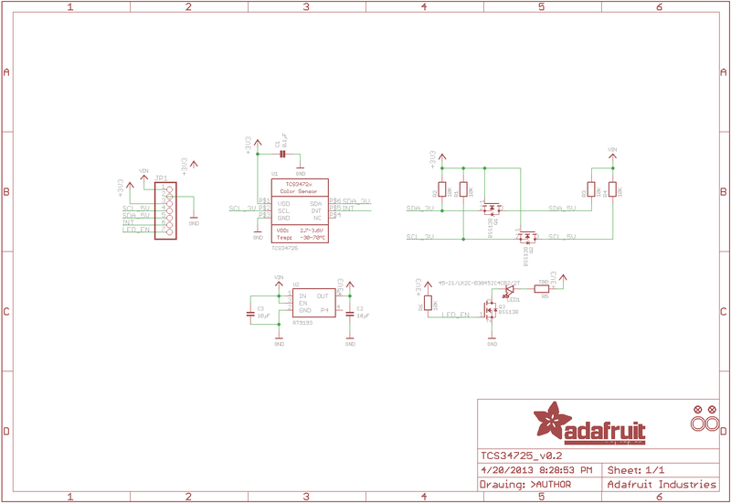
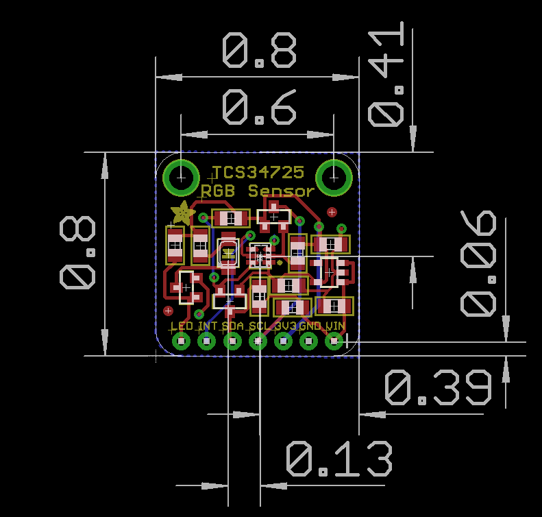

# Adafruit TCS34725 RGB Color Sensor

High-quality RGB color light sensor with integrated IR blocking filter and white LED illumination for accurate color measurements.


_Adafruit TCS34725 RGB Color Sensor - High-quality color detection with IR filter_

## Overview

The TCS34725 is considered one of the best color sensors on the market, featuring RGB and Clear light sensing elements with an integrated IR blocking filter. This sensor provides much more accurate color readings than typical sensors because it filters out infrared light that humans cannot see.

## Key Features

### Advanced Color Sensing

- **RGB + Clear Channels**: Four-channel color detection
- **IR Blocking Filter**: Integrated on-chip filter for accurate color measurement
- **True Color Detection**: Minimizes IR spectral component for human-like color perception
- **High Dynamic Range**: 3,800,000:1 dynamic range
- **Adjustable Parameters**: Configurable integration time and gain

### Sensor Specifications

- **Light Sensing Elements**: RGB and Clear photodiodes
- **IR Filter**: Localized to color sensing photodiodes
- **Dynamic Range**: 3,800,000:1
- **Darkened Glass Compatible**: Suitable for use behind tinted surfaces
- **Temperature Compensation**: Stable readings across temperature range

## Technical Specifications

### Electrical Characteristics

- **Supply Voltage**: 3.3V (regulated on-board from 3-5VDC input)
- **Logic Levels**: 3.3V or 5V compatible (level shifted)
- **Interface**: I2C communication
- **I2C Address**: 0x29 (7-bit)
- **Current Consumption**: Low power operation

### Physical Specifications

- **Dimensions**: 20.44mm × 20.28mm (0.8" × 0.79")
- **Weight**: 3.23g
- **Mounting**: Standard breadboard compatible
- **Header Pins**: 0.1" spacing for easy connection

## On-Board Features

### Power Management

- **3.3V Regulator**: On-board voltage regulation
- **Wide Input Range**: Accepts 3-5VDC safely
- **Level Shifting**: I2C pins compatible with 3.3V or 5V logic
- **Power Indicator**: LED shows power status

### Illumination System

- **White LED**: 4150°K neutral temperature LED
- **MOSFET Driver**: On-board LED driver circuit
- **Logic Control**: LED can be controlled by any logic level output
- **Consistent Lighting**: Provides uniform illumination for measurements

## Communication and Interface

### I2C Protocol

- **Standard I2C**: Two-wire communication interface
- **7-bit Address**: 0x29 (fixed address)
- **Clock Speed**: Standard and fast I2C speeds supported
- **Pull-up Resistors**: May require external pull-ups depending on setup

### Pin Configuration

**Breakout Board Pinout:**

| Pin | Signal | Description                 |
| --- | ------ | --------------------------- |
| VIN | VDD    | Power supply (3-5VDC)       |
| GND | GND    | Ground connection           |
| SCL | SCL    | I2C Clock line              |
| SDA | SDA    | I2C Data line               |
| LED | LED    | LED control pin (optional)  |
| INT | INT    | Interrupt output (optional) |

## Wiring Diagrams

### Arduino Uno Connection

```
TCS34725    Arduino Uno
--------    -----------
VIN    →    5V or 3.3V
GND    →    GND
SCL    →    A5 (SCL)
SDA    →    A4 (SDA)
LED    →    Pin 7 (optional)
INT    →    Pin 2 (optional)

Required: 4.7kΩ pull-up resistors on SDA and SCL lines
```

### Raspberry Pi Pico Connection

```
TCS34725    Pico
--------    ----
VIN    →    3V3
GND    →    GND
SCL    →    GP5 (I2C0 SCL)
SDA    →    GP4 (I2C0 SDA)
LED    →    GP15 (optional)
INT    →    GP2 (optional)

Required: 4.7kΩ pull-up resistors on SDA and SCL lines
```

### ESP32 Connection

```
TCS34725    ESP32
--------    -----
VIN    →    3.3V
GND    →    GND
SCL    →    GPIO22 (SCL)
SDA    →    GPIO21 (SDA)
LED    →    GPIO5 (optional)
INT    →    GPIO4 (optional)

Required: 4.7kΩ pull-up resistors on SDA and SCL lines
```

**Connection Notes:**

- **VIN**: Connect to 3.3V or 5V power supply
- **GND**: Connect to ground
- **SCL/SDA**: I2C bus connections (may need pull-up resistors)
- **LED**: Connect to digital output to control white LED
- **INT**: Interrupt pin for threshold-based alerts (optional)
- **I2C Address**: 0x29 (fixed, not configurable)

## Software Support

### Arduino Integration

- **Adafruit Library**: Comprehensive Arduino library available
- **Example Code**: Ready-to-use sketches provided
- **Easy Installation**: Library manager compatible
- **Documentation**: Detailed tutorial and API reference

### Raspberry Pi Support

- **Python Libraries**: CircuitPython and Python support
- **I2C Interface**: Uses standard I2C bus
- **GPIO Control**: LED control via GPIO pins
- **Cross-platform**: Works with various single-board computers

## Measurement Capabilities

### Color Detection

- **RGB Values**: Individual red, green, blue channel readings
- **Clear Channel**: Ambient light level measurement
- **Color Temperature**: Estimated color temperature calculation
- **Lux Calculation**: Light intensity in lux units
- **Color Matching**: Compare colors against reference values

### Advanced Features

- **Adjustable Gain**: Multiple gain settings for different light levels
- **Integration Time**: Configurable measurement duration
- **Interrupt Support**: Threshold-based interrupts available
- **Calibration**: Software calibration for improved accuracy

## Applications

### Color Matching

- **Paint Matching**: Compare paint colors
- **Fabric Sorting**: Sort textiles by color
- **Quality Control**: Verify product colors in manufacturing
- **Art Projects**: Interactive color-responsive installations

### Light Measurement

- **Ambient Light Sensing**: Monitor environmental lighting
- **Display Brightness**: Automatic screen brightness adjustment
- **Photography**: Color temperature measurement for lighting
- **Horticulture**: Monitor grow light spectrum

### Interactive Projects

- **Color-Responsive Devices**: Change behavior based on detected colors
- **Sorting Machines**: Automated color-based sorting
- **Educational Tools**: Teach color theory and light physics
- **Accessibility**: Color identification for visually impaired users

## Usage Examples

### Arduino Code Example

```cpp
#include <Wire.h>
#include "Adafruit_TCS34725.h"

// Initialize sensor with integration time and gain
Adafruit_TCS34725 tcs = Adafruit_TCS34725(TCS34725_INTEGRATIONTIME_50MS, TCS34725_GAIN_4X);

void setup() {
  Serial.begin(9600);

  if (tcs.begin()) {
    Serial.println("Found TCS34725 sensor");
  } else {
    Serial.println("No TCS34725 found ... check your connections");
    while (1);
  }
}

void loop() {
  uint16_t r, g, b, c;

  // Read raw color values
  tcs.getRawData(&r, &g, &b, &c);

  // Calculate color temperature
  uint16_t colorTemp = tcs.calculateColorTemperature(r, g, b);

  // Calculate lux
  uint16_t lux = tcs.calculateLux(r, g, b);

  Serial.print("Color Temp: "); Serial.print(colorTemp, DEC); Serial.print(" K - ");
  Serial.print("Lux: "); Serial.print(lux, DEC); Serial.print(" - ");
  Serial.print("R: "); Serial.print(r, DEC); Serial.print(" ");
  Serial.print("G: "); Serial.print(g, DEC); Serial.print(" ");
  Serial.print("B: "); Serial.print(b, DEC); Serial.print(" ");
  Serial.print("C: "); Serial.print(c, DEC); Serial.print(" ");
  Serial.println(" ");

  delay(500);
}
```

### CircuitPython Code Example

```python
import time
import board
import busio
import adafruit_tcs34725

# Initialize I2C bus and sensor
i2c = busio.I2C(board.SCL, board.SDA)
sensor = adafruit_tcs34725.TCS34725(i2c)

# Optional: Enable LED
# led_pin = digitalio.DigitalInOut(board.D7)
# led_pin.direction = digitalio.Direction.OUTPUT
# led_pin.value = True

while True:
    # Read color values
    r, g, b, clear = sensor.color_raw

    # Calculate color temperature and lux
    color_temp = adafruit_tcs34725.color_temperature(r, g, b)
    lux = adafruit_tcs34725.lux(r, g, b, clear)

    print(f"Color: R={r} G={g} B={b} Clear={clear}")
    print(f"Color Temperature: {color_temp}K")
    print(f"Lux: {lux}")
    print("---")

    time.sleep(1)
```

### Basic Color Reading

```python
# Pseudocode for basic color reading
sensor = TCS34725()
r, g, b, clear = sensor.read_color()
color_temp = sensor.calculate_color_temperature(r, g, b)
lux = sensor.calculate_lux(r, g, b, clear)
```

### Color Matching Application

- Read reference color values
- Compare new measurements against references
- Determine closest color match
- Trigger actions based on color detection

## Installation and Setup

### Hardware Connection

1. **Power**: Connect VDD to 3-5V, GND to ground
2. **I2C**: Connect SCL to I2C clock, SDA to I2C data
3. **LED Control**: Optionally connect LED pin to digital output
4. **Pull-ups**: Add I2C pull-up resistors if needed

### Software Setup

1. **Install Library**: Use Arduino Library Manager or pip install
2. **Load Example**: Start with provided example sketches
3. **Calibration**: Perform initial calibration if needed
4. **Integration**: Integrate into your project code

## Performance Characteristics

### Accuracy

- **High Precision**: Professional-grade color measurement
- **Repeatability**: Consistent readings under same conditions
- **Temperature Stability**: Minimal drift with temperature changes
- **Long-term Stability**: Reliable operation over extended periods

### Speed

- **Fast Response**: Quick color measurement updates
- **Configurable Speed**: Trade-off between speed and accuracy
- **Real-time**: Suitable for real-time color monitoring
- **Batch Processing**: Can handle multiple rapid measurements

## Limitations and Considerations

### Environmental Factors

- **Ambient Light**: Strong ambient light may affect readings
- **Surface Properties**: Reflective vs. matte surfaces give different results
- **Distance**: Sensor distance from target affects readings
- **Angle**: Measurement angle can influence color detection

### Calibration Requirements

- **White Balance**: May need white reference calibration
- **Color Standards**: Compare against known color references
- **Environmental Compensation**: Account for ambient lighting conditions
- **Regular Recalibration**: Periodic calibration for best accuracy

## Pinout Diagrams

### Official Adafruit TCS34725 Schematic



### TCS34725 Dimensions and Layout



## Basic Wiring Examples

### Arduino Connection (Standard)

```
Arduino 5V → TCS34725 VIN
Arduino GND → TCS34725 GND
Arduino SDA (A4 on Uno) → TCS34725 SDA
Arduino SCL (A5 on Uno) → TCS34725 SCL
Arduino Pin 3 → TCS34725 LED (optional LED control)

Note: I2C address is fixed at 0x29
```

### ESP32 Connection

```
ESP32 3.3V → TCS34725 VIN
ESP32 GND → TCS34725 GND
ESP32 GPIO21 (SDA) → TCS34725 SDA
ESP32 GPIO22 (SCL) → TCS34725 SCL
ESP32 GPIO4 → TCS34725 LED (optional LED control)

Code: Wire.begin(21, 22); // SDA, SCL
```

### Raspberry Pi Connection

```
Pi 3.3V → TCS34725 VIN
Pi GND → TCS34725 GND
Pi GPIO2 (SDA) → TCS34725 SDA
Pi GPIO3 (SCL) → TCS34725 SCL
Pi GPIO18 → TCS34725 LED (optional LED control)

Note: Enable I2C in raspi-config
```

### RGB LED Display Circuit

```
TCS34725 → Arduino (I2C connection as above)

RGB LED Common Anode → Arduino 5V
RGB LED Red → 220Ω Resistor → Arduino Pin 9 (PWM)
RGB LED Green → 220Ω Resistor → Arduino Pin 10 (PWM)
RGB LED Blue → 220Ω Resistor → Arduino Pin 11 (PWM)

Code: analogWrite(9, red_value); // Display detected color
```

### Multiple Sensor Array (Advanced)

```
All sensors share I2C bus (SDA/SCL)
Each sensor needs individual LED control pin
Use I2C multiplexer (TCA9548A) for >1 sensor

Sensor 1 LED → Arduino Pin 3
Sensor 2 LED → Arduino Pin 4
Sensor 3 LED → Arduino Pin 5
```

## Programming Setup Guide

### Arduino IDE Setup

1. Install Arduino IDE 1.8.19 or later
2. Install required libraries via Library Manager:
   - Adafruit TCS34725 library
   - Adafruit Unified Sensor library
   - Adafruit BusIO library (auto-installed)
3. Select appropriate board from Tools → Board
4. Connect sensor with I2C wiring

### CircuitPython Setup

1. Install CircuitPython on your microcontroller
2. Install required libraries in lib folder:
   - adafruit_tcs34725.mpy
   - adafruit_bus_device folder
3. Create code.py file with your color sensing code

## Programming Examples

### Arduino - Basic Color Reading

```cpp
#include <Wire.h>
#include <Adafruit_TCS34725.h>

// Initialize sensor with default integration time and gain
Adafruit_TCS34725 tcs = Adafruit_TCS34725(TCS34725_INTEGRATIONTIME_50MS, TCS34725_GAIN_4X);

void setup() {
  Serial.begin(115200);

  if (tcs.begin()) {
    Serial.println("TCS34725 found");
  } else {
    Serial.println("No TCS34725 found ... check your connections");
    while (1); // halt!
  }
}

void loop() {
  uint16_t r, g, b, c;
  float red, green, blue;

  // Read raw RGBC values
  tcs.getRawData(&r, &g, &b, &c);

  // Calculate color temperature and lux
  uint16_t colorTemp = tcs.calculateColorTemperature(r, g, b);
  uint16_t lux = tcs.calculateLux(r, g, b);

  // Convert to 0-255 range for easier use
  uint32_t sum = c;
  red = r; red /= sum; red *= 256;
  green = g; green /= sum; green *= 256;
  blue = b; blue /= sum; blue *= 256;

  // Display results
  Serial.print("Color Temp: "); Serial.print(colorTemp, DEC); Serial.print(" K - ");
  Serial.print("Lux: "); Serial.print(lux, DEC); Serial.print(" - ");
  Serial.print("R: "); Serial.print((int)red);
  Serial.print(" G: "); Serial.print((int)green);
  Serial.print(" B: "); Serial.print((int)blue);
  Serial.println();

  delay(1000);
}
```

### Arduino - Color Matching System

```cpp
#include <Wire.h>
#include <Adafruit_TCS34725.h>

Adafruit_TCS34725 tcs = Adafruit_TCS34725(TCS34725_INTEGRATIONTIME_50MS, TCS34725_GAIN_4X);

// Define color thresholds for common colors
struct ColorRange {
  String name;
  int r_min, r_max;
  int g_min, g_max;
  int b_min, b_max;
};

ColorRange colors[] = {
  {"Red",    150, 255, 0, 100, 0, 100},
  {"Green",  0, 100, 150, 255, 0, 100},
  {"Blue",   0, 100, 0, 100, 150, 255},
  {"Yellow", 200, 255, 200, 255, 0, 100},
  {"Orange", 255, 255, 100, 200, 0, 50},
  {"Purple", 100, 200, 0, 100, 150, 255},
  {"White",  200, 255, 200, 255, 200, 255},
  {"Black",  0, 50, 0, 50, 0, 50}
};

const int NUM_COLORS = sizeof(colors) / sizeof(colors[0]);

void setup() {
  Serial.begin(115200);

  if (!tcs.begin()) {
    Serial.println("No TCS34725 found");
    while (1);
  }

  Serial.println("Color Matching System Ready");
  Serial.println("Place objects in front of sensor...");
}

void loop() {
  uint16_t r, g, b, c;
  tcs.getRawData(&r, &g, &b, &c);

  // Normalize to 0-255 range
  uint32_t sum = c;
  int red = (r * 255) / sum;
  int green = (g * 255) / sum;
  int blue = (b * 255) / sum;

  // Find matching color
  String detectedColor = "Unknown";
  for (int i = 0; i < NUM_COLORS; i++) {
    if (red >= colors[i].r_min && red <= colors[i].r_max &&
        green >= colors[i].g_min && green <= colors[i].g_max &&
        blue >= colors[i].b_min && blue <= colors[i].b_max) {
      detectedColor = colors[i].name;
      break;
    }
  }

  // Display results
  Serial.print("RGB: (");
  Serial.print(red); Serial.print(", ");
  Serial.print(green); Serial.print(", ");
  Serial.print(blue); Serial.print(") -> ");
  Serial.println(detectedColor);

  delay(500);
}
```

### Arduino - RGB LED Color Display

```cpp
#include <Wire.h>
#include <Adafruit_TCS34725.h>

Adafruit_TCS34725 tcs = Adafruit_TCS34725(TCS34725_INTEGRATIONTIME_50MS, TCS34725_GAIN_4X);

// RGB LED pins (PWM capable)
const int RED_PIN = 9;
const int GREEN_PIN = 10;
const int BLUE_PIN = 11;
const int LED_CONTROL_PIN = 3; // TCS34725 LED control

void setup() {
  Serial.begin(115200);

  // Initialize RGB LED pins
  pinMode(RED_PIN, OUTPUT);
  pinMode(GREEN_PIN, OUTPUT);
  pinMode(BLUE_PIN, OUTPUT);
  pinMode(LED_CONTROL_PIN, OUTPUT);

  // Turn on TCS34725 LED for reflected light measurement
  digitalWrite(LED_CONTROL_PIN, LOW); // LED on

  if (!tcs.begin()) {
    Serial.println("No TCS34725 found");
    while (1);
  }

  Serial.println("Color Display System Ready");
}

void loop() {
  uint16_t r, g, b, c;
  tcs.getRawData(&r, &g, &b, &c);

  // Normalize and scale to PWM range (0-255)
  uint32_t sum = c;
  int red = (r * 255) / sum;
  int green = (g * 255) / sum;
  int blue = (b * 255) / sum;

  // Apply gamma correction for better color representation
  red = gamma8[red];
  green = gamma8[green];
  blue = gamma8[blue];

  // Display color on RGB LED
  analogWrite(RED_PIN, red);
  analogWrite(GREEN_PIN, green);
  analogWrite(BLUE_PIN, blue);

  // Print color values
  Serial.print("Detected RGB: (");
  Serial.print(red); Serial.print(", ");
  Serial.print(green); Serial.print(", ");
  Serial.print(blue); Serial.println(")");

  delay(100);
}

// Gamma correction table for better color representation
const uint8_t PROGMEM gamma8[] = {
    0,  0,  0,  0,  0,  0,  0,  0,  0,  0,  0,  0,  0,  0,  0,  0,
    0,  0,  0,  0,  0,  0,  0,  0,  0,  0,  0,  0,  1,  1,  1,  1,
    1,  1,  1,  1,  1,  1,  1,  1,  1,  2,  2,  2,  2,  2,  2,  2,
    2,  3,  3,  3,  3,  3,  3,  3,  4,  4,  4,  4,  4,  5,  5,  5,
    5,  6,  6,  6,  6,  7,  7,  7,  7,  8,  8,  8,  9,  9,  9, 10,
   10, 10, 11, 11, 11, 12, 12, 13, 13, 13, 14, 14, 15, 15, 16, 16,
   17, 17, 18, 18, 19, 19, 20, 20, 21, 21, 22, 22, 23, 24, 24, 25,
   25, 26, 27, 27, 28, 29, 29, 30, 31, 32, 32, 33, 34, 35, 35, 36,
   37, 38, 39, 39, 40, 41, 42, 43, 44, 45, 46, 47, 48, 49, 50, 50,
   51, 52, 54, 55, 56, 57, 58, 59, 60, 61, 62, 63, 64, 66, 67, 68,
   69, 70, 72, 73, 74, 75, 77, 78, 79, 81, 82, 83, 85, 86, 87, 89,
   90, 92, 93, 95, 96, 98, 99,101,102,104,105,107,109,110,112,114,
  115,117,119,120,122,124,126,127,129,131,133,135,137,138,140,142,
  144,146,148,150,152,154,156,158,160,162,164,167,169,171,173,175,
  177,180,182,184,186,189,191,193,196,198,200,203,205,208,210,213,
  215,218,220,223,225,228,231,233,236,239,241,244,247,249,252,255
};
```

### CircuitPython - Color Sorting System

```python
import time
import board
import busio
import digitalio
import pwmio
import adafruit_tcs34725

# Initialize I2C and color sensor
i2c = busio.I2C(board.SCL, board.SDA)
tcs = adafruit_tcs34725.TCS34725(i2c)

# Initialize servo for sorting mechanism
servo = pwmio.PWMOut(board.D9, frequency=50)

# Initialize status LED
status_led = digitalio.DigitalInOut(board.D13)
status_led.direction = digitalio.Direction.OUTPUT

def servo_angle(angle):
    """Convert angle to servo pulse width"""
    pulse_width = (angle / 180.0) * (0.102 - 0.051) + 0.051
    servo.duty_cycle = int(pulse_width * 65535)

def classify_color(r, g, b):
    """Classify color based on RGB values"""
    # Normalize values
    total = r + g + b
    if total == 0:
        return "black"

    r_norm = r / total
    g_norm = g / total
    b_norm = b / total

    # Color classification logic
    if r_norm > 0.4 and g_norm < 0.3 and b_norm < 0.3:
        return "red"
    elif g_norm > 0.4 and r_norm < 0.3 and b_norm < 0.3:
        return "green"
    elif b_norm > 0.4 and r_norm < 0.3 and g_norm < 0.3:
        return "blue"
    elif r_norm > 0.35 and g_norm > 0.35 and b_norm < 0.25:
        return "yellow"
    elif r_norm > 0.3 and g_norm > 0.3 and b_norm > 0.3:
        return "white"
    else:
        return "unknown"

def sort_object(color):
    """Move servo to appropriate position based on color"""
    positions = {
        "red": 30,
        "green": 60,
        "blue": 90,
        "yellow": 120,
        "white": 150,
        "unknown": 90  # Center position for unknown colors
    }

    angle = positions.get(color, 90)
    servo_angle(angle)
    time.sleep(0.5)  # Allow time for sorting
    servo_angle(90)  # Return to center

print("Color Sorting System Ready")
print("Place objects in front of sensor...")

while True:
    try:
        # Read color values
        r, g, b = tcs.color_rgb_bytes

        # Classify the color
        detected_color = classify_color(r, g, b)

        # Display results
        print(f"RGB: ({r}, {g}, {b}) -> {detected_color}")

        # Sort object if color is recognized
        if detected_color != "unknown":
            status_led.value = True
            sort_object(detected_color)
            print(f"Sorted as: {detected_color}")
            status_led.value = False

        time.sleep(1)

    except RuntimeError as e:
        print(f"Sensor error: {e}")
        time.sleep(0.5)
```

### CircuitPython - Color Temperature Monitor

```python
import time
import board
import busio
import displayio
import terminalio
import adafruit_tcs34725
from adafruit_display_text import label

# Initialize I2C and color sensor
i2c = busio.I2C(board.SCL, board.SDA)
tcs = adafruit_tcs34725.TCS34725(i2c)

# Initialize display (assuming OLED or similar)
display = board.DISPLAY
splash = displayio.Group()
display.root_group = splash

# Create text labels
title_label = label.Label(terminalio.FONT, text="Color Monitor", color=0xFFFFFF)
title_label.x = 10
title_label.y = 10
splash.append(title_label)

temp_label = label.Label(terminalio.FONT, text="Temp: ---- K", color=0xFFFFFF)
temp_label.x = 10
temp_label.y = 30
splash.append(temp_label)

lux_label = label.Label(terminalio.FONT, text="Lux: ----", color=0xFFFFFF)
lux_label.x = 10
lux_label.y = 50
splash.append(lux_label)

rgb_label = label.Label(terminalio.FONT, text="RGB: (---, ---, ---)", color=0xFFFFFF)
rgb_label.x = 10
rgb_label.y = 70
splash.append(rgb_label)

# Color temperature classification
def classify_light_type(temp_k):
    """Classify light source based on color temperature"""
    if temp_k < 2000:
        return "Candle"
    elif temp_k < 3000:
        return "Incandescent"
    elif temp_k < 4000:
        return "Warm White"
    elif temp_k < 5000:
        return "Cool White"
    elif temp_k < 6500:
        return "Daylight"
    elif temp_k < 10000:
        return "Overcast Sky"
    else:
        return "Blue Sky"

print("Color Temperature Monitor Ready")

while True:
    try:
        # Read sensor values
        r, g, b = tcs.color_rgb_bytes
        temp_k = tcs.color_temperature
        lux = tcs.lux

        # Classify light type
        light_type = classify_light_type(temp_k)

        # Update display
        temp_label.text = f"Temp: {temp_k}K ({light_type})"
        lux_label.text = f"Lux: {lux:.1f}"
        rgb_label.text = f"RGB: ({r}, {g}, {b})"

        # Print to console
        print(f"Temperature: {temp_k}K ({light_type})")
        print(f"Illuminance: {lux:.1f} lux")
        print(f"RGB: ({r}, {g}, {b})")
        print("-" * 40)

        time.sleep(2)

    except RuntimeError as e:
        print(f"Sensor error: {e}")
        time.sleep(1)
```

### CircuitPython - Plant Health Monitor

```python
import time
import board
import busio
import digitalio
import adafruit_tcs34725
import math

# Initialize I2C and color sensor
i2c = busio.I2C(board.SCL, board.SDA)
tcs = adafruit_tcs34725.TCS34725(i2c)

# Initialize alert LED
alert_led = digitalio.DigitalInOut(board.D13)
alert_led.direction = digitalio.Direction.OUTPUT

# Plant health parameters
class PlantHealth:
    def __init__(self):
        self.readings = []
        self.max_readings = 10

    def add_reading(self, r, g, b):
        """Add a new color reading"""
        self.readings.append((r, g, b))
        if len(self.readings) > self.max_readings:
            self.readings.pop(0)

    def calculate_greenness_index(self):
        """Calculate plant greenness index"""
        if not self.readings:
            return 0

        # Average recent readings
        avg_r = sum(r for r, g, b in self.readings) / len(self.readings)
        avg_g = sum(g for r, g, b in self.readings) / len(self.readings)
        avg_b = sum(b for r, g, b in self.readings) / len(self.readings)

        # Calculate greenness ratio
        total = avg_r + avg_g + avg_b
        if total == 0:
            return 0

        green_ratio = avg_g / total
        red_ratio = avg_r / total

        # Greenness index (higher = healthier)
        greenness = (green_ratio - red_ratio) * 100
        return max(0, min(100, greenness))

    def assess_health(self):
        """Assess plant health based on color analysis"""
        greenness = self.calculate_greenness_index()

        if greenness > 15:
            return "Healthy", "green"
        elif greenness > 10:
            return "Good", "yellow"
        elif greenness > 5:
            return "Fair", "orange"
        else:
            return "Poor", "red"

# Initialize plant health monitor
plant_monitor = PlantHealth()

print("Plant Health Monitor Ready")
print("Point sensor at plant leaves...")

measurement_count = 0

while True:
    try:
        # Read color values
        r, g, b = tcs.color_rgb_bytes

        # Add reading to monitor
        plant_monitor.add_reading(r, g, b)
        measurement_count += 1

        # Calculate health metrics
        greenness = plant_monitor.calculate_greenness_index()
        health_status, health_color = plant_monitor.assess_health()

        # Display results
        print(f"Measurement #{measurement_count}")
        print(f"RGB: ({r}, {g}, {b})")
        print(f"Greenness Index: {greenness:.1f}")
        print(f"Health Status: {health_status}")

        # Alert if plant health is poor
        if health_color == "red":
            alert_led.value = True
            print("⚠️  ALERT: Plant may need attention!")
        else:
            alert_led.value = False

        # Provide care recommendations
        if greenness < 5:
            print("💡 Recommendation: Check watering and light conditions")
        elif greenness < 10:
            print("💡 Recommendation: Monitor plant closely")
        else:
            print("✅ Plant appears healthy")

        print("-" * 50)

        time.sleep(5)  # Longer interval for plant monitoring

    except RuntimeError as e:
        print(f"Sensor error: {e}")
        alert_led.value = False
        time.sleep(1)
```

## Important Notes

### Technical Specifications

- **I2C Address**: 0x29 (fixed, not configurable)
- **Supply Voltage**: 3.3V regulated (accepts 3-5V input)
- **Dynamic Range**: 3,800,000:1 with adjustable gain and integration time
- **IR Filter**: Integrated on-chip filter for accurate color measurement
- **Response Time**: Configurable from 2.4ms to 700ms integration time

### Programming Considerations

- **Calibration**: May require white balance calibration for accurate color matching
- **Ambient Light**: Results affected by ambient lighting conditions
- **Distance**: Optimal sensing distance is 3-10mm from object
- **Surface Properties**: Works best with matte surfaces (avoid reflective materials)
- **LED Control**: Use onboard LED for consistent illumination in reflected light mode

### Application Guidelines

- **Color Sorting**: Use normalized RGB values with threshold ranges
- **Light Monitoring**: Color temperature and lux calculations are estimates
- **Plant Health**: Greenness index is experimental - calibrate for specific plants
- **Multiple Sensors**: Use I2C multiplexer (TCA9548A) for sensor arrays
- **Power Management**: Sensor can be put in sleep mode to save power

## Storage Information

- **Location**: Cabinet 3, Bin 27
- **Quantity**: 6 units
- **Condition**: New, unused breakout boards
- **Packaging**: Anti-static packaging
- **Documentation**: Includes links to online tutorials and datasheets
