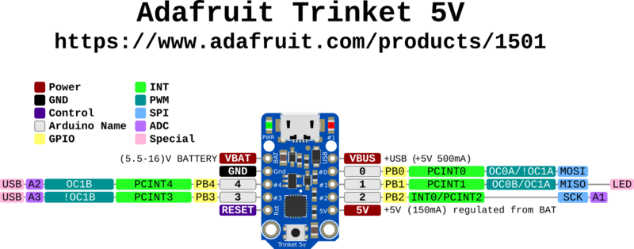
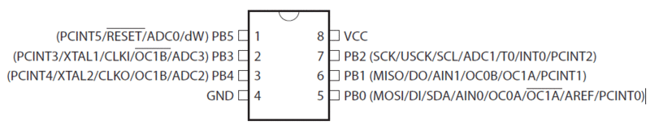

# Adafruit Trinket - Mini Microcontroller - 5V Logic


## ⚠️ Deprecation Warning

**The Trinket bit-bang USB technique it uses doesn't work as well as it did in 2014, many modern computers won't work well. So while we still carry the Trinket so that people can maintain some older projects, we no longer recommend it.** Please check out the [Trinket M0](https://www.adafruit.com/product/3500). It has built-in USB, more capabilities, and is comparable in price!

## Overview

Trinket may be small, but do not be fooled by its size! It's a tiny microcontroller board, built around the Atmel ATtiny85, a little chip with a lot of power. We wanted to design a microcontroller board that was small enough to fit into any project, and low cost enough to use without hesitation. Perfect for when you don't want to give up your expensive dev-board and you aren't willing to take apart the project you worked so hard to design. It's our lowest-cost arduino-IDE programmable board!

## Specifications

- **Microcontroller**: ATtiny85
- **Operating Voltage**: 5V
- **Input Voltage**: Up to 16V (with onboard regulator)
- **Flash Memory**: 8KB (5.25KB available for user code)
- **SRAM**: 512 bytes
- **EEPROM**: 512 bytes
- **Clock Speed**: 8MHz internal (can be doubled to 16MHz in software)
- **GPIO Pins**: 5 total (2 shared with USB)
- **Analog Inputs**: 3 (on the 3 independent pins)
- **PWM Outputs**: 3 (2 on independent pins, 1 on shared)
- **Dimensions**: 1.2" x 0.6" x 0.2" / 31mm x 15.5mm x 5mm
- **Weight**: 1.85 grams (without headers)

## Key Features

### Compact Design

- **Ultra-small**: One of the smallest Arduino-compatible boards
- **Lightweight**: Under 2 grams without headers
- **Breadboard Friendly**: Fits on standard breadboards
- **Mounting Holes**: For permanent installations

### ATtiny85 Processor

- **8KB Flash**: Sufficient for many small projects
- **512B SRAM**: Runtime memory for variables
- **512B EEPROM**: Non-volatile storage for settings
- **Harvard Architecture**: Separate program and data memory

### USB Connectivity

- **USB Bootloader**: Program directly via USB
- **Micro-USB Connector**: Modern connector type
- **No FTDI Needed**: Built-in USB programming capability
- **USBtinyISP Compatible**: Can be programmed with AVRdude

### Power Management

- **5V Logic**: Compatible with 5V sensors and devices
- **Onboard Regulator**: 150mA output with ultra-low dropout
- **Wide Input Range**: Up to 16V input voltage
- **Reverse Polarity Protection**: Built-in protection
- **Auto Power Switching**: USB or external power

## Pinout Diagrams

### Official Adafruit Trinket 5V Pinout



### ATtiny85 Chip Pinout Reference



## Basic Wiring Examples

### LED Blink Circuit

```
LED Anode (long leg) → 220Ω Resistor → Trinket Pin 1
LED Cathode (short leg) → Trinket GND

Code: digitalWrite(1, HIGH); // Pin 1 has built-in LED too
```

### Button Input Circuit

```
Trinket 5V → 10kΩ Pull-up Resistor → Trinket Pin 0
Trinket Pin 0 → Button → Trinket GND

Code: pinMode(0, INPUT_PULLUP); digitalRead(0);
```

### Analog Sensor Reading

```
Sensor Output → Trinket Pin 2 (Analog A1)
Sensor VCC → Trinket 5V
Sensor GND → Trinket GND

Code: analogRead(A1); // Pin 2 = Analog A1
```

### PWM LED Dimming

```
LED Anode → 220Ω Resistor → Trinket Pin 0 or Pin 1
LED Cathode → Trinket GND

Code: analogWrite(0, 128); // 50% brightness
```

### External Power Connection

```
Battery Pack + (6-16V) → Trinket BAT+
Battery Pack - → Trinket GND

Note: Onboard regulator provides 150mA at 5V
```

### I2C Device Connection (Software I2C)

```
I2C Device VCC → Trinket 5V
I2C Device GND → Trinket GND
I2C Device SDA → Trinket Pin 0
I2C Device SCL → Trinket Pin 2

Note: Use SoftwareWire library for I2C communication
```

## Programming Setup Guide

### Arduino IDE Setup

1. Install Arduino IDE 1.8.19 or later
2. Add Adafruit board package URL in preferences:
   `https://adafruit.github.io/arduino-board-index/package_adafruit_index.json`
3. Install "Adafruit AVR Boards" package
4. Install required libraries:
   - Adafruit NeoPixel (for WS2812 LEDs)
   - SoftwareSerial (for serial communication)
   - SoftwareWire (for I2C communication)
5. Select "Adafruit Trinket 8MHz" from Tools → Board

### Bootloader Activation

1. Plug Trinket into USB port
2. Press reset button on Trinket
3. Red LED will pulse for 10 seconds (bootloader mode)
4. Upload code during this 10-second window
5. If upload fails, press reset and try again

### Important Programming Notes

- **Limited Memory**: Only 5.25KB available for user code
- **No Hardware Serial**: Use SoftwareSerial for debugging
- **Timing Sensitive**: USB bit-banging requires precise timing
- **Modern Computer Issues**: May not work reliably on newer computers

## Programming Examples

### Arduino - Basic LED Blink

```cpp
// Trinket 5V Basic LED Blink
// Pin 1 has built-in LED

void setup() {
  pinMode(1, OUTPUT);  // Pin 1 = built-in LED
}

void loop() {
  digitalWrite(1, HIGH);   // Turn LED on
  delay(1000);             // Wait 1 second
  digitalWrite(1, LOW);    // Turn LED off
  delay(1000);             // Wait 1 second
}
```

### Arduino - Button Controlled LED

```cpp
// Trinket 5V Button Input Example
// Button on Pin 0, LED on Pin 1

void setup() {
  pinMode(0, INPUT_PULLUP);  // Button input with pullup
  pinMode(1, OUTPUT);        // LED output
}

void loop() {
  if (digitalRead(0) == LOW) {  // Button pressed (pulled to ground)
    digitalWrite(1, HIGH);      // Turn LED on
  } else {
    digitalWrite(1, LOW);       // Turn LED off
  }
  delay(50);  // Debounce delay
}
```

### Arduino - Analog Sensor Reading

```cpp
// Trinket 5V Analog Reading Example
// Sensor on Pin 2 (Analog A1), LED on Pin 1

void setup() {
  pinMode(1, OUTPUT);  // LED output
}

void loop() {
  int sensorValue = analogRead(A1);  // Read Pin 2 (A1)

  // Map sensor value to LED brightness
  int brightness = map(sensorValue, 0, 1023, 0, 255);
  analogWrite(1, brightness);  // PWM on Pin 1

  delay(100);
}
```

### Arduino - NeoPixel Control

```cpp
#include <Adafruit_NeoPixel.h>

// NeoPixel strip on Pin 0
#define PIN 0
#define NUMPIXELS 8

Adafruit_NeoPixel pixels(NUMPIXELS, PIN, NEO_GRB + NEO_KHZ800);

void setup() {
  pixels.begin();
  pixels.setBrightness(50);  // Reduce brightness to save power
}

void loop() {
  // Rainbow cycle
  for (int i = 0; i < NUMPIXELS; i++) {
    int hue = (i * 65536L / NUMPIXELS);
    pixels.setPixelColor(i, pixels.gamma32(pixels.ColorHSV(hue)));
  }
  pixels.show();
  delay(50);

  // Rotate colors
  static int offset = 0;
  offset = (offset + 1) % NUMPIXELS;
}
```

### Arduino - PWM Servo Control

```cpp
// Trinket 5V Servo Control (Software PWM)
// Servo on Pin 0

int servoPin = 0;

void setup() {
  pinMode(servoPin, OUTPUT);
}

void loop() {
  // Sweep servo from 0 to 180 degrees
  for (int angle = 0; angle <= 180; angle += 5) {
    servoWrite(servoPin, angle);
    delay(100);
  }

  // Sweep back from 180 to 0 degrees
  for (int angle = 180; angle >= 0; angle -= 5) {
    servoWrite(servoPin, angle);
    delay(100);
  }
}

void servoWrite(int pin, int angle) {
  // Convert angle to pulse width (1-2ms)
  int pulseWidth = map(angle, 0, 180, 1000, 2000);

  // Generate PWM signal for 20ms period
  for (int i = 0; i < 10; i++) {  // Repeat for stability
    digitalWrite(pin, HIGH);
    delayMicroseconds(pulseWidth);
    digitalWrite(pin, LOW);
    delayMicroseconds(20000 - pulseWidth);
  }
}
```

### Arduino - Temperature Sensor with LED Indicator

```cpp
// Trinket 5V Temperature Monitor
// TMP36 sensor on Pin 2 (A1), LED on Pin 1

void setup() {
  pinMode(1, OUTPUT);  // LED output
}

void loop() {
  // Read temperature sensor (TMP36)
  int sensorValue = analogRead(A1);

  // Convert to voltage (5V reference)
  float voltage = sensorValue * (5.0 / 1023.0);

  // Convert to temperature (TMP36: 10mV/°C, 500mV offset)
  float temperatureC = (voltage - 0.5) * 100.0;
  float temperatureF = (temperatureC * 9.0 / 5.0) + 32.0;

  // LED indicator based on temperature
  if (temperatureF > 80) {
    // Hot: Fast blink
    digitalWrite(1, HIGH);
    delay(100);
    digitalWrite(1, LOW);
    delay(100);
  } else if (temperatureF > 70) {
    // Warm: Medium blink
    digitalWrite(1, HIGH);
    delay(250);
    digitalWrite(1, LOW);
    delay(250);
  } else {
    // Cool: Slow blink
    digitalWrite(1, HIGH);
    delay(500);
    digitalWrite(1, LOW);
    delay(500);
  }
}
```

## Pin Configuration

### Independent GPIO Pins (3 pins)

- **Pin 0**: Digital I/O, PWM output, analog input
- **Pin 1**: Digital I/O, PWM output, analog input
- **Pin 2**: Digital I/O, analog input

### Shared USB Pins (2 pins)

- **Pin 3**: Digital I/O, analog input (shared with USB D-)
- **Pin 4**: Digital I/O, PWM output (shared with USB D+)

### Special Functions

- **Hardware I2C**: Available on pins 0 (SDA) and 2 (SCL)
- **Hardware SPI**: Available on pins 0 (MISO), 1 (MOSI), 2 (SCK)
- **Reset Pin**: For external reset button
- **Power Pins**: VIN, 5V, 3V, GND

## Programming

### Arduino IDE Support

- **Modified Arduino IDE**: Special board package required
- **Limited Libraries**: Not all Arduino libraries compatible
- **No Serial Monitor**: No hardware serial port for debugging
- **USB Programming**: Upload code via USB bootloader

### Bootloader Features

- **Robust Design**: Reliable programming process
- **LED Indicator**: Shows programming status
- **Auto-reset**: No need to manually enter bootloader mode
- **Foolproof**: Designed to prevent bricking

### Programming Limitations

- **No Serial Debug**: Cannot use Serial.print() for debugging
- **USB v3 Issues**: Some USB 3.0 ports don't recognize bootloader
- **Limited Pins**: Only 5 GPIO pins available
- **Memory Constraints**: Limited RAM and flash memory

## Applications

### Small Projects

- **LED Controllers**: NeoPixel strips and matrices
- **Sensor Nodes**: Simple sensor reading and transmission
- **Wearable Electronics**: Tiny form factor for clothing integration
- **IoT Endpoints**: Small connected devices

### Embedded Applications

- **Permanent Installations**: Leave in projects without worry
- **Cost-sensitive Projects**: Very low cost per unit
- **Space-constrained**: Fits where larger boards cannot
- **Battery Powered**: Low power consumption

### Learning and Prototyping

- **Arduino Introduction**: Learn microcontroller basics
- **Constraint Programming**: Work within memory limitations
- **Embedded Concepts**: Understand resource-limited programming
- **Quick Prototypes**: Fast project development

## Power Specifications

### Input Power

- **USB Power**: 5V from micro-USB connector
- **External Power**: VIN pin accepts up to 16V
- **Battery Power**: Can run from 3.7V LiPo batteries
- **Current Consumption**: Very low power operation

### Output Power

- **5V Rail**: Regulated 5V output for sensors
- **3V Rail**: 3.3V output for low-voltage devices
- **GPIO Current**: Limited current per pin
- **Total Current**: 150mA maximum from regulator

## Communication Protocols

### I2C Communication

- **Hardware I2C**: Pins 0 (SDA) and 2 (SCL)
- **Master Mode**: Can control I2C devices
- **Multiple Devices**: Address-based device selection
- **Pull-up Resistors**: External pull-ups required

### SPI Communication

- **Hardware SPI**: Pins 0 (MISO), 1 (MOSI), 2 (SCK)
- **Master Mode**: Can control SPI devices
- **High Speed**: Fast synchronous communication
- **Device Selection**: Use additional pins for chip select

## Memory Organization

### Flash Memory (8KB)

- **Bootloader**: 2.75KB reserved for USB bootloader
- **User Code**: 5.25KB available for programs
- **Program Storage**: Contains compiled Arduino sketches
- **Non-volatile**: Retains programs when powered off

### SRAM (512 bytes)

- **Variable Storage**: Runtime variables and arrays
- **Stack Space**: Function calls and local variables
- **Very Limited**: Careful memory management required
- **Volatile**: Lost when power is removed

### EEPROM (512 bytes)

- **Persistent Storage**: Data survives power cycles
- **Configuration**: Settings and calibration data
- **User Accessible**: Can be read/written by sketches
- **Limited Writes**: ~100,000 write cycles per location

## Hardware Features

### Onboard Components

- **Power LED**: Green LED indicates power
- **Pin 1 LED**: Red LED connected to pin 1
- **Reset Button**: Manual reset capability
- **USB Connector**: Micro-USB for power and programming

### Protection Features

- **Reverse Polarity**: Protection against wrong power connection
- **Thermal Protection**: Regulator thermal shutdown
- **Current Limiting**: Built-in current protection
- **ESD Protection**: Electrostatic discharge protection

## Compatibility and Limitations

### Arduino Compatibility

- **Partial Compatibility**: Not 100% Arduino compatible
- **Library Limitations**: Many libraries won't work
- **No Serial**: Cannot use Serial monitor for debugging
- **Pin Limitations**: Only 5 GPIO pins vs 14+ on Uno

### USB Limitations

- **USB v3 Issues**: May not work with some USB 3.0 ports
- **Bit-bang USB**: Software USB implementation
- **Modern Computer Issues**: Compatibility problems with newer systems
- **Hub Recommendation**: Use USB 2.0 hub if needed

## Getting Started

### Setup Requirements

1. **Install Arduino IDE**: Download from arduino.cc
2. **Install Trinket Support**: Add Adafruit board package
3. **Connect USB**: Use micro-USB cable
4. **Select Board**: Choose "Adafruit Trinket 8MHz" or "16MHz"
5. **Upload Code**: Start with simple examples

### First Projects

- **Blink LED**: Control the onboard red LED
- **NeoPixel Control**: Drive addressable LED strips
- **Sensor Reading**: Read analog sensors
- **I2C Communication**: Interface with I2C devices

## Package Contents

- 1x Adafruit Trinket 5V board
- Documentation and tutorial links
- No headers included (sold separately)

## Important Notes

- **Deprecated Product**: No longer recommended for new projects
- **USB Compatibility**: May not work with modern computers
- **Limited Debugging**: No serial monitor capability
- **Memory Constraints**: Very limited RAM and flash
- **Alternative Available**: Consider Trinket M0 for new projects

## Advantages

- **Ultra Compact**: Smallest Arduino-compatible board
- **Low Cost**: Very affordable for embedded projects
- **USB Programming**: No external programmer needed
- **5V Logic**: Compatible with 5V sensors and devices
- **Proven Design**: Many successful projects built with Trinket

## Limitations

- **Deprecated**: No longer recommended by manufacturer
- **USB Issues**: Compatibility problems with modern computers
- **Limited Resources**: Very constrained memory and pins
- **No Serial Debug**: Difficult to troubleshoot programs
- **Library Compatibility**: Many Arduino libraries don't work

## Migration Path

For new projects, consider these alternatives:

- **Trinket M0**: Modern replacement with native USB
- **QT Py**: Similar size with more capabilities
- **ItsyBitsy**: Slightly larger but much more powerful
- **Arduino Nano**: More pins and better compatibility
