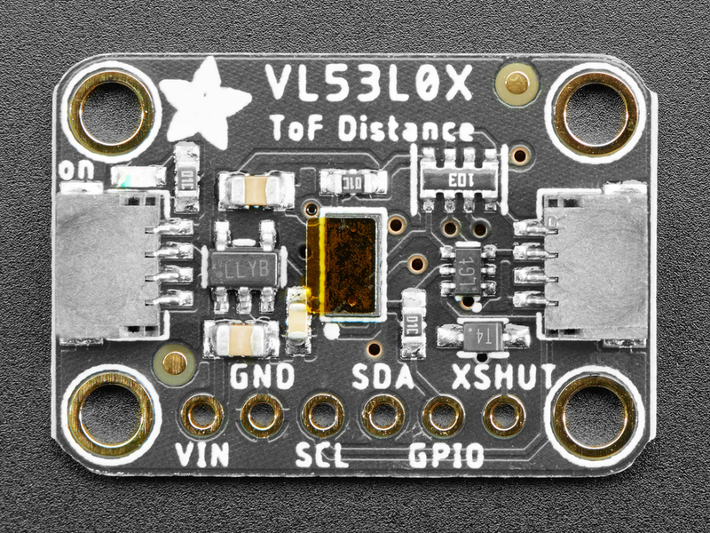

# Adafruit VL53L0X Time of Flight Distance Sensor

Precision laser-based distance sensor using Time of Flight technology for accurate distance measurements from 30mm to 1200mm with STEMMA QT connectivity.

## Overview

The Adafruit VL53L0X is a Time of Flight (ToF) distance sensor that uses a tiny invisible laser and matching sensor to measure distance by calculating the time it takes for light to bounce back from an object. Unlike ultrasonic sensors with wide detection cones or IR sensors with linearity issues, the VL53L0X provides precise, narrow-beam distance measurement.

## Key Features

### Time of Flight Technology

- **Invisible laser source** for precise distance measurement
- **Narrow detection cone** (35 degrees) for focused sensing
- **No linearity problems** unlike IR distance sensors
- **No double imaging** issues common with other sensors
- **Immune to ambient light** variations

### Precision Performance

- **High accuracy** with 3-12% ranging precision
- **Fast measurement** with minimal delay
- **Consistent readings** across temperature range
- **Multiple ranging modes** for different applications
- **Programmable measurement** timing and accuracy

### Easy Integration

- **STEMMA QT connectors** for plug-and-play I²C
- **Voltage regulation** for 3-5V operation
- **Level shifting** for mixed voltage systems
- **Arduino and CircuitPython** library support
- **Compact form factor** for space-constrained applications

## Technical Specifications

### Electrical Characteristics

- **Operating Voltage**: 3.0V to 5.5V (with onboard regulator)
- **Supply Current**: 19mA active, 5μA standby
- **Interface**: I²C (up to 400kHz)
- **I²C Address**: 0x29 (default, programmable)
- **Logic Levels**: 3.3V with 5V tolerance

### Performance Specifications

- **Measurement Range**: 30mm to 1200mm (default mode)
- **Extended Range**: Up to 2000mm (long range mode, white surface)
- **Accuracy**: ±3% to ±12% (depending on conditions)
- **Detection Angle**: 35 degrees cone
- **Measurement Rate**: Up to 50Hz
- **Resolution**: 1mm

### Environmental Specifications

- **Operating Temperature**: -20°C to +70°C
- **Storage Temperature**: -40°C to +85°C
- **Ambient Light**: Immune to ambient light interference
- **Target Reflectance**: Works with various surface types
- **Laser Class**: Class 1 (eye-safe)

### Physical Specifications

- **Dimensions**: 21.0mm × 18.0mm × 2.8mm
- **Weight**: 1.3g
- **Mounting**: Four mounting holes
- **Connectors**: Two STEMMA QT connectors

## Pinout Diagram



## Wiring Diagrams

### I2C Connection (STEMMA QT - Recommended)

#### Using STEMMA QT Cable

```
Simply plug STEMMA QT cable between VL53L0X and microcontroller
No wiring required! STEMMA QT provides:
- 3.3V Power
- Ground
- SDA (I2C Data)
- SCL (I2C Clock)
```

### Manual I2C Connection

#### Arduino Uno Connection

```
VL53L0X        Arduino Uno
-------        -----------
VIN       →    5V or 3.3V
GND       →    GND
SCL       →    A5 (SCL)
SDA       →    A4 (SDA)
GPIO      →    Pin 2 (optional interrupt)
SHDN      →    Pin 3 (optional shutdown control)

Note: Board has built-in level shifting for 5V compatibility
```

#### Raspberry Pi Pico Connection

```
VL53L0X        Pico
-------        ----
VIN       →    3V3
GND       →    GND
SCL       →    GP5 (I2C0 SCL)
SDA       →    GP4 (I2C0 SDA)
GPIO      →    GP2 (optional interrupt)
SHDN      →    GP3 (optional shutdown control)

Note: Add 4.7kΩ pull-up resistors on SDA and SCL if needed
```

#### ESP32 Connection

```
VL53L0X        ESP32
-------        -----
VIN       →    3.3V
GND       →    GND
SCL       →    GPIO22 (SCL)
SDA       →    GPIO21 (SDA)
GPIO      →    GPIO4 (optional interrupt)
SHDN      →    GPIO5 (optional shutdown control)

Note: ESP32 has built-in I2C pull-up resistors
```

## Programming Examples

### Arduino Basic Distance Reading

```cpp
#include "Adafruit_VL53L0X.h"

Adafruit_VL53L0X lox = Adafruit_VL53L0X();

void setup() {
  Serial.begin(115200);

  if (!lox.begin()) {
    Serial.println(F("Failed to boot VL53L0X"));
    while(1);
  }

  Serial.println(F("VL53L0X API Simple Ranging example"));
}

void loop() {
  VL53L0X_RangingMeasurementData_t measure;

  lox.rangingTest(&measure, false);

  if (measure.RangeStatus != 4) {  // Phase failures have incorrect data
    Serial.print("Distance (mm): ");
    Serial.println(measure.RangeMilliMeter);
  } else {
    Serial.println("Out of range");
  }

  delay(100);
}
```

### CircuitPython Example

```python
import time
import board
import busio
import adafruit_vl53l0x

# Initialize I2C bus and sensor
i2c = busio.I2C(board.SCL, board.SDA)
vl53 = adafruit_vl53l0x.VL53L0X(i2c)

# Optional: adjust the measurement timing budget
# vl53.measurement_timing_budget = 33000

while True:
    try:
        distance = vl53.range
        print(f"Distance: {distance}mm")
    except RuntimeError:
        print("Range error")

    time.sleep(0.1)
```

### Arduino Multiple Sensors Example

```cpp
#include "Adafruit_VL53L0X.h"

// Shutdown pins for multiple sensors
#define SENSOR1_SHDN 2
#define SENSOR2_SHDN 3

Adafruit_VL53L0X sensor1 = Adafruit_VL53L0X();
Adafruit_VL53L0X sensor2 = Adafruit_VL53L0X();

void setup() {
  Serial.begin(115200);

  // Set shutdown pins
  pinMode(SENSOR1_SHDN, OUTPUT);
  pinMode(SENSOR2_SHDN, OUTPUT);

  // Reset all sensors
  digitalWrite(SENSOR1_SHDN, LOW);
  digitalWrite(SENSOR2_SHDN, LOW);
  delay(10);

  // Initialize first sensor
  digitalWrite(SENSOR1_SHDN, HIGH);
  delay(10);
  if (!sensor1.begin(0x30)) {  // Set new address
    Serial.println("Failed to boot sensor 1");
    while(1);
  }

  // Initialize second sensor
  digitalWrite(SENSOR2_SHDN, HIGH);
  delay(10);
  if (!sensor2.begin()) {  // Use default address 0x29
    Serial.println("Failed to boot sensor 2");
    while(1);
  }

  Serial.println("Both sensors initialized");
}

void loop() {
  VL53L0X_RangingMeasurementData_t measure1, measure2;

  sensor1.rangingTest(&measure1, false);
  sensor2.rangingTest(&measure2, false);

  Serial.print("Sensor 1: ");
  if (measure1.RangeStatus != 4) {
    Serial.print(measure1.RangeMilliMeter);
    Serial.print("mm");
  } else {
    Serial.print("Out of range");
  }

  Serial.print(" | Sensor 2: ");
  if (measure2.RangeStatus != 4) {
    Serial.print(measure2.RangeMilliMeter);
    Serial.print("mm");
  } else {
    Serial.print("Out of range");
  }

  Serial.println();
  delay(100);
}
```

## Configuration Options

### Measurement Timing Budget

- **Default**: 33ms (30Hz measurement rate)
- **High Speed**: 20ms (50Hz measurement rate)
- **High Accuracy**: 200ms (5Hz measurement rate)
- **Custom**: 20ms to 1000ms range

### Range Modes

- **Default Mode**: 30mm to 1200mm
- **Long Range Mode**: Up to 2000mm (white surfaces)
- **High Speed Mode**: Faster measurements, shorter range

## Important Notes

### Power Considerations

- **Operating Voltage**: 3.0V to 5.5V (regulated onboard)
- **Current Draw**: 19mA active, 5μA standby
- **STEMMA QT**: Provides 3.3V power automatically
- **Level Shifting**: Built-in for 5V microcontroller compatibility

### I2C Address Management

- **Default Address**: 0x29 (fixed in hardware)
- **Multiple Sensors**: Use SHDN pin to change addresses in software
- **Address Range**: 0x08 to 0x77 (software configurable)
- **Reset Required**: Address resets to 0x29 on power cycle

### Performance Tips

- **Target Surface**: Works best with matte, non-reflective surfaces
- **Ambient Light**: Immune to most ambient light conditions
- **Detection Cone**: 35° cone for focused measurements
- **Calibration**: Factory calibrated, no user calibration needed

## Applications

### Robotics and Automation

- **Robot navigation** and obstacle avoidance
- **Autonomous vehicle** distance sensing
- **Drone altitude** and obstacle detection
- **Robotic arm** positioning and safety
- **Mobile robot** mapping and localization

### Industrial Applications

- **Level measurement** in tanks and containers
- **Conveyor belt** object detection
- **Machine safety** proximity sensing
- **Quality control** dimensional measurement
- **Automated sorting** systems

### Consumer Electronics

- **Smart home** occupancy detection
- **Camera autofocus** assistance
- **Gaming controllers** gesture recognition
- **Security systems** perimeter monitoring
- **Interactive displays** proximity activation

### Scientific and Educational

- **Physics experiments** distance measurement
- **STEM education** sensor projects
- **Research applications** precise ranging
- **Environmental monitoring** water level sensing
- **Laboratory automation** positioning systems

## Programming Examples

### Arduino Basic Usage

```cpp
#include <Adafruit_VL53L0X.h>

Adafruit_VL53L0X lox = Adafruit_VL53L0X();

void setup() {
  Serial.begin(115200);

  if (!lox.begin()) {
    Serial.println("Failed to boot VL53L0X");
    while(1);
  }

  Serial.println("VL53L0X API Simple Ranging example");
}

void loop() {
  VL53L0X_RangingMeasurementData_t measure;

  lox.rangingTest(&measure, false);

  if (measure.RangeStatus != 4) {
    Serial.print("Distance (mm): ");
    Serial.println(measure.RangeMilliMeter);
  } else {
    Serial.println("Out of range");
  }

  delay(100);
}
```

### Advanced Configuration

```cpp
// Configure for long range mode
void setupLongRange() {
  // Lower the return signal rate limit (default is 0.25 MCPS)
  lox.setSignalRateLimit(0.1);

  // Increase laser pulse periods (defaults are 14 and 10 PCLKs)
  lox.setVcselPulsePeriod(VL53L0X_VCSEL_PERIOD_PRE_RANGE, 18);
  lox.setVcselPulsePeriod(VL53L0X_VCSEL_PERIOD_FINAL_RANGE, 14);

  // Increase timing budget to 200ms (default is 33ms)
  lox.setMeasurementTimingBudget(200000);
}

// Configure for high speed mode
void setupHighSpeed() {
  // Reduce timing budget for faster measurements
  lox.setMeasurementTimingBudget(20000);  // 20ms

  // Set higher signal rate limit
  lox.setSignalRateLimit(0.5);
}

// Configure for high accuracy mode
void setupHighAccuracy() {
  // Increase timing budget for better accuracy
  lox.setMeasurementTimingBudget(200000);  // 200ms

  // Lower signal rate limit for better accuracy
  lox.setSignalRateLimit(0.25);
}
```

### CircuitPython Example

```python
import time
import board
import busio
import adafruit_vl53l0x

# Initialize I2C bus and sensor
i2c = busio.I2C(board.SCL, board.SDA)
vl53 = adafruit_vl53l0x.VL53L0X(i2c)

# Optionally adjust the measurement timing budget to change speed and accuracy
# vl53.measurement_timing_budget = 200000  # 200ms for high accuracy
# vl53.measurement_timing_budget = 20000   # 20ms for high speed

while True:
    try:
        distance = vl53.range
        print(f"Distance: {distance}mm")
    except RuntimeError:
        print("Range error")

    time.sleep(0.1)
```

### Arduino - Proximity Alarm System

```cpp
#include <Adafruit_VL53L0X.h>

Adafruit_VL53L0X lox = Adafruit_VL53L0X();

const int BUZZER_PIN = 8;
const int LED_PIN = 13;
const int PROXIMITY_THRESHOLD = 200; // 200mm threshold

void setup() {
  Serial.begin(115200);
  pinMode(BUZZER_PIN, OUTPUT);
  pinMode(LED_PIN, OUTPUT);

  if (!lox.begin()) {
    Serial.println("Failed to boot VL53L0X");
    while(1);
  }

  // Configure for fast response
  lox.setMeasurementTimingBudget(30000); // 30ms

  Serial.println("Proximity Alarm System Ready");
}

void loop() {
  VL53L0X_RangingMeasurementData_t measure;
  lox.rangingTest(&measure, false);

  if (measure.RangeStatus != 4) {
    int distance = measure.RangeMilliMeter;

    Serial.print("Distance: ");
    Serial.print(distance);
    Serial.println("mm");

    if (distance < PROXIMITY_THRESHOLD) {
      // Object detected within threshold
      digitalWrite(LED_PIN, HIGH);

      // Variable frequency based on distance
      int frequency = map(distance, 50, PROXIMITY_THRESHOLD, 2000, 500);
      tone(BUZZER_PIN, frequency, 100);

      Serial.println("PROXIMITY ALERT!");
    } else {
      digitalWrite(LED_PIN, LOW);
      noTone(BUZZER_PIN);
    }
  } else {
    Serial.println("Out of range");
    digitalWrite(LED_PIN, LOW);
    noTone(BUZZER_PIN);
  }

  delay(100);
}
```

### Arduino - Multiple Sensors Array

```cpp
#include <Adafruit_VL53L0X.h>

// Create sensor objects
Adafruit_VL53L0X sensor1 = Adafruit_VL53L0X();
Adafruit_VL53L0X sensor2 = Adafruit_VL53L0X();
Adafruit_VL53L0X sensor3 = Adafruit_VL53L0X();

// Shutdown pins for each sensor
#define XSHUT_pin1 2
#define XSHUT_pin2 3
#define XSHUT_pin3 4

// New I2C addresses for sensors
#define sensor1_newAddress 0x30
#define sensor2_newAddress 0x31
#define sensor3_newAddress 0x32

void setup() {
  Serial.begin(115200);

  // Initialize shutdown pins
  pinMode(XSHUT_pin1, OUTPUT);
  pinMode(XSHUT_pin2, OUTPUT);
  pinMode(XSHUT_pin3, OUTPUT);

  // Shutdown all sensors
  digitalWrite(XSHUT_pin1, LOW);
  digitalWrite(XSHUT_pin2, LOW);
  digitalWrite(XSHUT_pin3, LOW);
  delay(10);

  // Initialize sensor 1
  digitalWrite(XSHUT_pin1, HIGH);
  delay(10);
  if (!sensor1.begin(sensor1_newAddress)) {
    Serial.println("Failed to boot sensor 1");
    while(1);
  }

  // Initialize sensor 2
  digitalWrite(XSHUT_pin2, HIGH);
  delay(10);
  if (!sensor2.begin(sensor2_newAddress)) {
    Serial.println("Failed to boot sensor 2");
    while(1);
  }

  // Initialize sensor 3
  digitalWrite(XSHUT_pin3, HIGH);
  delay(10);
  if (!sensor3.begin(sensor3_newAddress)) {
    Serial.println("Failed to boot sensor 3");
    while(1);
  }

  Serial.println("All sensors initialized");
}

void loop() {
  VL53L0X_RangingMeasurementData_t measure1, measure2, measure3;

  // Read all sensors
  sensor1.rangingTest(&measure1, false);
  sensor2.rangingTest(&measure2, false);
  sensor3.rangingTest(&measure3, false);

  // Display results
  Serial.print("Sensor 1: ");
  if (measure1.RangeStatus != 4) {
    Serial.print(measure1.RangeMilliMeter);
    Serial.print("mm");
  } else {
    Serial.print("OOR");
  }

  Serial.print(" | Sensor 2: ");
  if (measure2.RangeStatus != 4) {
    Serial.print(measure2.RangeMilliMeter);
    Serial.print("mm");
  } else {
    Serial.print("OOR");
  }

  Serial.print(" | Sensor 3: ");
  if (measure3.RangeStatus != 4) {
    Serial.print(measure3.RangeMilliMeter);
    Serial.print("mm");
  } else {
    Serial.print("OOR");
  }

  Serial.println();
  delay(200);
}
```

### CircuitPython - Smart Lighting Controller

```python
import time
import board
import busio
import digitalio
import pwmio
import adafruit_vl53l0x

# Initialize I2C and sensor
i2c = busio.I2C(board.SCL, board.SDA)
vl53 = adafruit_vl53l0x.VL53L0X(i2c)

# Initialize LED with PWM for brightness control
led = pwmio.PWMOut(board.D13, frequency=5000, duty_cycle=0)

# Configuration
MIN_DISTANCE = 100  # mm
MAX_DISTANCE = 800  # mm
FADE_SPEED = 0.02   # seconds between brightness steps

def map_range(value, in_min, in_max, out_min, out_max):
    """Map a value from one range to another"""
    return (value - in_min) * (out_max - out_min) // (in_max - in_min) + out_min

def set_led_brightness(brightness):
    """Set LED brightness (0-100%)"""
    duty_cycle = int(brightness * 65535 / 100)
    led.duty_cycle = max(0, min(65535, duty_cycle))

print("Smart Lighting Controller Ready")
print(f"Detection range: {MIN_DISTANCE}mm to {MAX_DISTANCE}mm")

current_brightness = 0
target_brightness = 0

while True:
    try:
        distance = vl53.range

        if MIN_DISTANCE <= distance <= MAX_DISTANCE:
            # Map distance to brightness (closer = brighter)
            target_brightness = map_range(distance, MAX_DISTANCE, MIN_DISTANCE, 0, 100)
        else:
            target_brightness = 0

        # Smooth brightness transition
        if current_brightness < target_brightness:
            current_brightness = min(current_brightness + 2, target_brightness)
        elif current_brightness > target_brightness:
            current_brightness = max(current_brightness - 2, target_brightness)

        set_led_brightness(current_brightness)

        print(f"Distance: {distance}mm, Brightness: {current_brightness}%")

    except RuntimeError:
        print("Range error")
        target_brightness = 0

    time.sleep(FADE_SPEED)
```

### CircuitPython - Data Logger with Statistics

```python
import time
import board
import busio
import adafruit_vl53l0x
import math

# Initialize I2C and sensor
i2c = busio.I2C(board.SCL, board.SDA)
vl53 = adafruit_vl53l0x.VL53L0X(i2c)

# Data collection settings
SAMPLE_SIZE = 100
SAMPLE_INTERVAL = 0.1  # seconds

class DistanceStats:
    def __init__(self):
        self.measurements = []
        self.valid_count = 0
        self.error_count = 0

    def add_measurement(self, distance):
        if distance is not None:
            self.measurements.append(distance)
            self.valid_count += 1
            if len(self.measurements) > SAMPLE_SIZE:
                self.measurements.pop(0)
        else:
            self.error_count += 1

    def get_statistics(self):
        if not self.measurements:
            return None

        # Calculate statistics
        mean = sum(self.measurements) / len(self.measurements)

        # Calculate standard deviation
        variance = sum((x - mean) ** 2 for x in self.measurements) / len(self.measurements)
        std_dev = math.sqrt(variance)

        # Find min and max
        min_val = min(self.measurements)
        max_val = max(self.measurements)

        # Calculate median
        sorted_measurements = sorted(self.measurements)
        n = len(sorted_measurements)
        if n % 2 == 0:
            median = (sorted_measurements[n//2 - 1] + sorted_measurements[n//2]) / 2
        else:
            median = sorted_measurements[n//2]

        return {
            'mean': mean,
            'median': median,
            'std_dev': std_dev,
            'min': min_val,
            'max': max_val,
            'range': max_val - min_val,
            'samples': len(self.measurements),
            'valid_count': self.valid_count,
            'error_count': self.error_count
        }

# Initialize statistics tracker
stats = DistanceStats()

print("VL53L0X Data Logger with Statistics")
print(f"Collecting {SAMPLE_SIZE} samples every {SAMPLE_INTERVAL}s")
print("Press Ctrl+C to stop and view final statistics")

try:
    while True:
        try:
            distance = vl53.range
            stats.add_measurement(distance)
            print(f"Distance: {distance}mm (Sample #{stats.valid_count})")

            # Show running statistics every 10 samples
            if stats.valid_count % 10 == 0:
                current_stats = stats.get_statistics()
                if current_stats:
                    print(f"Running Stats - Mean: {current_stats['mean']:.1f}mm, "
                          f"StdDev: {current_stats['std_dev']:.1f}mm, "
                          f"Range: {current_stats['min']}-{current_stats['max']}mm")

        except RuntimeError:
            stats.add_measurement(None)
            print("Range error")

        time.sleep(SAMPLE_INTERVAL)

except KeyboardInterrupt:
    print("\nData collection stopped. Final Statistics:")
    final_stats = stats.get_statistics()
    if final_stats:
        print(f"Samples collected: {final_stats['samples']}")
        print(f"Valid measurements: {final_stats['valid_count']}")
        print(f"Errors: {final_stats['error_count']}")
        print(f"Mean distance: {final_stats['mean']:.2f}mm")
        print(f"Median distance: {final_stats['median']:.2f}mm")
        print(f"Standard deviation: {final_stats['std_dev']:.2f}mm")
        print(f"Min distance: {final_stats['min']}mm")
        print(f"Max distance: {final_stats['max']}mm")
        print(f"Range: {final_stats['range']}mm")
        print(f"Measurement precision: ±{final_stats['std_dev']:.1f}mm")
```

## Pinout and Connections

### STEMMA QT Connector

| Pin | Signal | Description |
| --- | ------ | ----------- |
| 1   | GND    | Ground      |
| 2   | VCC    | 3.3V Power  |
| 3   | SDA    | I²C Data    |
| 4   | SCL    | I²C Clock   |

### Breakout Pins

| Pin   | Signal | Description                |
| ----- | ------ | -------------------------- |
| VIN   | VCC    | Power input (3.0V to 5.5V) |
| GND   | GND    | Ground                     |
| SCL   | SCL    | I²C Clock                  |
| SDA   | SDA    | I²C Data                   |
| GPIO1 | GPIO1  | Interrupt output           |
| XSHUT | XSHUT  | Shutdown input             |

### Connection Notes

- **VIN**: Connect to 3.3V or 5V power supply
- **GND**: Connect to system ground
- **SCL/SDA**: I²C bus connections (pull-up resistors included)
- **GPIO1**: Interrupt output for data ready or threshold alerts
- **XSHUT**: Pull low to shutdown sensor, high for normal operation

## Measurement Modes and Configuration

### Default Mode

- **Range**: 30mm to 1200mm
- **Timing Budget**: 33ms
- **Accuracy**: Good for most applications
- **Speed**: Fast measurements

### Long Range Mode

- **Range**: Up to 2000mm (white reflective surface)
- **Timing Budget**: 200ms
- **Accuracy**: Reduced at maximum range
- **Applications**: Large area monitoring

### High Speed Mode

- **Range**: 30mm to 800mm
- **Timing Budget**: 20ms
- **Accuracy**: Slightly reduced
- **Applications**: Fast-moving object detection

### High Accuracy Mode

- **Range**: 30mm to 1200mm
- **Timing Budget**: 200ms
- **Accuracy**: Maximum precision
- **Applications**: Precision measurement

## Performance Factors

### Target Surface Properties

- **Reflectivity**: White/light surfaces give best range
- **Surface finish**: Matte surfaces work better than glossy
- **Material**: Non-absorbing materials preferred
- **Angle**: Perpendicular surfaces give best accuracy

### Environmental Conditions

- **Ambient light**: Minimal effect on performance
- **Temperature**: Stable across operating range
- **Humidity**: No significant impact
- **Vibration**: Minimal effect on readings

### Measurement Optimization

- **Timing budget**: Balance speed vs accuracy
- **Signal rate limit**: Adjust for target reflectivity
- **VCSEL pulse periods**: Optimize for range requirements
- **Averaging**: Implement software averaging for stability

## Design Considerations

### Mechanical Design

- **Sensor orientation**: Point directly at target surface
- **Mounting stability**: Secure mounting to prevent vibration
- **Optical window**: Keep sensor window clean and unobstructed
- **Target alignment**: Ensure target is within detection cone

### Electrical Design

- **Power supply**: Use clean, stable power source
- **I²C bus**: Include appropriate pull-up resistors (10kΩ typical)
- **Bypass capacitors**: Add near power pins for noise reduction
- **Ground plane**: Use solid ground connection

### Software Design

- **Error handling**: Check for range status and out-of-range conditions
- **Filtering**: Implement appropriate signal filtering
- **Calibration**: Consider offset calibration for specific applications
- **Interrupt handling**: Use GPIO1 for efficient data collection

## Troubleshooting

### Common Issues

- **No readings**: Check power, I²C connections, and sensor orientation
- **Erratic readings**: Verify target surface properties and stability
- **Short range**: Check for obstructions or poor target reflectivity
- **Slow response**: Adjust timing budget for application requirements

### Performance Optimization

- **Target selection**: Use appropriate target surface for best results
- **Environmental control**: Minimize vibration and movement
- **Configuration tuning**: Optimize settings for specific application
- **Signal processing**: Implement appropriate filtering and averaging

## Advantages and Limitations

### Advantages

- **High precision**: Accurate distance measurement
- **Narrow beam**: Focused detection area
- **Ambient light immunity**: Works in various lighting conditions
- **Fast response**: Quick measurement updates
- **Easy integration**: Simple I²C interface with libraries

### Limitations

- **Range dependent on target**: Performance varies with surface properties
- **Single point measurement**: Only measures distance to one point
- **Line of sight required**: Cannot measure through transparent materials
- **Power consumption**: Higher than passive sensors
- **Cost**: More expensive than basic distance sensors

## Storage Information

- **Location**: Cabinet 3, Bin 31
- **Quantity**: 1 unit
- **Condition**: New, unused
- **Features**: STEMMA QT, laser ToF technology, Arduino/CircuitPython support
- **Accessories**: Includes header pins and STEMMA QT connectors
