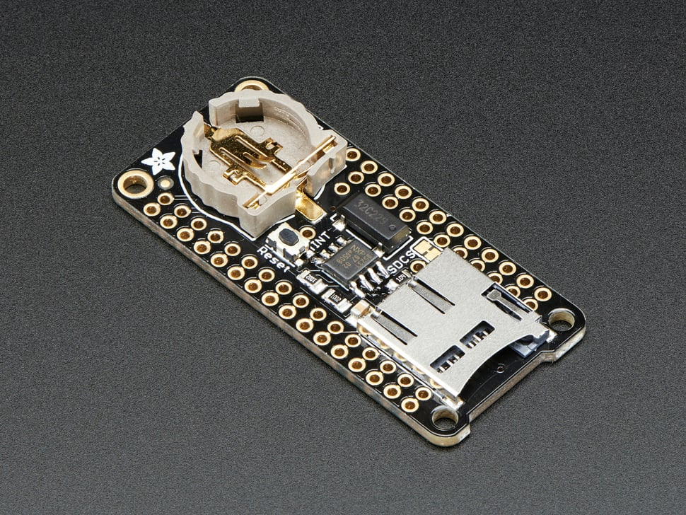

# Adalogger FeatherWing

## Details

- **Location**: Cabinet-1, Bin 16
- **Category**: Featherwings
- **Quantity**: 1
- **Product URL**: https://www.adafruit.com/product/2922

## Description

Adalogger FeatherWing - RTC + SD Add-on For All Feather Boards. Combines real-time clock and SD card storage.

## Image

## Tags

#featherwing #adalogger #rtc #sd-card #storage #adafruit
