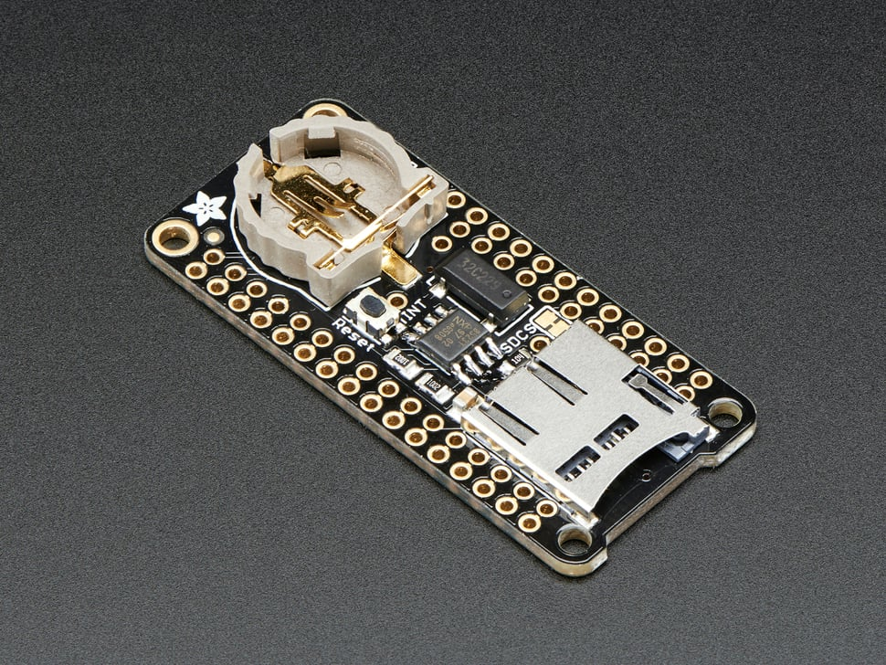

# Adalogger FeatherWing

## Description

Adalogger FeatherWing - RTC + SD Add-on For All Feather Boards. Combines real-time clock and SD card storage.

## Image

## Tags

#featherwing #adalogger #rtc #sd-card #storage #adafruit
