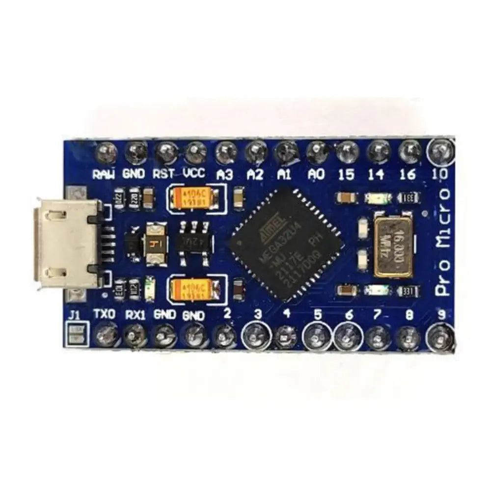
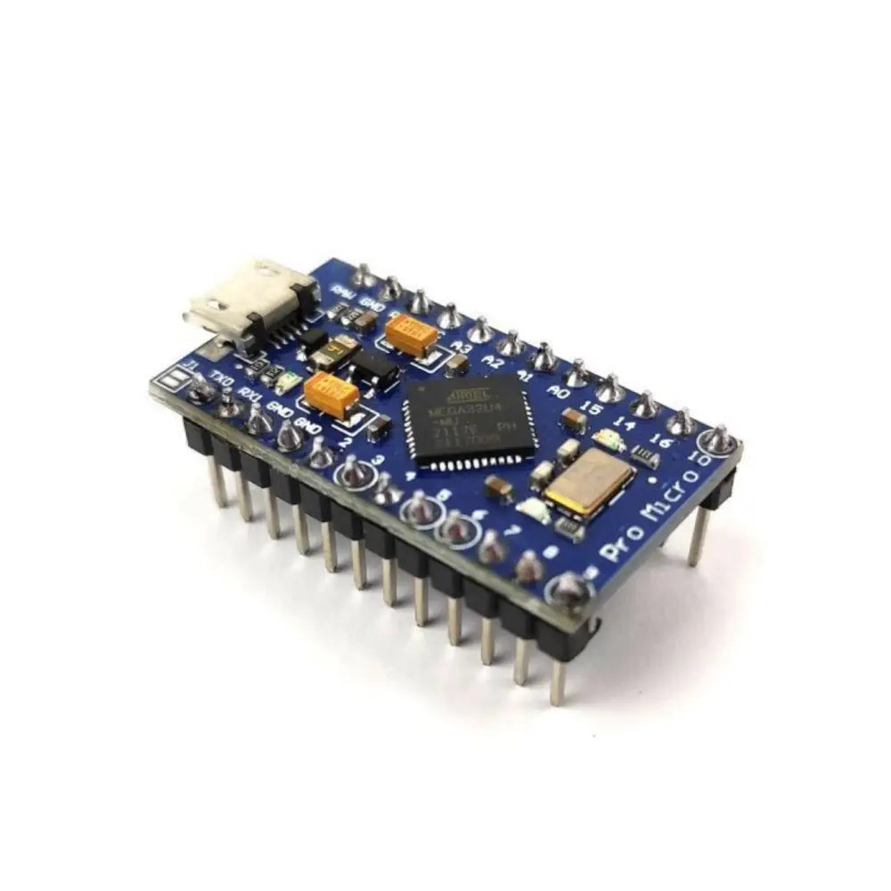

# Arduino Pro Micro (ATmega32U4)

## Details

- Location: Cabinet-1, Bin 25
- Category: Microcontroller Boards → Arduino Compatible
- MCU: ATmega32U4 (native USB)
- USB: Micro USB
- Quantity: 1 (update if different)

## Description

A compact Arduino-compatible development board featuring the ATmega32U4 microcontroller with onboard USB. Ideal for compact projects, custom keyboards, HID devices, and embedded controllers. Available in 5V/16MHz and 3.3V/8MHz variants.

## Specifications

- Microcontroller: ATmega32U4
- Clock: 16 MHz
- Flash: 32 KB (4 KB used by bootloader)
- SRAM: 2.5 KB
- EEPROM: 1 KB
- I/O: 12 digital (5 PWM), 9 analog inputs (some shared)
- Interfaces: I2C, SPI, UART, USB HID
- Operating Voltage: 5V
- Logic Level: 5V

## Applications

- USB HID devices (keyboards, mice, game controllers)
- Compact embedded projects
- Wearables and small controllers
- Prototyping with native USB

## Images

## Product Links

- Official reference (SparkFun Pro Micro series): https://www.sparkfun.com/search/results?term=pro+micro

## Notes

- Update quantity and product link if you have a specific listing or vendor.
