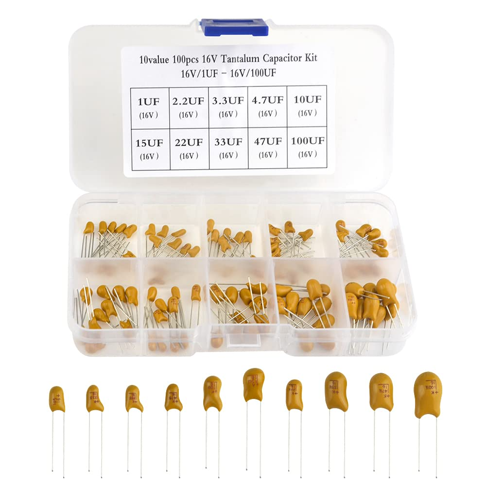

# Assorted Capacitor Kit

## Details

- Location: Cabinet-2, Bin 21
- Category: Passive Components → Capacitors
- Type: Mixed-value leaded capacitors kit (ceramic/film)
- Quantity: Various (assortment)
- Product Link: https://a.co/d/g7DKVBS

## Image

## Description

A mixed-value electrolytic capacitor assortment (all values in microfarads) suitable for breadboarding, repairs, and general electronics work. Values and voltage ratings vary by kit; refer to packaging for exact contents.

## Values Included

- 1 uF (1 µF)
- 2.2 uF (2.2 µF)
- 3.3 uF (3.3 µF)
- 4.7 uF (4.7 µF)
- 10 uF (10 µF)
- 15 uF (15 µF)
- 22 uF (22 µF)
- 33 uF (33 µF)
- 47 uF (47 µF)
- 100 uF (100 µF)

- Leaded through-hole parts for easy prototyping

## Applications

- RC filters and timing networks
- Signal coupling/decoupling
- Noise suppression and bypass
- General prototyping and circuit tuning

## Notes

- Exact values and counts depend on the specific kit batch
- For precision timing, prefer C0G/NP0 dielectric values when available
- For power paths, ensure voltage rating is adequate for the circuit
