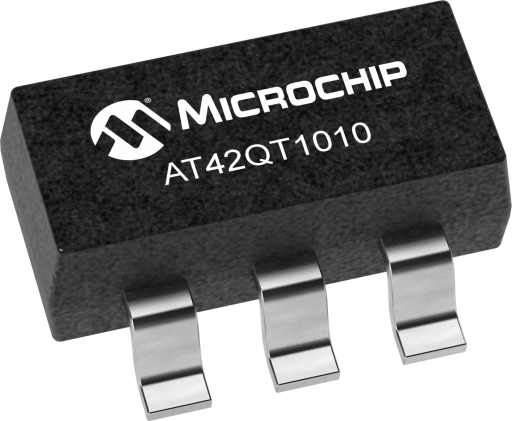

## Details

The AT42QT1010 is a single-channel capacitive touch sensor IC from Microchip Technology. It's a standalone momentary touch controller that requires no microcontroller - just power and touch detection. The device implements advanced filtering algorithms for robust operation in noisy environments.

## Description

The AT42QT1010 is a one-channel capacitive touch sensor IC designed for easy integration into any application. It detects capacitive touch through various materials including glass, plastic, and other dielectrics. The device outputs a high signal when touch is detected and can drive an LED directly. It features configurable sensitivity and low-power modes.

## Specifications

- **Type**: Single-Channel Capacitive Touch Sensor
- **Output Type**: Momentary (max ~60s on-time)
- **Supply Voltage**: 1.8V to 5.5V
- **Operating Current**: 17µA typical at 1.8V
- **Output Current**: 20mA (can drive LED directly)
- **Package**: SOIC-8 (8-pin Surface Mount)
- **Key Sensitivity**: Configurable via capacitor (Cs)
- **Panel Thickness**: Up to 12mm glass, 6mm plastic
- **Electrode Materials**: Etched copper, silver, carbon, ITO
- **Operating Temperature**: -40°C to +85°C
- **Features**:
  - Advanced filtering for noise immunity
  - Configurable sensitivity
  - Low-power mode available
  - Direct LED drive capability
  - Settable via external capacitor
- **RoHS Compliant**: Yes

## Image

## Applications

- Touch-activated control panels
- Consumer appliances with touch buttons
- IoT devices with touch interface
- Proximity sensor applications
- Toys and interactive devices
- Lighting controls
- Mechanical switch/button replacement
- Touch-sensitive user interfaces

## Technical Notes

- Maximum on-time is approximately 60 seconds; output goes low after this duration
- Related devices: AT42QT1011 (no max on-time), AT42QT1012 (toggle functionality)
- Commonly used in Adafruit breakout boards (product 1374)
- Can sense touch through various materials without direct contact
- Sensitivity adjustable via external capacitor
- Very low power consumption makes it suitable for battery-powered applications

## Tags

AT42QT1010, touch sensor, capacitive, Microchip, SOIC-8, low-power, momentary output, sensor IC

