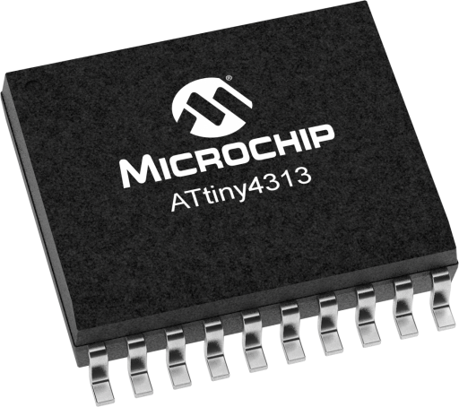

# Microchip ATtiny4313-SU Microcontroller

## Details

- **Location**: Cabinet-6, Bin 1, Container G
- **Category**: Microcontrollers
- **Brand**: Microchip Technology
- **Part Number**: ATTINY4313-SU
- **Model**: ATtiny4313
- **Package**: SOIC-20 (20-pin Surface Mount)
- **Quantity**: 10 units
- **Status**: Available
- **Price Range**: $0.85-1.20 per unit
- **Datasheet**: [ATtiny2313A/4313 Datasheet](https://ww1.microchip.com/downloads/aemDocuments/documents/OTH/ProductDocuments/DataSheets/8246S.pdf)
- **Product URL**: [Microchip - ATtiny4313](https://www.microchip.com/en-us/product/attiny4313)

## Description

The Microchip ATtiny4313-SU is a low-power 8-bit AVR RISC microcontroller featuring 4KB of in-system programmable Flash memory, 256 bytes of SRAM, and 256 bytes of EEPROM. With a maximum clock speed of 20MHz and support for multiple communication interfaces (UART, SPI, I2C), the ATtiny4313 is ideal for embedded control applications, sensor interfaces, and IoT devices. The 20-pin SOIC package provides a compact form factor suitable for space-constrained designs.

## Specifications

### Memory

- **Flash Program Memory**: 4 KB (4096 bytes)
- **SRAM Data Memory**: 256 bytes
- **EEPROM Data Memory**: 256 bytes
- **Write/Erase Cycles**: 10,000 cycles (Flash), 100,000 cycles (EEPROM)

### Performance

- **Architecture**: 8-bit AVR RISC
- **Maximum Clock Speed**: 20 MHz
- **Instruction Execution**: Single-cycle execution (most instructions)
- **Performance**: Up to 20 MIPS at 20 MHz

### Electrical Characteristics

- **Operating Voltage**: 1.8V to 5.5V
- **Active Current**: 5 mA (typical at 20 MHz, 5V)
- **Idle Current**: 20 µA (typical)
- **Power-Down Current**: 1 µA (typical)
- **Operating Temperature**: -40°C to +85°C
- **Storage Temperature**: -65°C to +150°C

### Peripherals

- **UART**: 1x Full-duplex UART (USART)
- **SPI**: 1x Serial Peripheral Interface
- **I2C**: 1x Two-Wire Serial Interface (TWI)
- **Timers**: 2x 8-bit, 1x 16-bit
- **Analog Comparator**: 1x
- **ADC**: None (digital I/O only)
- **GPIO**: 18 programmable I/O pins

### Mechanical Characteristics

- **Package**: SOIC-20 (20-pin Surface Mount)
- **Pin Count**: 20 pins
- **Mounting**: Surface Mount
- **RoHS Compliant**: Yes

## Image



## Pin Configuration

Standard SOIC-20 pinout:

```
Pin 1:  PA0 (GPIO)
Pin 2:  PA1 (GPIO)
Pin 3:  PA2 (GPIO)
Pin 4:  PD0 (RXD/GPIO)
Pin 5:  PD1 (TXD/GPIO)
Pin 6:  PD2 (GPIO)
Pin 7:  PD3 (GPIO)
Pin 8:  PD4 (GPIO)
Pin 9:  PD5 (GPIO)
Pin 10: GND
Pin 11: PD6 (GPIO)
Pin 12: PB0 (GPIO)
Pin 13: PB1 (GPIO)
Pin 14: PB2 (GPIO)
Pin 15: PB3 (GPIO)
Pin 16: PB4 (GPIO)
Pin 17: PB5 (GPIO)
Pin 18: PB6 (GPIO)
Pin 19: PB7 (GPIO)
Pin 20: VCC (+1.8V to +5.5V)
```

## Applications

- Embedded control systems
- Sensor interfaces and data acquisition
- IoT and wireless devices
- Motor control
- LED drivers and lighting control
- UART/SPI/I2C communication interfaces
- Timer and counter applications
- Low-power battery-operated devices
- Prototyping and hobbyist projects

## Key Features

- **Low Power**: Ideal for battery-powered applications
- **Wide Voltage Range**: 1.8V to 5.5V operation
- **Multiple Interfaces**: UART, SPI, I2C support
- **In-System Programming**: ISP capability for field updates
- **debugWIRE Support**: On-chip debugging capability
- **Compact Package**: SOIC-20 for space-constrained designs
- **Cost-Effective**: Affordable microcontroller solution
- **Arduino Compatible**: Supported by Arduino IDE with ATtinyCore

## Programming

### ISP Programming

Connect ISP programmer to standard 6-pin ISP header:

- MOSI, MISO, SCK, VCC, GND, RESET

### debugWIRE Debugging

Single-wire debugging interface for real-time debugging and monitoring.

### Arduino IDE Support

Use ATtinyCore library for Arduino IDE programming:

- Board: ATtiny4313
- Clock: 20 MHz (internal or external)
- Programmer: USBtinyISP or similar

## Technical Notes

- SOIC-20 package requires SMD soldering or breakout board
- Supports both internal and external clock sources
- Brown-out detection available
- Watchdog timer for system reliability
- Multiple power-saving modes for low-power applications
- Can be programmed via ISP or debugWIRE interface
- Excellent for learning AVR microcontroller programming

## Software Support

- **Arduino IDE**: Full support via ATtinyCore library
- **AVR-GCC**: Native C/C++ compiler support
- **Atmel Studio**: Official IDE from Microchip
- **MicroPython**: Limited support via custom builds
- **Assembly**: Direct assembly language programming

## Tags

microcontroller, avr, attiny, 8-bit, 4kb-flash, 20mhz, soic-20, microchip, cabinet-6, bin-1, status-available

## Notes

Excellent general-purpose microcontrollers for embedded applications. The ATtiny4313 offers a good balance of features, performance, and cost. Stock of 10 units provides good supply for multiple projects. These chips are widely used in hobby electronics, IoT devices, and embedded systems. The SOIC-20 package is suitable for both prototyping (with breakout boards) and production designs.
