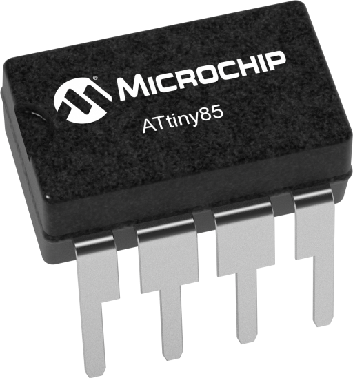

## Details

The ATtiny85 is a high-performance, low-power 8-bit microcontroller based on the AVR RISC architecture. It's one of the most popular tiny microcontrollers for hobbyist and professional projects due to its small size, low cost, and rich feature set.

## Description

The Microchip ATtiny85 is an 8-bit RISC microcontroller featuring 8KB of In-System Programmable Flash memory, 512 bytes of SRAM, and 512 bytes of EEPROM. It operates at up to 20MHz and can be powered from 1.8V to 5.5V, making it suitable for battery-powered applications.

## Specifications

- **Processor**: 8-bit AVR RISC
- **Flash Memory**: 8KB
- **SRAM**: 512 bytes
- **EEPROM**: 512 bytes
- **Clock Speed**: Up to 20MHz
- **Supply Voltage**: 1.8V to 5.5V
- **Operating Current**: 5mA (typical active), 20µA (idle)
- **Package**: SOIC-8 (8-pin Surface Mount)
- **Pin Count**: 8 pins
- **Interfaces**: 
  - 6 GPIO pins (Port B)
  - SPI (Serial Peripheral Interface)
  - I2C/TWI (Two-Wire Interface)
  - UART (via GPIO)
  - Analog Comparator
  - 4-channel 10-bit ADC
- **Timers**: 
  - 8-bit Timer/Counter (with PWM)
  - 16-bit Timer/Counter (with PWM)
- **Operating Temperature**: -40°C to +85°C
- **RoHS Compliant**: Yes

## Image



## Pin Configuration

Standard SOIC-8 pinout:
```
Pin 1: PB5 (GPIO/Reset)
Pin 2: PB3 (GPIO/Analog Input)
Pin 3: PB4 (GPIO/Analog Input)
Pin 4: GND
Pin 5: PB0 (GPIO/SPI MOSI/PWM)
Pin 6: PB1 (GPIO/SPI MISO/PWM)
Pin 7: PB2 (GPIO/SPI SCK/Analog Input)
Pin 8: VCC (+1.8V to +5.5V)
```

## Applications

- Arduino-compatible microcontroller boards (DigiSpark, Trinket)
- LED controllers and blinkers
- Sensor interfaces
- PWM motor control
- I2C/SPI device communication
- Battery-powered IoT devices
- Wearable electronics
- Simple automation projects

## Technical Notes

- The ATtiny85 is widely supported by the Arduino IDE with the ATtinyCore library
- Popular in maker projects due to low cost and small form factor
- Can be programmed via ISP (In-System Programming) or UPDI interface
- Excellent for learning microcontroller programming
- Limited I/O compared to larger AVR chips, but sufficient for many applications

## Tags

ATtiny85, microcontroller, AVR, 8-bit, 8KB Flash, 20MHz, SOIC-8, Microchip, embedded systems, Arduino-compatible

