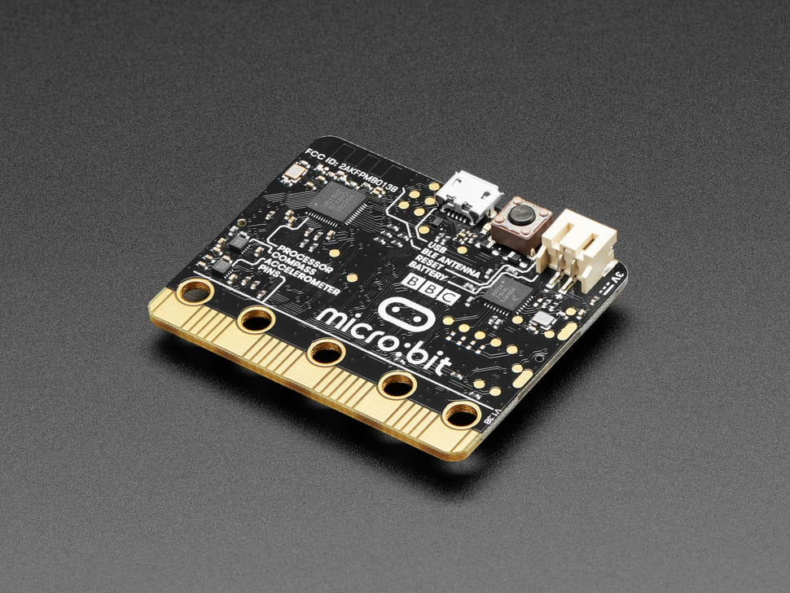

# BBC micro:bit

## Details

- **Location**: Cabinet-1, Bin 28
- **Category**: Microcontroller Boards
- **Type**: Educational Development Board
- **Microcontroller**: Nordic nRF51822
- **Brand**: BBC
- **Part Number**: 3530 (Adafruit)
- **Quantity**: 1
- **Product URL**: https://www.adafruit.com/product/3530

## Description

Pocket-sized programmable computer designed specifically for education and beginners. Created by the BBC for teaching programming and electronics to children and newcomers. Features built-in sensors, LED display, and Bluetooth connectivity in a user-friendly package. Perfect introduction to coding, electronics, and physical computing.

## Specifications

- **Part Number**: 3530 (Adafruit distribution)
- **Microcontroller**: Nordic nRF51822
- **Architecture**: 32-bit ARM Cortex-M0
- **Clock Speed**: 16MHz
- **Operating Voltage**: 3.3V
- **Power Input**: 3V (2×AAA batteries) or 5V (USB/external)
- **Dimensions**: 52.0mm × 42.1mm × 11.0mm
- **Weight**: 9.0g
- **Temperature Range**: -25°C to +75°C

## Image

## Features

- **5×5 LED Matrix**: 25 programmable red LEDs for display
- **Built-in Sensors**: Accelerometer, magnetometer, temperature sensor
- **User Interface**: 2 programmable buttons (A and B)
- **Bluetooth LE**: Wireless communication and app connectivity
- **Edge Connector**: 25 pins for external connections
- **USB Interface**: Programming and power via micro-USB
- **Beginner Friendly**: Designed for educational use

## Built-in Components

- **LED Display**: 5×5 matrix of red LEDs
- **Accelerometer**: 3-axis motion detection
- **Magnetometer**: Digital compass functionality
- **Temperature Sensor**: Built-in temperature measurement
- **Buttons**: 2 user-programmable buttons (A and B)
- **Reset Button**: System reset functionality
- **Power LED**: Indicates power status

## Connectivity & I/O

- **Edge Connector**: 25 pins total
  - 5 large pins for alligator clips (0, 1, 2, 3V, GND)
  - 20 additional pins for advanced connections
- **GPIO**: 19 general purpose I/O pins
- **Analog Inputs**: 6 pins with ADC capability
- **PWM**: Multiple pins support PWM output
- **Communication**: I2C, SPI, UART protocols supported

## Programming Options

- **MakeCode**: Visual block-based programming (recommended for beginners)
- **MicroPython**: Text-based Python programming
- **JavaScript**: Text-based JavaScript programming
- **C/C++**: Advanced programming with mbed
- **Scratch**: Visual programming environment

## Sensors & Capabilities

- **Motion Detection**: 3-axis accelerometer for tilt and shake detection
- **Compass**: Digital magnetometer for direction sensing
- **Temperature**: Built-in temperature sensor
- **Light Sensing**: LED matrix can detect ambient light levels
- **Touch Sensing**: Logo and pins can detect touch

## Power Options

- **USB Power**: 5V via micro-USB connector
- **Battery Pack**: 3V via 2×AAA battery pack (not included)
- **External Power**: 3V via edge connector pins
- **Power Management**: Automatic switching between power sources

## Educational Features

- **Curriculum Aligned**: Designed for UK computing curriculum
- **Age Appropriate**: Suitable for ages 7 and up
- **Cross-Curricular**: Integrates with math, science, art, music
- **Progression Path**: From blocks to text-based programming
- **Community**: Large educational community and resources

## Programming Environment

- **Web-Based**: No software installation required
- **Offline Options**: Downloadable editors available
- **Simulator**: Test code without hardware
- **Easy Upload**: Drag-and-drop programming
- **Multi-Platform**: Works on Windows, Mac, Linux, tablets

## Applications

- **Education**: Primary and secondary school computing lessons
- **STEM Projects**: Science, technology, engineering, math activities
- **Art Projects**: Interactive art and creative coding
- **Games**: Simple games using buttons and display
- **Wearables**: LED badges and interactive clothing
- **Home Automation**: Simple IoT projects
- **Robotics**: Control motors and sensors

## Advantages

- **Beginner Friendly**: Designed specifically for newcomers
- **No Setup Required**: Works immediately out of the box
- **Visual Programming**: Block-based coding reduces syntax errors
- **Built-in Everything**: Sensors and display included
- **Affordable**: Low cost for educational institutions
- **Robust**: Designed to withstand classroom use
- **Extensive Resources**: Tutorials, lessons, and projects available

## Ecosystem

- **Accessories**: Wide range of compatible add-ons
- **Breakout Boards**: Easy connection options
- **Cases**: Protective enclosures available
- **Expansion**: Compatible with various sensors and actuators
- **Community**: Active maker and educator community

## Kit Contents

- BBC micro:bit board
- Quick start guide
- Packaging with getting started information

## Additional Requirements

- **USB Cable**: Micro-USB cable for programming and power
- **Battery Pack**: 2×AAA battery holder for portable operation
- **Computer**: Any device with web browser for programming

## Notes

- **Version 1**: This is the original micro:bit (Version 2 now available)
- **No Longer Stocked**: Adafruit no longer carries this version
- **Upgrade Available**: micro:bit V2 has improved features
- **Educational Focus**: Designed primarily for learning, not production
- **Limited I/O**: Fewer pins compared to other development boards
- **Community Support**: Extensive educational resources and community

## Legacy Status

- Original micro:bit design from 2016
- Superseded by micro:bit V2 with additional features
- Still fully supported by programming environments
- Large installed base in educational institutions
- Compatible with most micro:bit accessories and resources
