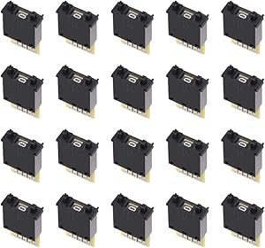

# BCD Mechanical Numeric Selector Switches Collection

## Details

- **Location**: Cabinet 4, Bin 13
- **Category**: Switches
- **Brand**: Various (uxcell, vintage manufacturers)
- **Part Number**: BCD-NUMERIC-COLLECTION
- **Package**: Various configurations
- **Quantity**: Various types and quantities
- **Status**: Available
- **Price Range**: $0.75 - $15.00 (depending on type and vintage)
- **Product URL**: https://a.co/d/esA48em (example modern type)

## Description

Comprehensive collection of BCD (Binary Coded Decimal) mechanical numeric selector switches spanning both vintage and modern designs. These switches provide reliable mechanical input for digital systems, converting decimal digit selection (0-9) into 4-bit BCD output codes. Collection includes thumbwheel DIP switches, panel-mount rotary selectors, and various vintage industrial types.

## Image



## Specifications

### Switch Types in Collection

- **Thumbwheel DIP Switches**: Modern uxcell KM2 type (30x18x8mm)
- **Panel Mount Rotary**: Vintage industrial rotary selectors
- **Slide Type**: Linear slide numeric selectors
- **Miniature Types**: Compact PCB-mount versions
- **Industrial Grade**: Heavy-duty panel mount switches

### Electrical Characteristics

- **Output Format**: 4-bit BCD (Binary Coded Decimal)
- **Logic Levels**: TTL/CMOS compatible
- **Contact Rating**: Typically 50mA @ 24VDC (varies by type)
- **Contact Resistance**: <50mΩ typical
- **Insulation Resistance**: >100MΩ @ 500VDC

### Mechanical Specifications

- **Operating Force**: Varies by type (typically 2-10N)
- **Mechanical Life**: 10,000+ operations (vintage), 50,000+ (modern)
- **Detent Positions**: 10 positions (0-9)
- **Operating Temperature**: -20°C to +70°C typical
- **Mounting**: DIP, panel mount, PCB mount variants

## Pinout/Connection Information

### Standard BCD Output (4-bit)

```
Decimal | BCD Output (D C B A)
   0    |    0 0 0 0
   1    |    0 0 0 1
   2    |    0 0 1 0
   3    |    0 0 1 1
   4    |    0 1 0 0
   5    |    0 1 0 1
   6    |    0 1 1 0
   7    |    0 1 1 1
   8    |    1 0 0 0
   9    |    1 0 0 1
```

### Typical Pin Configuration (DIP Type)

- **Pin 1**: BCD Bit A (LSB)
- **Pin 2**: BCD Bit B
- **Pin 3**: BCD Bit C
- **Pin 4**: BCD Bit D (MSB)
- **Pin 5**: Common (typically ground)
- **Additional pins**: May include complementary outputs

### Connection Diagram

```
Switch Output    Microcontroller
BCD A (LSB) -->  Digital Input Pin
BCD B       -->  Digital Input Pin
BCD C       -->  Digital Input Pin
BCD D (MSB) -->  Digital Input Pin
Common      -->  Ground
```

## Circuit Integration Notes

### Microcontroller Interface

- **Pull-up Resistors**: Use 10kΩ pull-ups for open-collector outputs
- **Input Protection**: Consider input protection for vintage switches
- **Debouncing**: Mechanical switches may require software debouncing
- **Logic Levels**: Verify compatibility with 3.3V or 5V systems

### Digital Logic Applications

- **BCD Counters**: Direct interface with 74HC4017, CD4017
- **Display Drivers**: Connect to BCD-to-7-segment decoders
- **Microprocessor Input**: Parallel input ports for data entry
- **Control Systems**: Set point entry for industrial controls

### Vintage Switch Considerations

- **Contact Cleaning**: May require contact cleaner for reliable operation
- **Voltage Ratings**: Verify voltage compatibility with modern circuits
- **Mounting**: May require custom mounting solutions
- **Documentation**: Original datasheets may be unavailable

## Technical Specifications

### BCD Encoding Standards

- **Standard BCD**: Natural binary representation of decimal digits
- **Excess-3 Code**: Some vintage switches may use excess-3 encoding
- **Gray Code**: Rare variants may use Gray code progression
- **Complement Outputs**: Some switches provide both true and complement outputs

### Contact Types

- **Make-Before-Break**: Ensures continuous connection during switching
- **Break-Before-Make**: Prevents momentary shorts during switching
- **Wiping Contacts**: Self-cleaning action during operation
- **Gold Plating**: Low-level signal compatibility (modern types)

### Environmental Specifications

- **Humidity**: 85% RH max (non-condensing)
- **Vibration**: Varies by construction (industrial types more robust)
- **Shock**: Mechanical shock resistance varies by mounting
- **Sealing**: Panel mount types may have IP ratings

## Applications

### Digital Input Systems

- **Data Entry**: Manual numeric input for embedded systems
- **Set Point Control**: Process control parameter setting
- **Address Selection**: Memory or device address selection
- **Channel Selection**: Multi-channel system input selection

### Vintage Computing

- **Front Panel Controls**: Minicomputer and mainframe front panels
- **Test Equipment**: Vintage oscilloscope and instrument controls
- **Calculator Input**: Early electronic calculator digit entry
- **Programming Switches**: Machine code entry switches

### Modern Applications

- **Prototype Development**: Quick numeric input for testing
- **Educational Projects**: Teaching BCD and digital concepts
- **Retro Computing**: Restoration of vintage computer systems
- **Industrial Controls**: Robust numeric input in harsh environments

## Troubleshooting

### Common Issues

1. **Intermittent Contacts**: Clean with contact cleaner or replace
2. **Incorrect BCD Output**: Verify pinout and encoding type
3. **Mechanical Binding**: Lubricate or replace worn mechanisms
4. **Logic Level Issues**: Check voltage compatibility and pull-ups

### Maintenance Procedures

- **Contact Cleaning**: Use appropriate contact cleaner for switch type
- **Mechanical Lubrication**: Light machine oil for moving parts
- **Mounting Check**: Ensure secure mounting to prevent mechanical stress
- **Electrical Testing**: Verify continuity and resistance values

### Testing Procedures

1. **Continuity Test**: Check each BCD output for proper switching
2. **Logic Level Test**: Verify output voltage levels
3. **Mechanical Test**: Check smooth operation through all positions
4. **Encoding Verification**: Confirm BCD output matches position

## Compatibility Notes

### Modern System Integration

- **Voltage Levels**: Most compatible with 5V systems, may need level shifting for 3.3V
- **Current Drive**: Low current switching suitable for CMOS inputs
- **Timing**: No timing constraints for static switching applications
- **Isolation**: Consider optical isolation for noisy environments

### Vintage System Restoration

- **Original Specifications**: Research original equipment requirements
- **Replacement Parts**: Modern equivalents may have different characteristics
- **Mounting Compatibility**: Verify mechanical fit with original equipment
- **Electrical Compatibility**: Check voltage and current ratings

## Notes

This collection represents a valuable resource for both vintage computer restoration and modern digital projects. The variety of switch types provides options for different applications, from precision laboratory instruments to rugged industrial controls.

**Vintage Value**: Many of the vintage switches in this collection are no longer manufactured and represent important historical artifacts of early digital technology. They provide authentic restoration options for vintage computing equipment.

**Modern Applications**: Contemporary BCD switches like the uxcell types offer reliable, cost-effective solutions for modern projects requiring manual numeric input.

**Educational Use**: The collection serves as an excellent teaching tool for understanding BCD encoding, mechanical switch operation, and the evolution of digital input devices.

## Related Components

- [[digital-logic-ics]] - BCD decoders and related logic circuits
- [[vintage-computing-parts]] - Other vintage computer restoration components
- [[mechanical-switches]] - Other types of mechanical switching devices
- [[display-drivers]] - BCD-to-7-segment and other display interfaces
