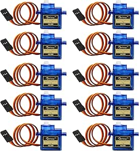

# Beffkkip SG90 9g Micro Servos

## Details

- **Location**: Cabinet 4, Bin 19
- **Category**: Servo Motors
- **Brand**: Beffkkip
- **Part Number**: SG90-9G
- **Package**: Various pack sizes
- **Quantity**: ~8 servos
- **Status**: Available
- **Price Range**: $7.99 (4pcs) - $18.99 (10pcs)
- **Product URL**: https://a.co/d/c0fgu7o

## Description

High-quality Beffkkip SG90 9g micro servo motors, ideal for RC aircraft, robotics projects, and Arduino applications. These compact servos provide reliable positioning control with 180-degree rotation range and are compatible with standard PWM control signals. Perfect for hobbyist and educational projects requiring precise angular positioning.

## Image



## Specifications

### Servo Characteristics
- **Model**: SG90 (industry standard)
- **Weight**: 9 grams
- **Dimensions**: 23 x 12.2 x 29mm
- **Gear Type**: Plastic gears
- **Rotation Range**: 180 degrees (±90 degrees)
- **Operating Speed**: 0.1 sec/60° (4.8V no load), 0.08 sec/60° (6V)

### Electrical Specifications
- **Operating Voltage**: 4.8V - 6.0V DC
- **Current Draw**: 100mA (no load), 220mA (stall)
- **Control Signal**: PWM (Pulse Width Modulation)
- **Pulse Width**: 1ms-2ms (20ms period)
- **Neutral Position**: 1.5ms pulse width
- **Dead Band**: 7μs

### Mechanical Properties
- **Torque**: 1.8 kg⋅cm (4.8V), 2.2 kg⋅cm (6V)
- **Gear Ratio**: Approximately 1:270
- **Bearing Type**: Plastic bushings
- **Output Shaft**: 20-tooth spline
- **Temperature Range**: 0°C to 55°C

## Pinout/Connection Information

### Wire Configuration
- **Red Wire**: VCC (Power) - Connect to 4.8V-6V
- **Brown/Black Wire**: Ground - Connect to system ground
- **Orange/Yellow Wire**: Signal - Connect to PWM output pin

### PWM Control Signals
```
Position Control:
0° (Full CCW)    = 1.0ms pulse width
90° (Center)     = 1.5ms pulse width  
180° (Full CW)   = 2.0ms pulse width

Pulse Period: 20ms (50Hz)
Voltage Levels: 0V (Low), 3.3V/5V (High)
```

### Arduino Connection Example
```
Servo Pin    Arduino Pin
VCC     -->  5V
GND     -->  GND
Signal  -->  Digital Pin (e.g., Pin 9)
```

## Applications

### RC Aircraft
- **Control Surfaces**: Primary and secondary flight controls
- **Landing Gear**: Retractable gear mechanisms
- **Payload Doors**: Bomb bay doors, camera covers
- **Throttle Control**: Engine throttle linkages

### Robotics Projects
- **Joint Actuation**: Robot arm and leg joints
- **Gripper Control**: End-effector positioning
- **Sensor Positioning**: Pan/tilt sensor mounts
- **Walking Mechanisms**: Bipedal and quadrupedal robots

### Arduino Projects
- **Automated Systems**: Door locks, window openers
- **Camera Systems**: Security camera positioning
- **Educational Projects**: STEM learning platforms
- **Art Installations**: Kinetic art and sculptures

## Notes

The SG90 servo is an industry-standard micro servo that offers excellent value for hobbyist applications. While the plastic gears limit heavy-duty use, they provide adequate performance for most RC aircraft and robotics projects.

**Quality Considerations**: Beffkkip servos offer good quality at competitive prices. The plastic gear train is suitable for light to moderate loads but may wear under continuous heavy use.

**Power Management**: When using multiple servos, consider the total current draw and use an appropriate power supply. The 220mA stall current can add up quickly with multiple servos.

## Related Components

- [[mg995-55g-metal-gear-servos]] - Larger servos in same bin
- [[arduino-microcontrollers]] - Compatible control platforms
- [[servo-accessories]] - Servo arms, linkages, and mounting hardware
