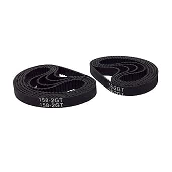

# BEMONOC 2GT Timing Belt Closed Loop Collection (Various Sizes)

## Details

- **Location**: Cabinet 4, Bins 15 & 16
- **Category**: Mechanical Components
- **Brand**: BEMONOC
- **Part Number**: 2GT-LOOPS-VARIOUS
- **Package**: Various closed-loop sizes
- **Quantity**: Various sizes distributed across two bins
- **Status**: Available
- **Price Range**: $9.99 - $15.99 per pack
- **Product URL**: https://a.co/d/ipoWjoy

## Description

Comprehensive collection of 2GT closed-loop timing belts in various lengths, designed for precision motion control in 3D printers, CNC machines, and automated systems. These pre-formed loops eliminate the need for belt joining and provide consistent, reliable power transmission with minimal backlash. Made from high-quality rubber with fiberglass reinforcement for durability and precise positioning.

## Image



## Specifications

### Belt Characteristics
- **Type**: 2GT (Gates Tooth Profile 2) closed loops
- **Pitch**: 2mm (center-to-center tooth spacing)
- **Width**: 6mm standard
- **Material**: Neoprene rubber with fiberglass core
- **Color**: Black
- **Profile**: Rounded tooth profile for smooth engagement

### Common Loop Sizes Available
- **110mm**: 55 teeth, small printer applications
- **112mm**: 56 teeth, compact mechanisms
- **122mm**: 61 teeth, medium-sized printers
- **158mm**: 79 teeth, standard printer size (example product)
- **200mm**: 100 teeth, larger format printers
- **280mm**: 140 teeth, extended travel applications
- **300mm**: 150 teeth, large format systems
- **400mm**: 200 teeth, industrial applications

### Mechanical Properties
- **Tensile Strength**: High-strength fiberglass reinforcement
- **Flexibility**: Excellent flexibility for small pulley diameters
- **Backlash**: Minimal backlash for precise positioning
- **Temperature Range**: -30°C to +80°C operating temperature
- **Durability**: Long service life under normal operating conditions

## Pinout/Connection Information

### Pulley Compatibility
- **GT2 Pulleys**: Designed specifically for 2GT/GT2 timing pulleys
- **Tooth Count**: Compatible with 16T, 20T, 36T, 60T GT2 pulleys
- **Bore Sizes**: Works with 3mm, 5mm, 8mm standard bore pulleys
- **Flange Types**: Compatible with flanged and non-flanged pulleys

### Installation Guidelines
```
Closed Loop Installation:
1. Select appropriate loop size for pulley spacing
2. Install over drive and driven pulleys
3. Ensure proper tension (moderate, not excessive)
4. Check pulley alignment for even belt tracking
5. Verify smooth operation through full rotation
6. No belt joining required - pre-formed loops
```

### Sizing Calculation
```
Belt Length = (Pulley Spacing × 2) + (Pulley Circumferences)
Example: For 20T pulleys spaced 50mm apart:
- Pulley circumference: 20T × 2mm = 40mm
- Required length: (50 × 2) + 40 = 140mm
- Select nearest available size (e.g., 158mm)
```

## Circuit Integration Notes

### 3D Printer Applications
- **X/Y Axis Drive**: Primary motion control for print head positioning
- **CoreXY Systems**: Dual belt configuration for X/Y movement
- **Extruder Drive**: Some extruder mechanisms use small loops
- **Z-Axis**: Belt-driven Z-axis systems in some printer designs

### CNC Machine Integration
- **Linear Motion**: Precise linear positioning for cutting operations
- **Multi-Axis Systems**: Coordinate multiple axes with different loop sizes
- **Tool Changers**: Automated tool changing mechanisms
- **Workpiece Handling**: Automated part positioning systems

### Automation Applications
- **Conveyor Systems**: Small-scale material handling
- **Robotic Systems**: Joint actuation and positioning mechanisms
- **Packaging Equipment**: Automated packaging and sorting systems
- **Pick and Place**: Component placement systems

## Technical Specifications

### Performance Parameters
- **Maximum Speed**: Suitable for high-speed applications
- **Load Capacity**: Moderate load carrying capability per belt width
- **Positioning Accuracy**: High precision with minimal backlash
- **Repeatability**: Consistent performance over many cycles
- **Noise Level**: Quiet operation compared to chain drives

### Environmental Specifications
- **Operating Temperature**: -30°C to +80°C
- **Storage Temperature**: -40°C to +85°C
- **Humidity**: Resistant to moderate humidity levels
- **Chemical Resistance**: Good resistance to oils and greases
- **UV Resistance**: Limited UV resistance (indoor use recommended)

### Dimensional Tolerances
- **Pitch Accuracy**: ±0.02mm pitch tolerance
- **Width Tolerance**: ±0.1mm width tolerance
- **Length Tolerance**: ±0.5mm loop length tolerance
- **Tooth Profile**: Consistent GT2 profile across all sizes

## Applications

### 3D Printing
- **FDM Printers**: X/Y axis motion control in Cartesian printers
- **CoreXY Printers**: Dual belt systems for improved speed and accuracy
- **Delta Printers**: Radial motion control in some delta configurations
- **Specialty Printers**: Custom printer designs requiring specific loop sizes

### CNC Machining
- **CNC Routers**: X/Y axis drive for routing operations
- **Laser Cutters**: Precise positioning for cutting and engraving
- **Plasma Cutters**: Motion control for automated cutting systems
- **Engraving Machines**: Fine positioning for detailed work

### Automation Systems
- **Linear Actuators**: Converting rotary to linear motion
- **Indexing Systems**: Precise positioning for manufacturing
- **Sorting Systems**: Automated sorting and distribution
- **Assembly Lines**: Component positioning and transport

## Troubleshooting

### Common Issues
1. **Belt Slipping**: Check tension and pulley condition
2. **Tooth Jumping**: Verify proper pulley alignment and belt tension
3. **Premature Wear**: Check for over-tensioning or contamination
4. **Incorrect Sizing**: Verify loop length matches pulley spacing

### Maintenance Procedures
- **Regular Inspection**: Check for wear, cracks, or damage
- **Tension Monitoring**: Maintain proper belt tension without over-tightening
- **Cleaning**: Keep belts and pulleys clean of debris
- **Replacement**: Replace when wear becomes excessive

### Sizing Guidelines
- **Proper Fit**: Belt should have moderate tension, not loose or overly tight
- **Pulley Spacing**: Calculate required length before selecting belt
- **Tolerance**: Allow for slight variations in pulley positioning
- **Multiple Sizes**: Keep various sizes for different applications

## Compatibility Notes

### 3D Printer Compatibility
- **Prusa i3**: Compatible with MK2, MK3 series printers
- **Ender Series**: Suitable for Ender 3, Ender 5 modifications
- **CoreXY Designs**: Ideal for CoreXY and H-Bot configurations
- **Custom Builds**: Adaptable to various custom printer designs

### CNC Machine Compatibility
- **Hobby CNC**: Suitable for small to medium hobby machines
- **Router Tables**: Compatible with CNC router applications
- **Laser Engravers**: Appropriate for CO2 and diode laser systems
- **Engraving Systems**: Fine positioning applications

### Pulley Systems
- **Standard GT2**: Compatible with all standard GT2/2GT pulleys
- **Bore Sizes**: Works with 3mm, 5mm, 8mm bore pulleys
- **Tooth Counts**: Suitable for 16T to 60T pulley configurations
- **Materials**: Compatible with aluminum, steel, and plastic pulleys

## Notes

This collection of closed-loop timing belts provides excellent convenience for projects requiring specific belt lengths. The pre-formed loops eliminate belt joining issues and provide consistent performance across different applications.

**Inventory Organization**: Having various sizes distributed across bins 15 and 16 allows for easy selection of appropriate belt lengths for different projects. Consider organizing by size ranges for efficient access.

**Quality Considerations**: BEMONOC belts offer good quality at competitive prices, suitable for hobbyist and semi-professional applications. The fiberglass reinforcement provides durability while maintaining the flexibility needed for small pulley applications.

**Application Note**: Closed loops are particularly valuable for applications where belt replacement needs to be quick and reliable, such as in production environments or frequently serviced equipment.

## Related Components

- [[scstyle-gt2-timing-belt-5m]] - Open-ended timing belt for custom lengths
- [[gt2-timing-pulleys]] - Compatible timing pulleys
- [[3d-printer-parts]] - Related 3D printer components
- [[cnc-machine-parts]] - CNC machine motion control components
