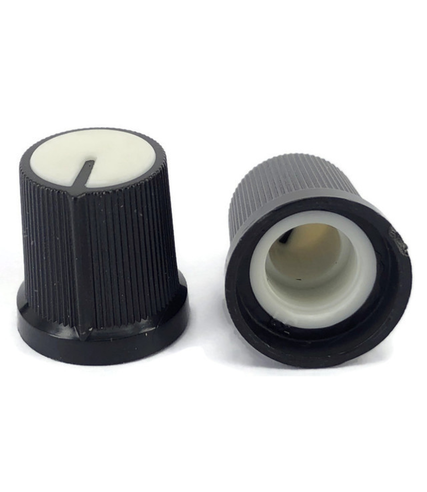

# Black Knob White Top 15x15mm Shaft Diameter 6.00mm Split Shaft

## Overview

Standard black plastic knob with white top indicator designed for 6mm split shaft potentiometers and rotary controls. The 15x15mm size provides good grip and control precision, while the white top indicator makes it easy to see the current position. Commonly used in audio equipment, control panels, and electronic projects requiring user-adjustable parameters.

## Location

**Cabinet-5, Bin 6, Section A** - Control Knobs

## Images



## Specifications

### Physical Specifications
- **Body Size**: 15x15mm (diameter x height)
- **Body Color**: Black plastic
- **Top Indicator**: White plastic top with position indicator
- **Shaft Type**: Split shaft (slotted)
- **Shaft Diameter**: 6.00mm
- **Mounting**: Friction fit on split shaft
- **Grip**: Knurled or textured sides for easy gripping

### Mechanical Specifications
- **Material**: ABS or similar plastic construction
- **Shaft Fit**: Split shaft design for secure mounting
- **Rotation**: 270° typical (depends on potentiometer)
- **Torque**: Low friction, smooth rotation
- **Temperature Range**: -20°C to +70°C (typical)
- **Durability**: 10,000+ rotation cycles

### Compatibility
- **Shaft Size**: 6mm split shaft potentiometers
- **Shaft Types**: D-shaft, split shaft, slotted shaft
- **Applications**: Linear and logarithmic potentiometers
- **Mounting**: Push-on friction fit

## Applications

### Audio Equipment
- **Volume Controls**: Main and channel volume adjustment
- **Tone Controls**: Bass, treble, and midrange adjustment
- **Balance Controls**: Left/right channel balance
- **Effects Controls**: Reverb, delay, and other effect parameters

### Control Panels
- **Industrial Controls**: Process parameter adjustment
- **Test Equipment**: Signal level and frequency controls
- **Power Supplies**: Voltage and current adjustment
- **Function Generators**: Frequency and amplitude controls

### DIY Electronics
- **Arduino Projects**: Analog input controls for sensors and parameters
- **Breadboard Prototyping**: Temporary control interfaces
- **Educational Projects**: Variable resistance demonstrations
- **Hobby Electronics**: Custom control interfaces

### Musical Equipment
- **Synthesizers**: Parameter control knobs
- **Guitar Amplifiers**: Gain, tone, and volume controls
- **Mixing Boards**: Channel level and EQ controls
- **Effects Pedals**: Parameter adjustment knobs

## Installation

### Mounting on Potentiometer
1. **Verify Shaft**: Ensure potentiometer has 6mm split shaft
2. **Align Knob**: Position knob with desired indicator direction
3. **Press Fit**: Push knob firmly onto shaft until seated
4. **Test Rotation**: Verify smooth operation and proper range
5. **Adjust Position**: Reposition if needed for proper indication

### Panel Integration
1. **Potentiometer Mounting**: Mount potentiometer through panel
2. **Shaft Length**: Ensure adequate shaft protrusion for knob
3. **Clearance**: Verify knob doesn't interfere with panel or other components
4. **Labeling**: Add labels near knob for function identification

### Removal and Replacement
1. **Gentle Removal**: Pull knob straight off shaft (may require firm grip)
2. **Avoid Damage**: Don't twist or rock knob during removal
3. **Replacement**: Clean shaft before installing new knob
4. **Proper Seating**: Ensure knob is fully seated on shaft

## Design Considerations

### Visual Indication
- **White Top**: Provides clear position indication against dark backgrounds
- **Contrast**: High contrast between black body and white indicator
- **Visibility**: Easy to see in various lighting conditions
- **Position Reference**: Clear indication of current setting

### Ergonomics
- **Size**: 15mm diameter provides good grip for most users
- **Height**: 15mm height allows comfortable finger operation
- **Texture**: Knurled or textured sides prevent slipping
- **Smooth Operation**: Low friction for easy adjustment

### Electrical Considerations
- **Insulation**: Plastic construction provides electrical isolation
- **No Electrical Contact**: Knob doesn't affect electrical characteristics
- **Shaft Connection**: Mechanical connection only
- **Grounding**: No electrical grounding required

## Circuit Integration

### Basic Potentiometer Circuit
```
VCC ----[Potentiometer]---- GND
              |
              +---- Signal Output
```

### Arduino Analog Input
```cpp
const int potPin = A0;
const int ledPin = 9;

void setup() {
  pinMode(potPin, INPUT);
  pinMode(ledPin, OUTPUT);
  Serial.begin(9600);
}

void loop() {
  int potValue = analogRead(potPin);
  int brightness = map(potValue, 0, 1023, 0, 255);
  
  analogWrite(ledPin, brightness);
  
  Serial.print("Pot Value: ");
  Serial.print(potValue);
  Serial.print(" - Brightness: ");
  Serial.println(brightness);
  
  delay(100);
}
```

### Volume Control Circuit
```
Audio Input ----[10kΩ Potentiometer]---- Audio Output
                        |
                       GND
```

## Troubleshooting

### Common Issues
- **Loose Fit**: Knob slips on shaft - check shaft size and knob condition
- **Difficult Removal**: Knob stuck on shaft - use gentle rocking motion
- **Poor Indication**: White top not visible - clean or replace knob
- **Rough Operation**: Scratchy feel - check potentiometer condition

### Maintenance
- **Cleaning**: Wipe with damp cloth, avoid harsh chemicals
- **Lubrication**: Not typically required for plastic knobs
- **Replacement**: Replace if cracked, worn, or loose fitting
- **Storage**: Keep in dry environment to prevent degradation

## Sourcing Information

### Supplier
- **Tayda Electronics**: Primary supplier
- **Part Number**: A0304
- **Price**: $0.37 per piece
- **URL**: https://www.taydaelectronics.com/black-knob-white-top-shaft-diameter-6-mm-split-shaft.html

### Alternative Sources
- **DigiKey**: Various manufacturers available
- **Mouser**: Multiple knob options
- **Amazon**: Knob assortment packs
- **AliExpress**: Low-cost alternatives

### Specifications to Match
- **6mm split shaft compatibility**
- **15mm diameter (approximate)**
- **Black body with white indicator**
- **Plastic construction**
- **Push-on mounting**

## Storage and Handling

### Storage Recommendations
- **Dry Environment**: Prevent moisture absorption
- **Temperature Control**: Avoid extreme temperatures
- **Organization**: Sort by shaft size and type
- **Protection**: Avoid crushing or deformation

### Handling Tips
- **Gentle Installation**: Don't force onto shaft
- **Proper Removal**: Pull straight, don't twist
- **Clean Handling**: Keep fingerprints off indicator surfaces
- **Inspection**: Check for cracks before installation

## Variants Available

### Shaft Sizes
- **6mm**: This variant (most common)
- **4mm**: Smaller shaft applications
- **8mm**: Larger shaft applications
- **1/4"**: Imperial shaft size

### Indicator Styles
- **White Top**: This variant (high contrast)
- **Colored Tops**: Red, blue, green indicators
- **Line Indicators**: Engraved or molded lines
- **Pointer Styles**: Arrow or dot indicators

### Body Sizes
- **15mm**: This variant (standard size)
- **20mm**: Larger grip size
- **12mm**: Compact applications
- **25mm**: Large control applications

## Tags

knobs, controls, hardware, mechanical, 6mm-shaft, split-shaft, black, white-top, potentiometer, audio, control-panel #cabinet-5 #status-available

## Notes

These black knobs with white top indicators are versatile control elements suitable for a wide range of electronic projects. The 6mm split shaft compatibility makes them ideal for standard potentiometers used in audio equipment and control panels. The white top indicator provides excellent visibility for position reference, making them particularly useful in applications where precise control settings are important. Store in Cabinet-5, Bin 6, Section A for easy access during project builds. The plastic construction provides good durability while maintaining electrical isolation from the control circuit.
