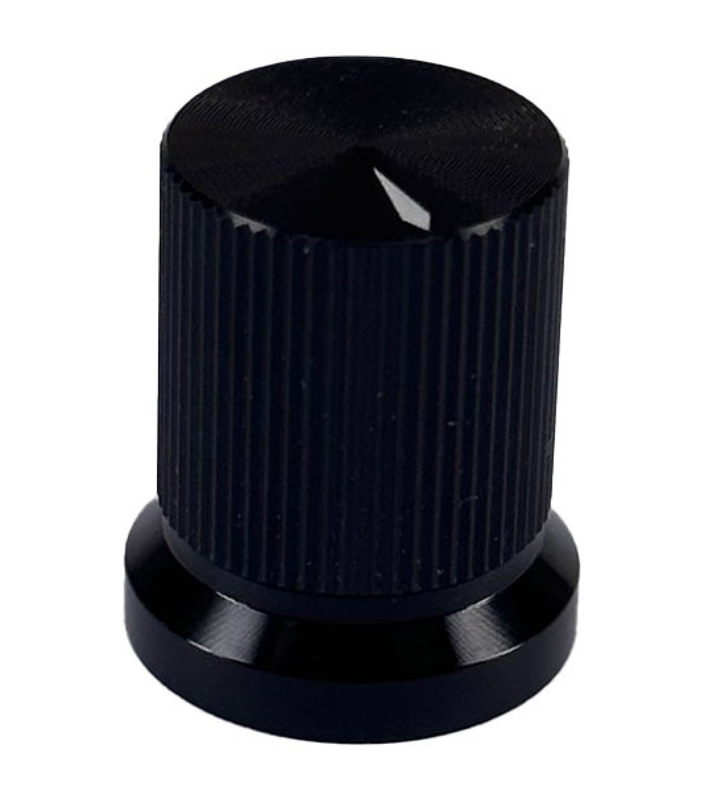

# Black Knurled Aluminum Knob 17x20mm Shaft Hole 6mm

## Overview

Professional-grade black anodized aluminum knob featuring a knurled grip surface for precise control applications. The 17x20mm dimensions provide excellent tactile feedback and control precision, while the durable aluminum construction ensures long-lasting performance in professional and industrial environments. The knurled surface offers superior grip even with wet or oily hands.

## Location

**Cabinet-5, Bin 7, Section B** - Professional Aluminum Knobs

## Images



## Specifications

### Physical Specifications
- **Body Size**: 17mm diameter x 20mm height
- **Material**: Aluminum alloy construction
- **Finish**: Black anodized coating
- **Surface**: Knurled grip pattern
- **Shaft Hole**: 6.00mm diameter
- **Mounting**: Set screw or friction fit
- **Weight**: Lightweight yet substantial feel

### Material Properties
- **Aluminum Grade**: 6061 or similar aluminum alloy
- **Anodizing**: Type II anodized finish
- **Hardness**: Hard anodized surface for durability
- **Corrosion Resistance**: Excellent resistance to oxidation
- **Thermal Properties**: Good heat dissipation
- **Electrical Properties**: Conductive (isolated by anodizing)

### Mechanical Specifications
- **Shaft Compatibility**: 6mm solid or split shaft
- **Knurling Pattern**: Diamond or straight knurl pattern
- **Grip Texture**: Aggressive knurling for secure grip
- **Temperature Range**: -40°C to +85°C
- **Durability**: 50,000+ rotation cycles
- **Torque Rating**: High torque handling capability

## Applications

### Professional Audio Equipment
- **Mixing Consoles**: Channel level and EQ controls
- **Audio Interfaces**: Input gain and monitoring controls
- **Studio Equipment**: Professional recording equipment controls
- **Live Sound**: Portable mixer and amplifier controls

### Test and Measurement Equipment
- **Oscilloscopes**: Timebase and voltage controls
- **Function Generators**: Frequency and amplitude adjustment
- **Power Supplies**: Voltage and current controls
- **Multimeters**: Range and function selection

### Industrial Controls
- **Process Control**: Parameter adjustment in industrial systems
- **Machine Controls**: Speed and position controls
- **Instrumentation**: Calibration and adjustment controls
- **Automation**: Manual override and setup controls

### Laboratory Equipment
- **Scientific Instruments**: Precision measurement controls
- **Research Equipment**: Parameter adjustment in experiments
- **Analytical Instruments**: Calibration and operation controls
- **Educational Equipment**: Training and demonstration systems

## Installation

### Shaft Preparation
1. **Verify Dimensions**: Confirm 6mm shaft diameter
2. **Clean Shaft**: Remove any debris, oil, or oxidation
3. **Inspect Condition**: Check for wear or damage
4. **Prepare Tools**: Gather appropriate hex keys for set screws

### Set Screw Installation
1. **Position Knob**: Place knob at desired position on shaft
2. **Locate Set Screw**: Find set screw access (usually on side)
3. **Align with Flat**: Position set screw over shaft flat if present
4. **Tighten Securely**: Use appropriate hex key to secure
5. **Test Fit**: Verify knob doesn't slip under normal torque

### Friction Fit Installation
1. **Check Tolerance**: Ensure proper shaft-to-hole fit
2. **Press On**: Push knob firmly onto shaft
3. **Verify Seating**: Ensure knob is fully seated
4. **Test Security**: Check that knob doesn't slip during use

### Panel Integration
1. **Mount Potentiometer**: Secure potentiometer in panel
2. **Check Clearance**: Ensure adequate space around knob
3. **Verify Operation**: Test full rotation range
4. **Professional Alignment**: Align multiple knobs for consistent appearance

## Design Considerations

### Professional Appearance
- **Black Anodized Finish**: Professional, non-reflective appearance
- **Consistent Color**: Uniform black finish across all knobs
- **Clean Lines**: Simple, functional design aesthetic
- **Size Consistency**: Standard dimensions for uniform panel appearance

### Functional Design
- **Knurled Grip**: Superior grip in all conditions
- **Optimal Size**: 17mm diameter provides good control leverage
- **Height**: 20mm height allows comfortable finger operation
- **Precision Feel**: Aluminum construction provides precise tactile feedback

### Durability Features
- **Anodized Coating**: Hard surface resists wear and corrosion
- **Aluminum Construction**: Lightweight yet durable
- **Chemical Resistance**: Resistant to most common chemicals
- **Temperature Stability**: Stable across wide temperature range

## Maintenance and Care

### Regular Maintenance
- **Cleaning**: Use mild detergent and soft cloth
- **Inspection**: Check for wear or damage regularly
- **Set Screw Check**: Verify set screw tightness periodically
- **Lubrication**: Generally not required for aluminum knobs

### Environmental Protection
- **Avoid Harsh Chemicals**: Strong acids or bases may damage anodizing
- **Prevent Scratching**: Use soft cloths for cleaning
- **Corrosion Prevention**: Keep dry in humid environments
- **Temperature Cycling**: Allow gradual temperature changes

### Restoration
- **Surface Cleaning**: Use aluminum polish for stubborn stains
- **Anodizing Repair**: Professional re-anodizing if coating is damaged
- **Knurling Maintenance**: Clean debris from knurled grooves
- **Replacement**: Replace if significantly worn or damaged

## Circuit Integration

### Precision Control Circuit
```
Reference Voltage ----[Precision Potentiometer]---- Output
                              |
                            Ground
```

### Audio Level Control
```cpp
// Arduino code for professional audio level control
const int levelPin = A0;
const int outputPin = 9;

void setup() {
  pinMode(levelPin, INPUT);
  pinMode(outputPin, OUTPUT);
  Serial.begin(9600);
}

void loop() {
  int level = analogRead(levelPin);
  // Professional audio uses logarithmic scaling
  float dbLevel = 20 * log10(level / 1023.0);
  int outputLevel = map(level, 0, 1023, 0, 255);
  
  analogWrite(outputPin, outputLevel);
  
  Serial.print("Level: ");
  Serial.print(dbLevel);
  Serial.println(" dB");
  
  delay(50);
}
```

### Industrial Control Interface
```
Control Signal ----[10kΩ Potentiometer]---- Process Controller
                           |
                         Ground
```

## Troubleshooting

### Common Issues
- **Slipping**: Check set screw tightness or shaft condition
- **Rough Operation**: Inspect potentiometer bearings
- **Finish Wear**: Normal wear pattern or chemical damage
- **Loose Fit**: Verify shaft diameter and hole tolerance

### Professional Maintenance
- **Calibration**: Verify control accuracy periodically
- **Replacement Schedule**: Replace based on usage cycles
- **Documentation**: Keep records of maintenance and replacement
- **Quality Control**: Inspect new knobs before installation

## Sourcing Information

### Supplier
- **Tayda Electronics**: Primary supplier
- **Part Number**: A0306
- **Price**: $1.59 per piece
- **URL**: https://www.taydaelectronics.com/black-knurled-aluminum-knob-17x20mm-shaft-hole-6mm.html

### Alternative Sources
- **Professional Audio Suppliers**: Specialized audio equipment suppliers
- **Industrial Suppliers**: Automation and control component suppliers
- **Electronic Distributors**: DigiKey, Mouser, etc.
- **Specialty Manufacturers**: Custom knob manufacturers

### Specifications to Match
- **6mm shaft hole**
- **Aluminum construction**
- **Black anodized finish**
- **Knurled grip surface**
- **17-20mm diameter range**

## Storage and Handling

### Storage Recommendations
- **Dry Environment**: Prevent moisture accumulation
- **Organized Storage**: Sort by size and type
- **Protection**: Avoid scratching anodized surface
- **Temperature Control**: Stable storage temperature

### Handling Tips
- **Clean Hands**: Handle with clean, dry hands
- **Avoid Scratching**: Use soft materials when handling
- **Proper Tools**: Use correct hex key size for set screws
- **Gentle Installation**: Don't over-tighten set screws

## Professional Features

### Quality Indicators
- **Uniform Anodizing**: Even, consistent black finish
- **Precise Machining**: Accurate dimensions and smooth surfaces
- **Clean Knurling**: Sharp, well-defined knurl pattern
- **Proper Fit**: Accurate shaft hole dimensions

### Performance Characteristics
- **High Torque**: Can handle high-torque applications
- **Precision Control**: Excellent tactile feedback
- **Durability**: Long service life in professional environments
- **Consistency**: Uniform performance across multiple units

## Tags

knobs, controls, hardware, mechanical, aluminum, knurled, black, professional, precision, 6mm-shaft, anodized, industrial #cabinet-5 #status-available

## Notes

These black knurled aluminum knobs provide professional-grade control hardware suitable for demanding applications in audio, test equipment, and industrial environments. The knurled surface ensures secure grip even in challenging conditions, while the anodized aluminum construction provides durability and professional appearance. The 6mm shaft compatibility makes them suitable for standard potentiometers and rotary controls. Store in Cabinet-5, Bin 7, Section B for easy access during professional equipment builds and industrial control projects. The balance of quality, durability, and price makes them ideal for both professional and serious hobbyist applications.
