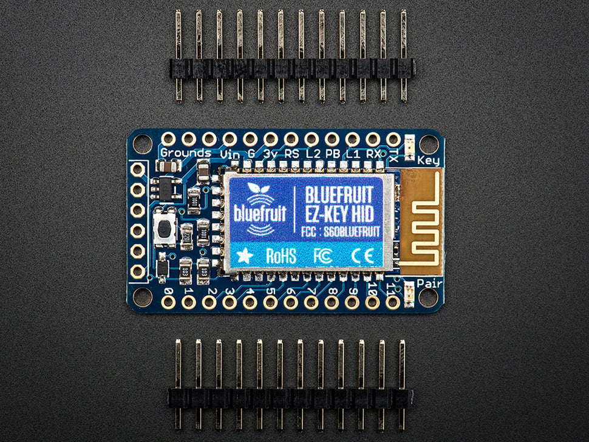
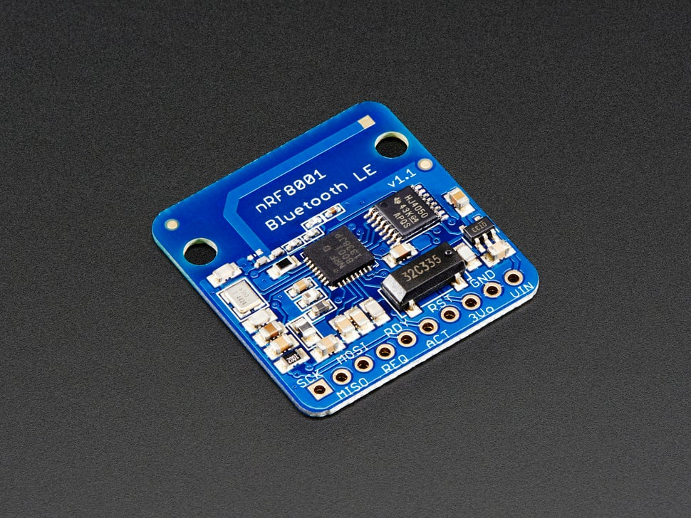
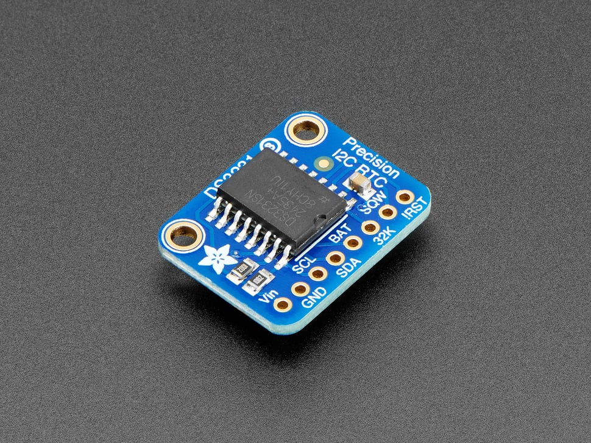

# Bluetooth and RTC Modules Collection

## Details

- **Location**: Cabinet-2, Bin 9
- **Category**: Wireless and Timing Modules
- **Total Quantity**: 5 modules
- **Applications**: Bluetooth connectivity, precise timekeeping

## Description

Collection of advanced wireless communication and precision timing modules including Bluetooth HID controllers, Bluetooth Low Energy modules, and ultra-precise real-time clocks with temperature compensation.

## Module Types

### Adafruit Bluefruit EZ-Key (Product ID: 1535)
- **Function**: 12-Input Bluetooth HID Keyboard Controller
- **Version**: v1.2
- **Quantity**: 1
- **Interface**: Bluetooth Classic (v2.1+)
- **Features**:
  - Acts as wireless Bluetooth keyboard
  - 12 programmable input pins
  - Pre-programmed with arrow keys, WASD, space, return
  - Reprogrammable via UART
  - Mouse support (clicks and movement)
  - Multimedia key support
  - Over-the-air remapping
- **Power**: 3-16VDC
- **Dimensions**: 23.01mm x 39.65mm x 4.25mm
- **Status**: No longer stocked by Adafruit

### Adafruit Bluefruit LE nRF8001 (Product ID: 1697)
- **Function**: Bluetooth Low Energy (BLE 4.0) Breakout
- **Version**: v1.0
- **Quantity**: 1
- **Interface**: SPI
- **Features**:
  - Bluetooth Low Energy (BLE 4.0)
  - UART simulation over BLE
  - iOS and Android compatible
  - Low power consumption
  - ASCII data transmission
- **Power**: 2.3-5.5V
- **Dimensions**: 29mm x 28mm x 0.8mm
- **Status**: No longer stocked (superseded by nRF51822 modules)

### Adafruit DS3231 Precision RTC (Product ID: 3013)
- **Function**: Precision Real-Time Clock Breakout
- **Quantity**: 2
- **Interface**: I2C
- **Features**:
  - Temperature-compensated crystal oscillator (TCXO)
  - Integrated crystal and temperature sensor
  - Battery backup with CR1220 coin cell
  - Years of precision timekeeping
  - Alarm functions
  - 32kHz output
- **Accuracy**: Extremely high precision
- **Power**: 3.3V - 5V
- **Dimensions**: 23mm x 17.6mm x 7.2mm

### Macetech ChronoDot
- **Function**: Ultra-Precise Real-Time Clock Module
- **Quantity**: 1
- **Interface**: I2C
- **Features**:
  - Based on DS3231 temperature-compensated RTC
  - Accuracy: ±2ppm (≈1 minute per year)
  - CR2016 battery backup (8+ year life)
  - No external crystal required
  - Breadboard compatible
  - Mounting holes for chassis installation
- **Power**: 2.3-5.5V
- **Current**: 200µA (active), 840nA (timekeeping)
- **PCB Size**: 1.2 inches diameter

## Images

## Applications

### Bluetooth Applications
- **Wireless Keyboards**: Custom input devices and game controllers
- **IoT Projects**: Low-power sensor data transmission
- **Mobile Apps**: iOS and Android connectivity
- **Wearables**: Bluetooth-enabled accessories
- **Remote Controls**: Custom wireless interfaces

### RTC Applications
- **Data Logging**: Precise timestamps for sensor data
- **Clocks**: Accurate timekeeping displays
- **Scheduling**: Time-based automation systems
- **Backup Systems**: Power-loss time retention
- **Scientific Instruments**: Precise timing requirements

## Technical Specifications

### Bluetooth Modules
- **EZ-Key**: Bluetooth Classic, HID profile, 12 inputs
- **Bluefruit LE**: BLE 4.0, SPI interface, low power

### RTC Modules
- **DS3231 Features**: Temperature compensation, integrated crystal
- **ChronoDot Features**: Ultra-high precision, long battery life
- **Both**: I2C interface, battery backup, alarm functions

## Compatibility

### Development Platforms
- **Arduino**: Full library support for all modules
- **Raspberry Pi**: I2C and SPI compatibility
- **CircuitPython**: Native support for Adafruit modules
- **Mobile Devices**: iOS and Android BLE support

### Interface Requirements
- **I2C**: Pull-up resistors required (4.7kΩ or 10kΩ)
- **SPI**: Standard SPI pins (MOSI, MISO, SCK, CS)
- **Bluetooth**: Compatible devices with BT 2.1+ or BLE 4.0+

## Documentation

- **EZ-Key Tutorial**: [Adafruit Learn Guide](https://learn.adafruit.com/introducing-bluefruit-ez-key-diy-bluetooth-hid-keyboard)
- **Bluefruit LE Guide**: [Getting Started](https://learn.adafruit.com/getting-started-with-the-nrf8001-bluefruit-le-breakout)
- **DS3231 Tutorial**: [RTC Breakout Guide](https://learn.adafruit.com/adafruit-ds3231-precision-rtc-breakout)
- **ChronoDot Docs**: [Macetech Documentation](https://docs.macetech.com/doku.php/chronodot)

## Tags

bluetooth, rtc, timing, wireless, adafruit, macetech, ds3231

## Notes

This collection represents both legacy and current wireless/timing technologies. The Bluetooth modules showcase the evolution from classic Bluetooth HID to modern BLE, while the RTC modules demonstrate different approaches to precision timekeeping. All modules are excellent for learning and prototyping applications.
