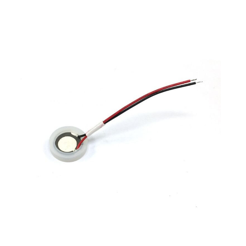

# BUZ-MIST-20 Ultrasonic Mist Maker

## Details

- **Location**: Cabinet-5, Bin 30
- **Category**: Electromechanical
- **Brand**: ABRA Electronics
- **Part Number**: BUZ-MIST-20
- **Package**: Individual Unit
- **Quantity**: 4
- **Status**: Available
- **Price Range**: $2-3
- **Product URL**: https://abra-electronics.com/electromechanical/audible-devices/buzzers/buz-mist-20-20mm-fogger-mist-maker-ultrasonic-atomization-ceramic.html

## Description

This ultrasonic mist maker/humidifier is a ceramic transducer device designed to generate fine mist through ultrasonic atomization technology. Operating at 108 KHz, it creates atomized water vapor that can be used for humidification, decorative effects, or odor elimination. The device uses electronic and ultrasonic technology to produce large amounts of mist with a long service life, making it ideal for decorative applications in rockeries, fountains, and potted landscapes.

## Specifications

### Electrical Characteristics

- **Nominal Frequency**: 108 KHz
- **Frequency Adjustment**: ±0.003 MHz
- **Temperature Frequency Difference**: 0.003 MHz
- **Total Frequency Difference**: 0.003 MHz
- **Load Capacitance**: 3200pF
- **Load Resonance Resistance**: 60Ω
- **Excitation Level**: 0.5mW
- **Input Impedance**: 0.2kΩ
- **Output Impedance**: 0.2kΩ

### Physical Characteristics

- **Diameter**: 20mm (0.79 inches)
- **Material**: Ceramic and Metal construction
- **Color**: White
- **Reference Temperature**: 26°C (78.8°F)
- **Insertion Loss**: 3 dB
- **Stopband Attenuation**: 2dB

### Key Features

- Ultrasonic atomization technology
- High-frequency ceramic transducer
- Long service life and reliability
- Large mist generation capacity
- Low power consumption (0.5mW excitation)
- Compact 20mm diameter form factor
- Temperature stable operation
- Professional-grade ceramic construction

## Image

**Visual Description**: This ultrasonic mist maker appears as a small white ceramic disc approximately 20mm in diameter. It features a smooth ceramic surface for water contact and metal electrical contacts for connection to the driving circuit. The device is designed to be partially submerged in water to create ultrasonic vibrations that atomize water into fine mist.

## Applications

Common use cases and applications for this component:

- Ultrasonic humidifiers and air purifiers
- Decorative fountain mist effects
- Aquarium and terrarium humidification
- Greenhouse humidity control
- Aromatherapy diffusers
- Pond and water feature enhancement
- Indoor plant care systems
- Air freshening and odor elimination
- Special effects for displays
- Laboratory humidity control

## Technical Notes

Important technical considerations and usage tips:

- Requires ultrasonic driver circuit operating at 108 KHz
- Must be used with clean, distilled water for best performance
- Ceramic surface should be kept clean for optimal mist generation
- Water level must be maintained above the transducer surface
- Frequency stability is critical for consistent mist output
- Temperature changes can affect operating frequency
- Regular cleaning prevents mineral buildup on ceramic surface
- Driver circuit should provide proper impedance matching
- Not suitable for continuous operation without proper cooling
- Water quality affects mist output and device longevity

## Tags

ultrasonic, mist-maker, fogger, humidifier, atomizer, ceramic, transducer, electromechanical #cabinet-5 #bin-30 #status-available

## Notes

These ultrasonic mist makers are essential components for building custom humidifiers, decorative water features, and special effects systems. The 108 KHz operating frequency provides efficient water atomization while the ceramic construction ensures durability and consistent performance. The compact 20mm size makes them suitable for small to medium-sized applications. Having 4 units provides flexibility for multiple projects or replacement needs. These devices require proper driver circuits to operate effectively, making them ideal for electronics enthusiasts working on humidity control or decorative water projects.
