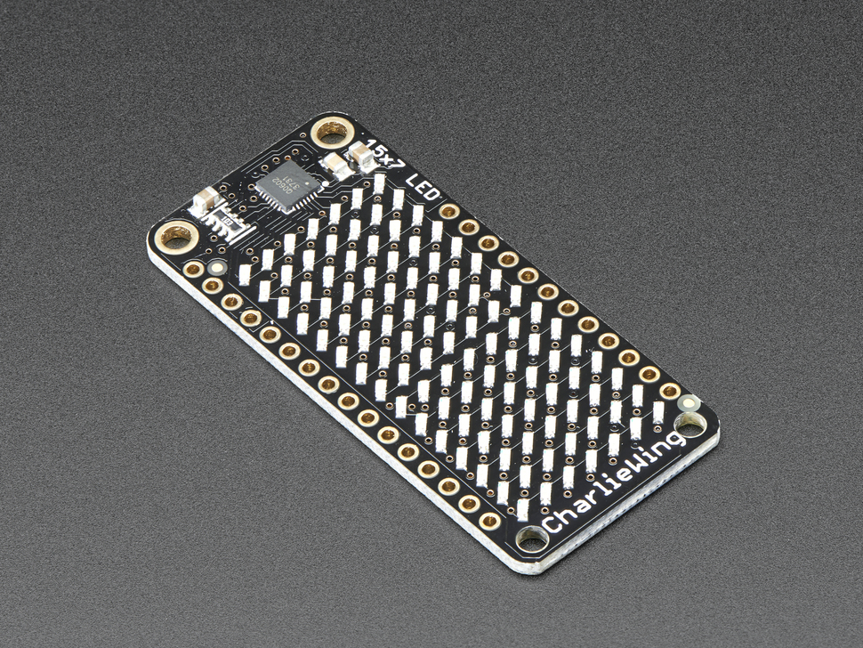

# Adafruit 15x7 CharliePlex LED Matrix Display FeatherWing - Green

## Details

- **Location**: Cabinet-1, Bin 23
- **Category**: FeatherWings
- **Type**: 15x7 CharliePlex LED Matrix Display FeatherWing
- **Color**: Green
- **LEDs**: 105 individually controllable
- **Form Factor**: Feather-compatible wing
- **Quantity**: 1
- **Product URL**: https://www.adafruit.com/product/3136

## Description

Mesmerizing 15x7 CharliePlex LED Matrix FeatherWing with 105 bright green LEDs. Features built-in IS31FL3731 I2C driver for easy control with any Feather board. Each LED can be individually controlled with 8-bit PWM dimming for stunning lighting effects and animations.

## Specifications

- **Part Number**: 3136
- **Matrix Size**: 15x7 (105 LEDs total)
- **LED Color**: Green
- **Driver**: IS31FL3731 CharliePlex LED driver
- **Interface**: I2C (address 0x74 or 0x77)
- **PWM Resolution**: 8-bit (256 levels) per LED
- **Form Factor**: Feather-compatible wing
- **Voltage**: 3.3V
- **Dimensions**: 51.0mm x 23.0mm x 3.0mm (2.0" x 0.9" x 0.1")
- **Weight**: 3.8g (0.1oz)

## Image

## Features

- **105 Individual LEDs**: Full 15x7 matrix of bright green LEDs
- **CharliePlex Technology**: Efficient LED control with minimal pins
- **8-bit PWM Dimming**: 256 brightness levels per LED
- **I2C Control**: Simple 2-wire interface
- **Frame Memory**: 8 frames of display memory for animations
- **Feather Compatible**: Works with any Feather board
- **Graphics Library**: Arduino and CircuitPython support
- **Animation Ready**: Built-in frame switching capabilities

## Driver Features

- **IS31FL3731**: Advanced CharliePlex LED driver
- **I2C Interface**: Addresses 0x74 or 0x77
- **8 Frame Buffer**: Store multiple animation frames
- **Auto Frame Advance**: Hardware-controlled animations
- **Individual LED Control**: Each LED independently addressable
- **Low Power**: 3.3V operation

## Applications

- LED animations and effects
- Status displays and indicators
- Visual feedback systems
- Art installations
- Wearable projects
- Educational demonstrations
- Interactive displays
- Ambient lighting

## Interface

- **Communication**: I2C (TWI)
- **Addresses**: 0x74 or 0x77 (selectable)
- **Voltage**: 3.3V
- **Pin Usage**: Only I2C pins (SDA/SCL)
- **Libraries**: Arduino, CircuitPython
- **Graphics**: Built-in drawing functions

## Compatibility

- **All Feather Boards**: ESP32, M0, M4, RP2040, etc.
- **Stackable**: Can be used with other FeatherWings
- **I2C Sharing**: Multiple devices can share the I2C bus
- **Cross-Platform**: Arduino IDE and CircuitPython

## Programming

- **Arduino Library**: Adafruit_IS31FL3731 library
- **CircuitPython**: Built-in support
- **Graphics**: Shape, text, and bitmap drawing
- **Animations**: Frame-based animation system
- **Effects**: Built-in patterns and transitions

## Notes

- CharliePlexing allows 105 LEDs with minimal pin usage
- IS31FL3731 handles all LED multiplexing automatically
- 8 frames of memory enable smooth animations
- Can create mesmerizing patterns and effects
- Leaves most Feather pins available for other uses
- Perfect for projects requiring eye-catching displays

## Tags

featherwing, led-matrix, charlieplexed, green, is31fl3731, i2c, adafruit
