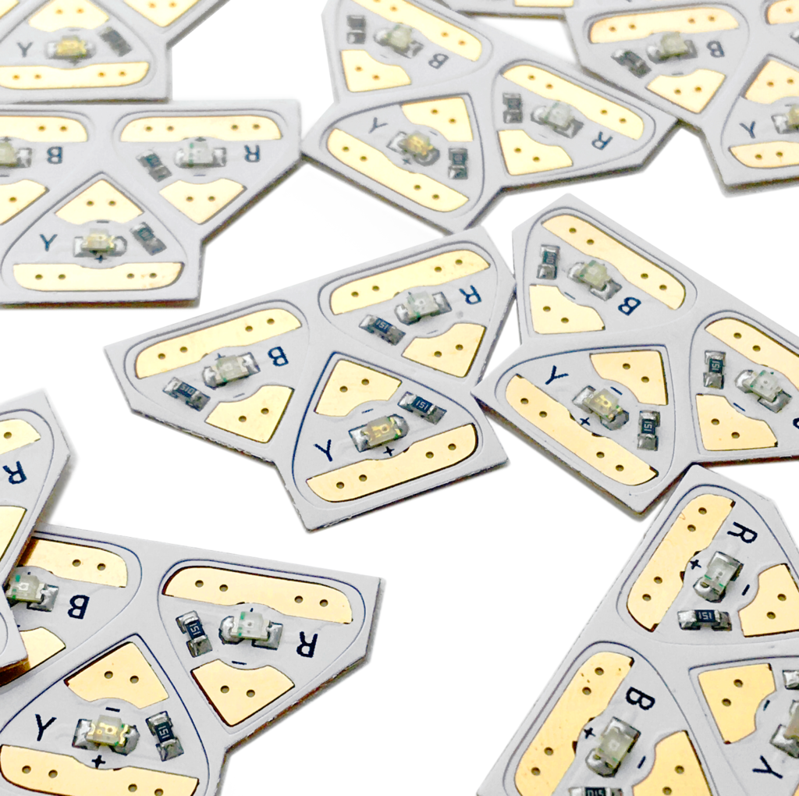

# Chibitronics Educational Electronics Kit

## Details

- **Location**: Cabinet-2, Bin 10
- **Category**: Educational Electronics
- **Type**: Paper Circuit Educational Kit
- **Brand**: Chibitronics
- **Quantity**: 1 complete kit
- **Website**: https://chibitronics.com

## Description

Chibitronics creates innovative educational electronics that blend craft with technology through peel-and-stick LED circuit stickers and paper-friendly microcontrollers. This collection includes various LED stickers, the Chibi Chip microcontroller, and supporting materials for creating interactive paper circuits.

## Kit Components

### LED Circuit Stickers
- **Function**: Colorful LED lights on peel-and-stick stickers
- **Colors**: White, red, yellow, blue, pink, orange, green
- **Application**: Add electronics to paper, fabric, plastic surfaces
- **Features**: Easy peel-and-stick application, no soldering required

### Chibi Chip Microcontroller
- **Function**: Paper-friendly programmable microcontroller
- **Programming**: Microsoft MakeCode (block-based) or Chibi Script (text-based)
- **Features**: Controls LED stickers with blink, fade, and pattern effects
- **Compatibility**: Works with circuit stickers and sensors

### Effects Stickers
- **Types**: Blink, twinkle, fade, heartbeat effects
- **Function**: Add dynamic light patterns to LED circuits
- **Quantity**: Set of 4 different effect stickers
- **Usage**: Connect to LED stickers for automated effects

### Light Sensor Stickers
- **Function**: Respond to ambient light levels
- **Applications**: Day/night activation, motion detection, interactive projects
- **Features**: Pressure-sensitive, integrates with paper circuits

### Conductive Materials
- **Copper Tape**: Creates flat circuits on paper without wires
- **Conductive Plastic**: Pressure-sensitive material for DIY sensors
- **Fabric Tape**: Flexible conductive patches for durable connections

## Image

## Educational Features

### STEAM Learning
- **Science**: Basic electronics and circuit principles
- **Technology**: Programming and digital logic
- **Engineering**: Circuit design and problem solving
- **Art**: Creative expression through light and design
- **Math**: Logical thinking and pattern recognition

### Age Appropriateness
- **Elementary**: Simple LED circuits with stickers
- **Middle School**: Programming with MakeCode blocks
- **High School**: Advanced programming with Chibi Script
- **Adult/Maker**: Artistic and craft applications

## Applications

### Educational Projects
- **Basic Circuits**: Simple, parallel, and switch circuits
- **Interactive Cards**: Light-up greeting cards and art
- **Sensor Projects**: Light-responsive and pressure-sensitive circuits
- **Programming**: Introduction to coding with visual blocks

### Craft Applications
- **Paper Crafts**: Enhanced scrapbooking and card making
- **Wearables**: Light-up clothing and accessories
- **Art Projects**: Interactive installations and displays
- **Holiday Decorations**: Animated light displays

## Technical Specifications

### LED Stickers
- **Voltage**: 3V (coin cell battery powered)
- **Current**: Low power consumption
- **Adhesive**: Repositionable peel-and-stick
- **Thickness**: Ultra-thin for paper applications

### Chibi Chip
- **Programming Languages**: MakeCode, Chibi Script
- **Connectivity**: Copper tape connections
- **Power**: Battery powered
- **I/O**: Multiple pins for sensors and LEDs

### Conductive Materials
- **Copper Tape**: 5mm width, conductive adhesive
- **Resistance**: Low resistance for reliable connections
- **Flexibility**: Bendable for 3D paper constructions

## Educational Resources

### Included Materials
- **Circuit Sticker Sketchbook**: Award-winning tutorial book
- **Project Templates**: Pre-designed circuit layouts
- **Activity Cards**: Step-by-step project guides
- **Lesson Plans**: Educator resources and curricula

### Online Resources
- **Website Tutorials**: Free project guides and templates
- **Educator Discount**: Special pricing for schools
- **Community Gallery**: Student and maker project showcase
- **Technical Support**: Documentation and troubleshooting

## Classroom Integration

### Lesson Plans
- **Basic Electricity**: Understanding circuits and current flow
- **Programming Concepts**: Logic, loops, and conditionals
- **Art Integration**: Combining technology with creative expression
- **Problem Solving**: Debugging circuits and code

### Assessment Tools
- **Project Portfolios**: Document student creations
- **Skill Progression**: From simple to complex circuits
- **Collaborative Learning**: Group projects and peer teaching
- **Cross-Curricular**: Integration with art, math, and science

## Safety Features

### Child-Safe Design
- **Low Voltage**: 3V battery operation
- **No Heat Generation**: LEDs remain cool during operation
- **Non-Toxic Materials**: Safe adhesives and components
- **Age Appropriate**: Designed for educational environments

## Advantages

### Educational Benefits
- **Hands-On Learning**: Tactile experience with electronics
- **Immediate Feedback**: Visual results encourage experimentation
- **Low Barrier to Entry**: No soldering or complex tools required
- **Scalable Complexity**: Grows with student skill level

### Practical Benefits
- **Reusable Components**: Stickers can be repositioned
- **Minimal Setup**: No special equipment required
- **Portable**: Lightweight and travel-friendly
- **Cost Effective**: Affordable entry into electronics education

## Tags

chibitronics, educational, led-stickers, paper-circuits, stem, craft, programming

## Notes

Chibitronics represents a revolutionary approach to electronics education, making circuit building accessible through craft-like activities. The combination of peel-and-stick LEDs, paper-friendly programming, and comprehensive educational resources makes this an excellent tool for introducing students to electronics and programming concepts in an engaging, creative way.
