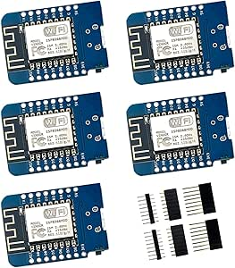

# D1 Mini NodeMCU ESP8266 ESP-12F WiFi Module Development Board

## Details

- **Location**: Cabinet-1, Bin 25
- **Category**: Microcontroller Boards
- **Type**: WiFi Development Board
- **Microcontroller**: ESP8266 ESP-12F
- **Brand**: Hosyond
- **Model**: D1 Mini
- **Quantity**: 6
- **Product URL**: https://a.co/d/9RKNNKX

## Description

Compact WiFi-enabled microcontroller development board based on the ESP8266 ESP-12F chip. Compatible with Arduino IDE and WeMos D1 Mini ecosystem. Perfect for IoT projects requiring WiFi connectivity in a small form factor. Features built-in USB programming interface and comprehensive GPIO support.

## Specifications

- **Microcontroller**: ESP8266 ESP-12F
- **Architecture**: Xtensa LX106 32-bit
- **Clock Speed**: 80MHz (up to 160MHz)
- **Operating Voltage**: 3.3V
- **Input Voltage**: 5V (via USB) or 3.3V
- **Flash Memory**: 4MB
- **RAM**: 1MB (512KB available for user)
- **WiFi**: 802.11 b/g/n 2.4GHz
- **Dimensions**: 34.2mm x 25.6mm x 7.6mm
- **Weight**: ~3g

## Image

## Features

- **WiFi Connectivity**: Built-in 802.11 b/g/n WiFi
- **Arduino Compatible**: Program with Arduino IDE
- **Compact Design**: Mini form factor for space-constrained projects
- **USB Programming**: Micro USB for power and programming
- **Rich I/O**: 11 digital pins with interrupt/PWM/I2C/1-wire support
- **Analog Input**: 1 analog input (3.2V max)
- **Power Management**: 5V switching power supply onboard
- **Reset Protection**: 500mA resettable fuse

## Pin Configuration

- **Digital I/O**: 11 pins (D0-D10)
- **Analog Input**: 1 pin (A0, 3.2V max)
- **PWM**: All digital pins except D0
- **I2C**: SDA (D2), SCL (D1)
- **SPI**: MOSI (D7), MISO (D6), SCK (D5)
- **UART**: TX (D1), RX (D3)
- **Special**: D0 (no interrupt/PWM/I2C support)

## Power Specifications

- **Operating Voltage**: 3.3V
- **Input Voltage**: 5V (USB) or 3.3V (VCC pin)
- **Current**: ~80mA active, ~20µA deep sleep
- **Power Supply**: Built-in 5V to 3.3V regulator
- **Protection**: 500mA resettable fuse

## Applications

- IoT sensor nodes
- Home automation controllers
- WiFi-enabled projects
- Remote monitoring systems
- Smart switches and relays
- Environmental sensors
- Web servers and clients
- MQTT clients

## Programming

- **Arduino IDE**: Full support with ESP8266 board package
- **MicroPython**: Native support
- **NodeMCU Lua**: Original firmware support
- **PlatformIO**: Professional development environment
- **Libraries**: Extensive WiFi, HTTP, MQTT libraries

## Compatibility

- **WeMos D1 Mini**: Pin-compatible
- **Arduino Shields**: Many shields compatible
- **Breadboard**: Fits standard breadboards
- **Prototyping**: Easy to integrate into projects

## WiFi Capabilities

- **Standards**: 802.11 b/g/n
- **Frequency**: 2.4GHz
- **Modes**: Station, Access Point, Station+AP
- **Security**: WEP, WPA, WPA2
- **Range**: Typical indoor WiFi range
- **Protocols**: TCP/IP, HTTP, HTTPS, MQTT, WebSocket

## Development Features

- **USB Programming**: No external programmer needed
- **Serial Monitor**: Built-in USB-to-serial
- **OTA Updates**: Over-the-air firmware updates
- **File System**: SPIFFS for file storage
- **Web Server**: Can host simple web interfaces

## Notes

- Compatible with Arduino IDE and WeMos D1 Mini libraries
- Excellent for beginners and professionals alike
- Large community support and documentation
- Perfect balance of features, size, and cost
- Ideal for rapid prototyping of WiFi projects
- Can be powered via USB or external 3.3V/5V supply

## Tags

microcontroller, esp8266, wifi, d1-mini, nodemcu, arduino-compatible, iot, wireless
