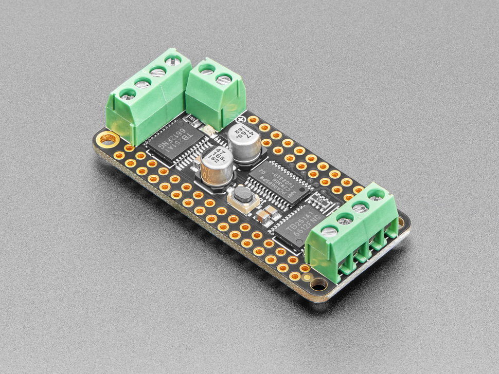

# DC Motor + Stepper FeatherWing

## Details
- **Location**: Cabinet-1, Bin 16
- **Category**: FeatherWings
- **Type**: Motor Driver Module
- **Functions**: DC Motor Driver, Stepper Motor Driver, PWM Control
- **Interface**: I2C (PCA9685 PWM driver)
- **Quantity**: 2
- **Product URL**: https://www.adafruit.com/product/2927

## Description
The DC Motor + Stepper FeatherWing lets you control 2 bi-polar stepper motors or 4 brushed DC motors (or 1 stepper and 2 DC motors). Features a fully-dedicated PWM driver chip that handles all motor and speed controls over I2C, making it compatible with any Feather board.

## Specifications
- **Motor Driver**: TB6612 chipset with 4 full H-bridges
- **Current**: 1.2A per bridge with thermal shutdown protection
- **Voltage Range**: 4.5VDC to 13.5VDC motor supply
- **Interface**: I2C (uses only SDA & SCL pins)
- **Speed Control**: 12-bit resolution (0.02% precision)
- **Dimensions**: 50.8mm x 22.9mm x 1.6mm (2" x 0.9" x 0.06")
- **Weight**: 4.6g

## Image

## Features
- **4 Full H-Bridges**: TB6612 chipset with thermal protection
- **Flexible Motor Support**: Up to 4 DC motors OR 2 stepper motors
- **PWM Control**: Dedicated PCA9685 PWM driver chip
- **I2C Interface**: Works with any Feather board
- **Stackable Design**: 5 address-select jumpers (up to 32 wings)
- **Terminal Blocks**: Big 3.5mm connectors for easy wiring (18-26AWG)
- **External Power**: Polarity-protected terminal block for motor supply
- **Safety Features**: Motors auto-disabled on power-up, kickback protection

## Motor Capabilities
- **DC Motors**: Up to 4 bi-directional with individual speed control
- **Stepper Motors**: Up to 2 (unipolar or bipolar)
- **Stepping Modes**: Single coil, double coil, interleaved, micro-stepping
- **Current Rating**: 1.2A per motor coil maximum
- **Voltage Range**: 4.5V to 13.5V motor supply

## Compatibility
- **Universal**: Works with any Feather board (uses only I2C)
- **Stackable**: Can stack with other FeatherWings
- **Addressable**: Up to 32 wings on same I2C bus
- **Power**: Requires external power supply for motors

## Libraries & Resources
- **Arduino Library**: Adafruit Motor Shield V2 Library
- **CircuitPython Library**: adafruit_motor
- **Documentation**: https://learn.adafruit.com/adafruit-stepper-dc-motor-featherwing
- **Example Projects**: Robot rovers, CNC machines, automated systems

## Applications
- Robot drive systems
- CNC and 3D printer control
- Automated positioning systems
- Camera pan/tilt mechanisms
- Conveyor belt control
- Robotic arms and actuators

## Tags
featherwing, motor-driver, stepper, dc-motor, tb6612, i2c, adafruit
