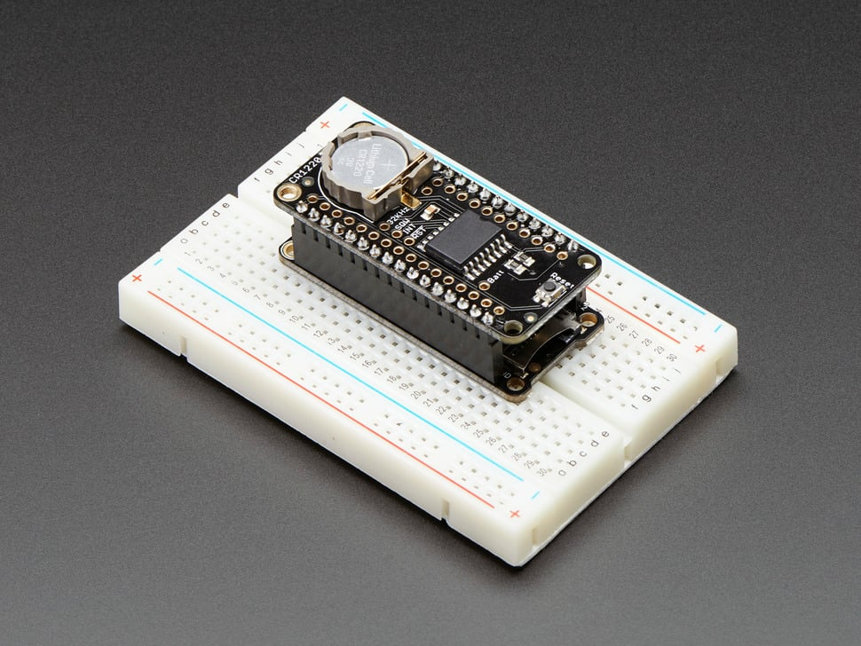

# DS3231 Precision RTC FeatherWing

## Details

- **Location**: Cabinet-1, Bin 16
- **Category**: Featherwings
- **Quantity**: 5
- **Product URL**: https://www.adafruit.com/product/3028

## Description

DS3231 Precision RTC FeatherWing - RTC Add-on For Feather Boards. High precision real-time clock module.

## Image

## Tags

#featherwing #rtc #ds3231 #real-time-clock #adafruit
