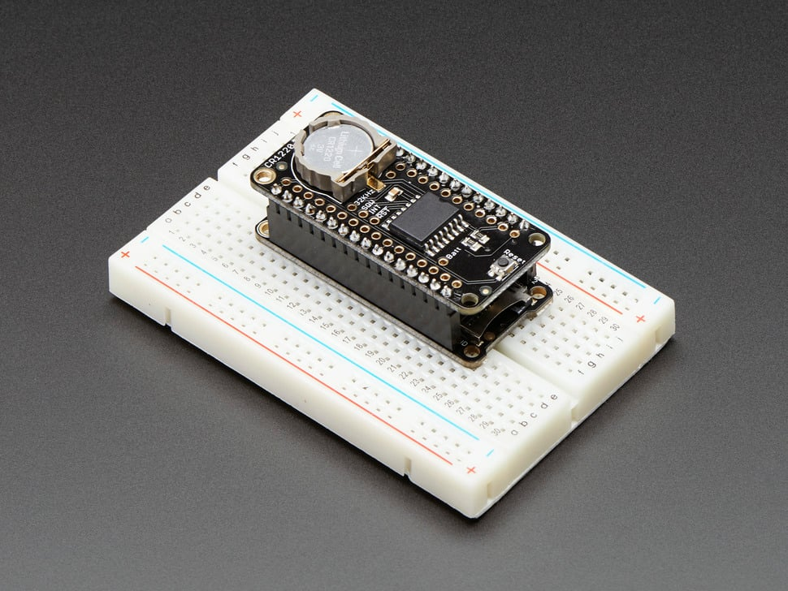

# DS3231 Precision RTC FeatherWing

## Description

DS3231 Precision RTC FeatherWing - RTC Add-on For Feather Boards. High precision real-time clock module.

## Image

## Tags

#featherwing #rtc #ds3231 #real-time-clock #adafruit
