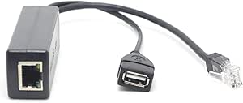

# DSLRKIT Active PoE Splitter 48V to 5V 2.4A USB Type A Female

## Details

- **Location**: Cabinet 4, Bin 17
- **Category**: Networking Components
- **Brand**: DSLRKIT
- **Part Number**: POE-SPLITTER-48V-5V
- **Package**: Individual unit
- **Quantity**: 8
- **Status**: Available
- **Price Range**: $10.50
- **Product URL**: https://a.co/d/c7kYSif

## Description

IEEE 802.3af compliant active PoE splitter that converts 48V Power over Ethernet to regulated 5V 2.4A USB output. Enables powering of non-PoE devices such as IP cameras, tablets, Raspberry Pi, and other USB-powered equipment using existing Ethernet infrastructure. Features 2.5KV isolation for protection and reliable operation.

## Image



## Specifications

### Electrical Characteristics
- **Input Voltage**: 48V DC (PoE standard)
- **Output Voltage**: 5.2V DC regulated
- **Output Current**: 2.4A maximum
- **Output Power**: 12W maximum
- **Efficiency**: >85% typical
- **Isolation**: 2.5KV isolation protection

### Standards Compliance
- **IEEE 802.3af**: Fully compliant with PoE standard
- **Power Classification**: Class 0 (0.44W to 12.95W)
- **Safety Standards**: CE, FCC compliant
- **Operating Temperature**: 0°C to 50°C
- **Storage Temperature**: -20°C to 70°C

### Physical Specifications
- **Dimensions**: 3.15" x 1.06" x 0.87" (80 x 27 x 22mm)
- **Weight**: 55 grams
- **Housing**: Black plastic enclosure
- **Mounting**: Desktop/wall mount compatible
- **Cable Length**: 1 meter attached cables

## Pinout/Connection Information

### Input Connection (PoE)
- **RJ45 Female**: Receives PoE power and data from switch/injector
- **Power Pairs**: Uses standard PoE power pairs (4,5 and 7,8)
- **Data Pairs**: Passes through data pairs (1,2 and 3,6)
- **Compatibility**: Works with PoE switches and PoE injectors

### Output Connections
- **RJ45 Male**: Data pass-through to connected device
- **USB Type A Female**: 5V 2.4A power output
- **Power LED**: Indicates power status
- **Data Integrity**: Full Ethernet data pass-through

### Connection Diagram
```
PoE Switch/Injector --> RJ45 Female Input --> [PoE Splitter] --> RJ45 Male Output --> Device
                                                    |
                                                    v
                                              USB-A Female --> USB-powered device
```

### Wiring Configuration
- **Input**: Standard PoE wiring (48V on pairs 4,5 and 7,8)
- **Output**: Standard Ethernet data on pairs 1,2 and 3,6
- **USB Output**: Standard USB 5V on USB-A connector
- **Ground**: Common ground between input and output

## Circuit Integration Notes

### IP Camera Applications
- **Non-PoE Cameras**: Power USB-powered IP cameras via Ethernet
- **Simplified Installation**: Single cable for power and data
- **Remote Locations**: Eliminate need for local power outlets
- **Centralized Power**: Use PoE switch for centralized power management

### Raspberry Pi Projects
- **Remote Pi Installations**: Power Pi via Ethernet infrastructure
- **IoT Applications**: Simplify IoT device deployment
- **Network Monitoring**: Power network monitoring devices
- **Home Automation**: Remote sensor and control nodes

### Tablet/Display Applications
- **Wall-Mounted Displays**: Power tablets and displays remotely
- **Kiosk Applications**: Eliminate power adapter requirements
- **Digital Signage**: Centralized power for display systems
- **Interactive Displays**: Touch screens and information panels

## Technical Specifications

### Power Management
- **Regulation**: Tight voltage regulation (±5%)
- **Ripple**: Low output ripple (<50mV)
- **Protection**: Over-current and over-voltage protection
- **Efficiency**: High efficiency switching regulator
- **Heat Dissipation**: Minimal heat generation

### Data Transmission
- **Speed**: 10/100 Mbps Ethernet pass-through
- **Latency**: Minimal additional latency
- **Signal Integrity**: Clean data signal pass-through
- **Cable Length**: Supports standard Ethernet cable lengths
- **Duplex**: Full duplex operation

### Reliability Features
- **Isolation**: 2.5KV galvanic isolation
- **ESD Protection**: Built-in ESD protection circuits
- **Thermal Protection**: Over-temperature shutdown
- **Short Circuit Protection**: Output short circuit protection
- **LED Indicators**: Power and status indication

## Applications

### Security Systems
- **IP Cameras**: Power non-PoE security cameras
- **Access Control**: Door controllers and card readers
- **Intercom Systems**: Video intercom and communication devices
- **Alarm Systems**: Remote alarm panels and sensors

### IoT and Automation
- **Sensor Networks**: Remote environmental sensors
- **Control Systems**: Industrial control and monitoring
- **Smart Building**: Building automation devices
- **Data Loggers**: Remote data collection systems

### Educational and Development
- **Raspberry Pi Projects**: Educational and development platforms
- **Prototyping**: Quick deployment of prototype systems
- **STEM Education**: Teaching PoE and networking concepts
- **Maker Projects**: DIY electronics and automation projects

## Troubleshooting

### Common Issues
1. **No Power Output**: Check PoE source and input connections
2. **Low Output Voltage**: Verify PoE voltage and current capacity
3. **Data Connection Issues**: Check Ethernet cable integrity
4. **Overheating**: Ensure adequate ventilation and proper load

### Installation Tips
- **PoE Source**: Ensure PoE switch/injector provides adequate power
- **Cable Quality**: Use quality Cat5e or Cat6 cables
- **Load Matching**: Verify device power requirements vs. output capacity
- **Environmental**: Keep unit dry and within temperature range

### Performance Optimization
- **Cable Length**: Minimize cable lengths for best efficiency
- **Power Budget**: Calculate total power requirements
- **Heat Management**: Provide adequate ventilation
- **Grounding**: Ensure proper grounding for best performance

## Compatibility Notes

### PoE Equipment Compatibility
- **PoE Switches**: Compatible with all IEEE 802.3af switches
- **PoE Injectors**: Works with standard PoE injectors
- **PoE Standards**: IEEE 802.3af (15.4W), not 802.3at (25.5W)
- **Voltage Range**: Designed for 48V nominal PoE voltage

### Device Compatibility
- **USB Devices**: Any device requiring 5V up to 2.4A
- **Tablets**: iPad, Android tablets with USB power input
- **Single Board Computers**: Raspberry Pi, Arduino, BeagleBone
- **IP Cameras**: USB-powered security cameras

### Network Compatibility
- **Ethernet Standards**: 10BASE-T, 100BASE-TX
- **Cable Types**: Cat5, Cat5e, Cat6, Cat6a
- **Distance**: Standard Ethernet distance limitations apply
- **Switches**: Compatible with managed and unmanaged switches

## Notes

This PoE splitter provides an excellent solution for powering USB devices in locations where only Ethernet infrastructure is available. The 2.4A output capacity makes it suitable for most tablets, single-board computers, and IP cameras.

**Installation Consideration**: Always verify that your PoE source can provide adequate power for the connected load. The splitter itself consumes some power, so ensure the PoE budget accounts for both the splitter and the connected device.

**Safety Note**: The 2.5KV isolation provides protection against ground loops and electrical faults, making it safe for use in various installation environments.

**Performance Tip**: For best results, use quality Ethernet cables and ensure all connections are secure. Poor connections can result in voltage drops and unreliable operation.

## Related Components

- [[bcd-mechanical-numeric-selector-switches]] - Other components in same bin
- [[poe-switches]] - Compatible PoE switches and injectors
- [[ip-cameras]] - Compatible IP camera systems
- [[raspberry-pi-accessories]] - Raspberry Pi and SBC accessories
