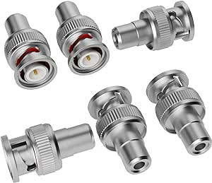

# Elecan BNC to RCA Adapters (6 Pack)

## Details

- **Location**: Cabinet-5, Bin 5
- **Category**: Test Equipment
- **Brand**: Elecan
- **Part Number**: B09TT3X8F6
- **Package**: Coaxial Adapter
- **Quantity**: 6 adapters
- **Status**: Available
- **Price Range**: $7.49 (pack of 6)
- **Product URL**: https://a.co/d/07rw1FN

## Description

Elecan BNC Male to RCA Female adapters are essential test equipment accessories for converting between BNC and RCA connector types. These adapters are commonly used with oscilloscopes, CCTV systems, test equipment, and video applications where you need to interface between professional BNC equipment and consumer RCA connections. The adapters maintain 75-ohm impedance for proper signal integrity in video and RF applications.

## Specifications

### Electrical Characteristics

- **Impedance**: 75 ohms (standard for video applications)
- **Frequency Range**: DC to 1 GHz
- **VSWR**: <1.3:1 (typical)
- **Insertion Loss**: <0.2 dB (typical)
- **Contact Resistance**: <5 milliohms
- **Insulation Resistance**: >1000 MΩ

### Physical Characteristics

- **Connector Type**: BNC Male to RCA Female
- **Housing Material**: Nickel-plated brass
- **Contact Material**: Gold-plated copper
- **Operating Temperature**: -40°C to +85°C
- **Mating Cycles**: >500 cycles
- **Dimensions**: Standard BNC/RCA form factor

### Key Features

- Professional-grade construction with gold-plated contacts
- 75-ohm impedance matching for video applications
- Nickel-plated brass housing for durability
- Secure BNC twist-lock connection
- Low insertion loss and excellent signal integrity
- Compatible with standard RCA cables and equipment

## Image

## Applications

Common use cases and applications for these BNC to RCA adapters:

- **Oscilloscope Connections**: Connect RCA cables to BNC oscilloscope inputs
- **CCTV Systems**: Interface between BNC cameras and RCA monitors/recorders
- **Test Equipment**: Connect consumer equipment to professional test instruments
- **Video Equipment**: Bridge between professional and consumer video equipment
- **RF Testing**: Connect RCA-terminated cables to BNC test equipment
- **Audio/Video Production**: Interface between different connector standards
- **Laboratory Equipment**: Connect various instruments with different connector types
- **Educational Electronics**: Demonstrate signal connections in teaching labs

## Technical Notes

Important technical considerations and usage tips:

- Maintains 75-ohm impedance for proper video signal transmission
- Gold-plated contacts ensure reliable electrical connection
- BNC twist-lock provides secure mechanical connection
- Suitable for both video and RF applications up to 1 GHz
- Low insertion loss preserves signal quality
- Can be used for both input and output connections
- Compatible with standard RCA patch cables
- Professional-grade construction for laboratory use

## Compatibility

These adapters are compatible with:

- Oscilloscopes with BNC inputs (Tektronix, Rigol, Siglent, etc.)
- CCTV cameras and DVR systems
- Function generators with BNC outputs
- Spectrum analyzers and network analyzers
- Video monitors and displays with RCA inputs
- Audio equipment with RCA connections
- RF test equipment and signal generators
- Coaxial cable assemblies

## Tags

elecan, bnc, rca, adapters, coaxial, test-equipment, cctv, oscilloscope #cabinet-5 #bin-5 #status-available

## Notes

These BNC to RCA adapters are essential for any electronics lab or test setup where you need to interface between professional BNC equipment and consumer RCA connections. The 6-pack provides good value and ensures you have spares available. The gold-plated contacts and 75-ohm impedance make them suitable for both video and RF applications. Quality construction makes them reliable for repeated use in test environments. Perfect for oscilloscope work, CCTV installations, and general electronics testing.
