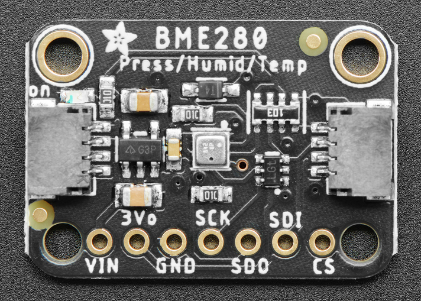
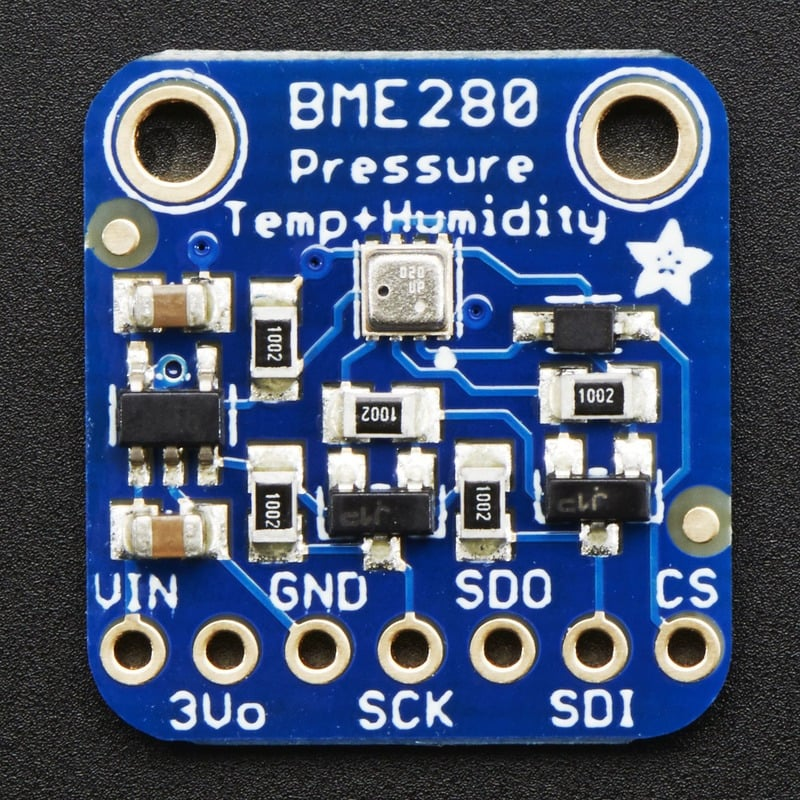

# Environmental Sensors Collection - Bin 29

Comprehensive collection of environmental sensors including temperature, humidity, pressure, and multi-parameter sensors for weather monitoring, HVAC control, and environmental data logging applications.

## Overview

This collection contains various environmental sensors from different manufacturers, providing capabilities for measuring temperature, humidity, barometric pressure, and other environmental parameters. These sensors are commonly used in weather stations, HVAC systems, greenhouse monitoring, and IoT environmental monitoring projects.

## Included Sensors

### SHT21 Humidity and Temperature Sensor (1)

**Modern Device SHT21 Breakout**

- **Manufacturer**: Sensirion (breakout by Modern Device)
- **Parameters**: Temperature and Relative Humidity
- **Interface**: I²C (2-wire)
- **Temperature Range**: -40°C to +125°C
- **Humidity Range**: 0-100% RH
- **Resolution**: 0.01°C temperature, 0.03% RH
- **Power**: 80μW at 12-bit, 3V
- **Applications**: HVAC, weather stations, greenhouse monitoring

### AliExpress Environmental Sensors (3)

**Generic Multi-Parameter Sensors**

- **Types**: DHT22, BME280, SHT30 variants
- **Parameters**: Temperature, humidity, some with pressure
- **Interface**: I²C, SPI, or digital output
- **Cost-effective** solutions for basic environmental monitoring
- **Varying quality** and specifications

### Adafruit Temperature Sensors (4)

**High-Quality Precision Sensors**

#### Adafruit Product 393 - TMP36 Temperature Sensor (1)

- **Type**: Analog temperature sensor
- **Range**: -40°C to +125°C
- **Output**: 10mV/°C linear
- **Power**: 2.7V to 5.5V
- **Accuracy**: ±2°C typical

#### Adafruit Product 385 - TMP102 Digital Temperature Sensor (2)

- **Type**: Digital I²C temperature sensor
- **Range**: -55°C to +128°C
- **Resolution**: 0.0625°C (12-bit)
- **Interface**: I²C
- **Accuracy**: ±0.5°C

#### Adafruit Product 386 - DS18B20 Digital Temperature Sensor (1)

- **Type**: 1-Wire digital temperature sensor
- **Range**: -55°C to +125°C
- **Resolution**: 9-12 bit configurable
- **Interface**: 1-Wire protocol
- **Accuracy**: ±0.5°C

### TMP37FT9Z Temperature Sensors (5)

**Analog Devices Precision Temperature Sensors**

- **Type**: Analog temperature sensor
- **Range**: +5°C to +100°C
- **Output**: 20mV/°C linear
- **Power**: 2.7V to 5.5V
- **Package**: TO-92
- **Accuracy**: ±1°C typical

### Adafruit Environmental Sensors (2)

#### Adafruit Product 4530 - SHT40 Temperature & Humidity Sensor (1)

- **Parameters**: Temperature and Humidity
- **Interface**: I²C with STEMMA QT
- **Temperature Range**: -40°C to +125°C
- **Humidity Range**: 0-100% RH
- **Accuracy**: ±0.2°C, ±1.8% RH
- **Features**: Low power, high accuracy

#### Adafruit Product 4534 - SHTC3 Temperature & Humidity Sensor (1)

- **Parameters**: Temperature and Humidity
- **Interface**: I²C with STEMMA QT
- **Temperature Range**: -40°C to +125°C
- **Humidity Range**: 0-100% RH
- **Accuracy**: ±0.2°C, ±2% RH
- **Features**: Ultra-low power, sleep mode

### BME280 Environmental Sensors (2)

**Bosch Multi-Parameter Sensors**

- **Parameters**: Temperature, Humidity, Pressure
- **Interface**: I²C or SPI
- **Temperature Range**: -40°C to +85°C
- **Humidity Range**: 0-100% RH
- **Pressure Range**: 300-1100 hPa
- **Applications**: Weather monitoring, altitude measurement

### Adafruit Product 1782 - DHT22 Sensors (3)

**Popular Temperature and Humidity Sensors**

- **Parameters**: Temperature and Humidity
- **Interface**: Single-wire digital
- **Temperature Range**: -40°C to +80°C
- **Humidity Range**: 0-100% RH
- **Accuracy**: ±0.5°C, ±2-5% RH
- **Power**: 3.3V to 6V

## Technical Specifications Summary

### Temperature Sensors

| Sensor    | Type    | Range           | Accuracy | Interface |
| --------- | ------- | --------------- | -------- | --------- |
| SHT21     | Digital | -40°C to +125°C | ±0.3°C   | I²C       |
| TMP36     | Analog  | -40°C to +125°C | ±2°C     | Analog    |
| TMP102    | Digital | -55°C to +128°C | ±0.5°C   | I²C       |
| DS18B20   | Digital | -55°C to +125°C | ±0.5°C   | 1-Wire    |
| TMP37FT9Z | Analog  | +5°C to +100°C  | ±1°C     | Analog    |
| SHT40     | Digital | -40°C to +125°C | ±0.2°C   | I²C       |
| SHTC3     | Digital | -40°C to +125°C | ±0.2°C   | I²C       |
| BME280    | Digital | -40°C to +85°C  | ±1°C     | I²C/SPI   |
| DHT22     | Digital | -40°C to +80°C  | ±0.5°C   | Digital   |

### Humidity Sensors

| Sensor | Range     | Accuracy | Response Time |
| ------ | --------- | -------- | ------------- |
| SHT21  | 0-100% RH | ±2% RH   | 8 seconds     |
| SHT40  | 0-100% RH | ±1.8% RH | 1 second      |
| SHTC3  | 0-100% RH | ±2% RH   | 1 second      |
| BME280 | 0-100% RH | ±3% RH   | 1 second      |
| DHT22  | 0-100% RH | ±2-5% RH | 2 seconds     |

## Wiring Diagrams

### I2C Environmental Sensors (SHT21, BME280, TMP102)

#### Arduino Uno Connection

```
Sensor         Arduino Uno
------         -----------
VCC       →    3.3V or 5V (check sensor specs)
GND       →    GND
SDA       →    A4 (SDA)
SCL       →    A5 (SCL)

Note: Add 4.7kΩ pull-up resistors on SDA and SCL lines
```

#### Raspberry Pi Pico Connection

```
Sensor         Pico
------         ----
VCC       →    3V3
GND       →    GND
SDA       →    GP4 (I2C0 SDA)
SCL       →    GP5 (I2C0 SCL)

Note: Built-in pull-up resistors usually sufficient
```

#### ESP32 Connection

```
Sensor         ESP32
------         -----
VCC       →    3.3V
GND       →    GND
SDA       →    GPIO21 (SDA)
SCL       →    GPIO22 (SCL)

Note: ESP32 has built-in I2C pull-up resistors
```

### Analog Temperature Sensors (TMP36, TMP37)

#### Arduino Connection

```
TMP36/TMP37    Arduino
-----------    -------
VCC       →    5V or 3.3V
GND       →    GND
OUT       →    A0 (or any analog pin)

Voltage divider may be needed for 3.3V systems
```

#### Voltage Calculation

```
For TMP36: Temperature (°C) = (Voltage - 0.5V) × 100
For TMP37: Temperature (°C) = (Voltage - 0.5V) × 50

Example: 0.75V reading on TMP36 = (0.75 - 0.5) × 100 = 25°C
```

### 1-Wire Sensors (DS18B20)

#### Arduino Connection

```
DS18B20        Arduino
-------        -------
VCC       →    5V or 3.3V
GND       →    GND
DATA      →    Pin 2 (with 4.7kΩ pull-up to VCC)

Multiple sensors can share the same data line
```

## Programming Examples

### Arduino - BME280 Environmental Sensor

```cpp
#include <Wire.h>
#include <Adafruit_Sensor.h>
#include <Adafruit_BME280.h>

Adafruit_BME280 bme; // I2C interface

void setup() {
  Serial.begin(9600);

  if (!bme.begin(0x76)) {  // Try 0x77 if 0x76 doesn't work
    Serial.println("Could not find BME280 sensor!");
    while (1);
  }

  Serial.println("BME280 Environmental Sensor");
}

void loop() {
  float temperature = bme.readTemperature();
  float pressure = bme.readPressure() / 100.0F;  // Convert to hPa
  float humidity = bme.readHumidity();
  float altitude = bme.readAltitude(1013.25);     // Sea level pressure

  Serial.print("Temperature: ");
  Serial.print(temperature);
  Serial.println(" °C");

  Serial.print("Pressure: ");
  Serial.print(pressure);
  Serial.println(" hPa");

  Serial.print("Humidity: ");
  Serial.print(humidity);
  Serial.println(" %");

  Serial.print("Altitude: ");
  Serial.print(altitude);
  Serial.println(" m");

  Serial.println("---");
  delay(2000);
}
```

### Arduino - TMP36 Analog Temperature

```cpp
const int sensorPin = A0;

void setup() {
  Serial.begin(9600);
  Serial.println("TMP36 Temperature Sensor");
}

void loop() {
  int sensorValue = analogRead(sensorPin);
  float voltage = sensorValue * (5.0 / 1023.0);  // Convert to voltage
  float temperatureC = (voltage - 0.5) * 100.0;  // Convert to Celsius
  float temperatureF = (temperatureC * 9.0 / 5.0) + 32.0;  // Convert to Fahrenheit

  Serial.print("Sensor Value: ");
  Serial.print(sensorValue);
  Serial.print(", Voltage: ");
  Serial.print(voltage);
  Serial.print("V, Temperature: ");
  Serial.print(temperatureC);
  Serial.print("°C (");
  Serial.print(temperatureF);
  Serial.println("°F)");

  delay(1000);
}
```

### Arduino - DS18B20 1-Wire Temperature

```cpp
#include <OneWire.h>
#include <DallasTemperature.h>

#define ONE_WIRE_BUS 2
#define TEMPERATURE_PRECISION 12

OneWire oneWire(ONE_WIRE_BUS);
DallasTemperature sensors(&oneWire);

void setup() {
  Serial.begin(9600);
  sensors.begin();

  Serial.print("Found ");
  Serial.print(sensors.getDeviceCount(), DEC);
  Serial.println(" temperature sensors.");
}

void loop() {
  sensors.requestTemperatures();

  for (int i = 0; i < sensors.getDeviceCount(); i++) {
    float tempC = sensors.getTempCByIndex(i);
    float tempF = sensors.getTempFByIndex(i);

    Serial.print("Sensor ");
    Serial.print(i);
    Serial.print(": ");
    Serial.print(tempC);
    Serial.print("°C (");
    Serial.print(tempF);
    Serial.println("°F)");
  }

  Serial.println("---");
  delay(2000);
}
```

### CircuitPython - I2C Environmental Sensor

```python
import time
import board
import busio
import adafruit_bme280

# Initialize I2C
i2c = busio.I2C(board.SCL, board.SDA)
bme280 = adafruit_bme280.Adafruit_BME280_I2C(i2c)

# Optional: Set sea level pressure for altitude calculation
bme280.sea_level_pressure = 1013.25

while True:
    print(f"Temperature: {bme280.temperature:.1f} °C")
    print(f"Humidity: {bme280.relative_humidity:.1f} %")
    print(f"Pressure: {bme280.pressure:.2f} hPa")
    print(f"Altitude: {bme280.altitude:.2f} m")
    print("---")
    time.sleep(2)
```

### Arduino - Multiple I2C Sensors

```cpp
#include <Wire.h>
#include <Adafruit_Sensor.h>
#include <Adafruit_BME280.h>
#include <Adafruit_TMP102.h>

Adafruit_BME280 bme;
Adafruit_TMP102 tmp102;

void setup() {
  Serial.begin(9600);

  if (!bme.begin(0x76)) {
    Serial.println("BME280 not found!");
  } else {
    Serial.println("BME280 initialized");
  }

  if (!tmp102.begin(0x48)) {
    Serial.println("TMP102 not found!");
  } else {
    Serial.println("TMP102 initialized");
  }
}

void loop() {
  // Read BME280
  Serial.println("=== BME280 ===");
  Serial.print("Temperature: ");
  Serial.print(bme.readTemperature());
  Serial.println(" °C");
  Serial.print("Humidity: ");
  Serial.print(bme.readHumidity());
  Serial.println(" %");
  Serial.print("Pressure: ");
  Serial.print(bme.readPressure() / 100.0F);
  Serial.println(" hPa");

  // Read TMP102
  Serial.println("=== TMP102 ===");
  Serial.print("Temperature: ");
  Serial.print(tmp102.readTempC());
  Serial.println(" °C");

  Serial.println("================");
  delay(3000);
}
```

## Sensor Selection Guide

### Temperature Only

- **TMP36/TMP37**: Simple analog sensors, good for basic temperature monitoring
- **TMP102**: Digital I2C, higher accuracy, programmable alerts
- **DS18B20**: 1-Wire, multiple sensors on one pin, waterproof versions available

### Temperature + Humidity

- **SHT21**: High accuracy, low power, industrial grade
- **DHT22**: Cost-effective, adequate accuracy for most projects
- **SHT30**: Modern replacement for SHT21, better accuracy

### Temperature + Humidity + Pressure

- **BME280**: Most popular, excellent accuracy, altitude calculation
- **BME680**: Adds air quality (VOC) sensing
- **BMP280**: Pressure + temperature only (no humidity)

## Calibration and Accuracy

### Calibration Tips

- **Reference Measurement**: Use calibrated thermometer for comparison
- **Multiple Readings**: Average multiple readings for better accuracy
- **Temperature Compensation**: Some sensors need temperature compensation
- **Offset Correction**: Apply offset correction if consistent error found

### Accuracy Considerations

- **Sensor Placement**: Avoid heat sources, direct sunlight, air currents
- **Thermal Mass**: Allow time for thermal equilibrium
- **Self-Heating**: Some sensors generate heat during operation
- **Humidity Effects**: Humidity can affect temperature readings

## Applications

### Weather Monitoring

- **Outdoor weather stations** with temperature, humidity, pressure
- **Indoor climate monitoring** for comfort and health
- **Agricultural monitoring** for greenhouse and field conditions
- **HVAC system** feedback and control
- **Data logging** for environmental research

### IoT and Smart Home

- **Smart thermostats** with environmental sensing
- **Home automation** based on environmental conditions
- **Energy management** systems with climate feedback
- **Health monitoring** for air quality and comfort
- **Remote monitoring** of vacation homes or facilities

### Industrial Applications

- **Process monitoring** in manufacturing
- **Storage facility** monitoring for sensitive materials
- **Laboratory environmental** control
- **Food storage** and transportation monitoring
- **Pharmaceutical** storage condition monitoring

## Programming Examples

### SHT21 with Arduino

```cpp
#include <Wire.h>
#include <SHT21.h>

SHT21 sht;

void setup() {
  Serial.begin(9600);
  Wire.begin();
  sht.begin();
}

void loop() {
  float temp = sht.getTemperature();
  float humidity = sht.getHumidity();

  Serial.print("Temperature: ");
  Serial.print(temp);
  Serial.println("°C");

  Serial.print("Humidity: ");
  Serial.print(humidity);
  Serial.println("%");

  delay(2000);
}
```

### BME280 Multi-Sensor Reading

```cpp
#include <Adafruit_BME280.h>

Adafruit_BME280 bme;

void setup() {
  Serial.begin(9600);

  if (!bme.begin()) {
    Serial.println("Could not find BME280 sensor!");
    while (1);
  }
}

void loop() {
  Serial.print("Temperature: ");
  Serial.print(bme.readTemperature());
  Serial.println("°C");

  Serial.print("Pressure: ");
  Serial.print(bme.readPressure() / 100.0F);
  Serial.println(" hPa");

  Serial.print("Humidity: ");
  Serial.print(bme.readHumidity());
  Serial.println("%");

  Serial.print("Altitude: ");
  Serial.print(bme.readAltitude(1013.25));
  Serial.println(" m");

  delay(2000);
}
```

### DS18B20 1-Wire Temperature

```cpp
#include <OneWire.h>
#include <DallasTemperature.h>

#define ONE_WIRE_BUS 2
OneWire oneWire(ONE_WIRE_BUS);
DallasTemperature sensors(&oneWire);

void setup() {
  Serial.begin(9600);
  sensors.begin();
}

void loop() {
  sensors.requestTemperatures();
  float temp = sensors.getTempCByIndex(0);

  Serial.print("Temperature: ");
  Serial.print(temp);
  Serial.println("°C");

  delay(1000);
}
```

## Calibration and Accuracy

### Temperature Calibration

1. **Reference comparison**: Use calibrated reference thermometer
2. **Ice point calibration**: 0°C reference point
3. **Boiling point calibration**: 100°C reference point (at sea level)
4. **Multi-point calibration**: Several temperature points
5. **Environmental compensation**: Account for self-heating

### Humidity Calibration

1. **Salt solution method**: Use saturated salt solutions for known RH
2. **Commercial standards**: Use certified humidity standards
3. **Two-point calibration**: Dry (0% RH) and saturated (100% RH)
4. **Temperature compensation**: Account for temperature effects
5. **Drift monitoring**: Regular recalibration schedule

### Pressure Calibration

1. **Barometric reference**: Compare to local weather station
2. **Altitude correction**: Account for elevation effects
3. **Temperature compensation**: Correct for temperature effects
4. **Sea level pressure**: Convert to standard conditions
5. **Long-term stability**: Monitor for sensor drift

## Design Considerations

### Power Management

- **Low power modes**: Use sleep modes for battery applications
- **Supply voltage**: Ensure stable, clean power supply
- **Current consumption**: Consider total system power budget
- **Wake-up sources**: Use interrupts for efficient operation

### Environmental Protection

- **Moisture protection**: Protect electronics while allowing air flow
- **Temperature extremes**: Design for expected operating range
- **Contamination**: Protect sensors from dust and chemicals
- **Mechanical stress**: Secure mounting to prevent damage

### Signal Conditioning

- **Analog sensors**: Use appropriate ADC resolution and reference
- **Digital sensors**: Ensure proper I²C pull-up resistors
- **Noise filtering**: Implement appropriate filtering
- **Calibration storage**: Store calibration data in EEPROM

## Troubleshooting

### Common Issues

- **Incorrect readings**: Check calibration and sensor placement
- **Communication errors**: Verify wiring and I²C addresses
- **Drift over time**: Implement regular recalibration
- **Environmental interference**: Shield from heat sources and air currents

### Performance Optimization

- **Sensor placement**: Position away from heat sources
- **Air circulation**: Ensure adequate ventilation
- **Response time**: Allow sufficient settling time
- **Data filtering**: Implement appropriate averaging and filtering

## Pinout Diagrams

### Official Adafruit BME280 Pinout



### BME280 Detailed Pin Layout



## Basic Wiring Examples

### BME280 I2C Connection (Standard)

```
Arduino 5V → BME280 VIN
Arduino GND → BME280 GND
Arduino SDA (A4 on Uno) → BME280 SDA
Arduino SCL (A5 on Uno) → BME280 SCL

I2C Address: 0x77 (default) or 0x76 (with SDO to GND)
```

### BME280 SPI Connection (High Speed)

```
Arduino 5V → BME280 VIN
Arduino GND → BME280 GND
Arduino Pin 13 (SCK) → BME280 SCK
Arduino Pin 11 (MOSI) → BME280 SDI
Arduino Pin 12 (MISO) → BME280 SDO
Arduino Pin 10 (CS) → BME280 CS

Note: SPI mode allows faster data rates
```

### ESP32 Connection with STEMMA QT

```
ESP32 3.3V → BME280 VIN
ESP32 GND → BME280 GND
ESP32 GPIO21 (SDA) → BME280 SDA
ESP32 GPIO22 (SCL) → BME280 SCL

Alternative: Use STEMMA QT cable for plug-and-play connection
```

### Multiple BME280 Sensors (I2C)

```
All sensors share VIN, GND, SDA, SCL
Sensor 1: Default address 0x77
Sensor 2: SDO to GND for address 0x76

For >2 sensors, use I2C multiplexer (TCA9548A)
```

### DHT22 Digital Connection

```
Arduino 5V → DHT22 VCC
Arduino GND → DHT22 GND
Arduino Pin 2 → DHT22 DATA
10kΩ Resistor between VCC and DATA (pull-up)

Note: DHT22 uses single-wire protocol
```

### TMP36 Analog Connection

```
Arduino 5V → TMP36 VCC
Arduino GND → TMP36 GND
Arduino A0 → TMP36 VOUT

Formula: Temperature (°C) = (Voltage - 0.5) * 100
```

## Programming Setup Guide

### Arduino IDE Setup

1. Install Arduino IDE 1.8.19 or later
2. Install required libraries via Library Manager:
   - Adafruit BME280 library
   - Adafruit Unified Sensor library
   - DHT sensor library (for DHT22)
   - OneWire library (for DS18B20)
3. Select appropriate board from Tools → Board
4. Connect sensors with proper wiring

### CircuitPython Setup

1. Install CircuitPython on your microcontroller
2. Install required libraries in lib folder:
   - adafruit_bme280.mpy
   - adafruit_dht.mpy
   - adafruit_ds18x20.mpy
   - adafruit_bus_device folder
3. Create code.py file with your environmental monitoring code

## Programming Examples

### Arduino - BME280 Weather Station

```cpp
#include <Wire.h>
#include <Adafruit_Sensor.h>
#include <Adafruit_BME280.h>

Adafruit_BME280 bme; // I2C interface

// Calibration and settings
float seaLevelPressure = 1013.25; // hPa at sea level
float temperatureOffset = 0.0;    // Calibration offset

void setup() {
  Serial.begin(115200);
  Serial.println("BME280 Weather Station");

  if (!bme.begin(0x77)) { // Try default address
    if (!bme.begin(0x76)) { // Try alternate address
      Serial.println("Could not find BME280 sensor!");
      while (1) delay(10);
    }
  }

  // Configure sensor settings
  bme.setSampling(Adafruit_BME280::MODE_NORMAL,     // Operating mode
                  Adafruit_BME280::SAMPLING_X2,     // Temperature oversampling
                  Adafruit_BME280::SAMPLING_X16,    // Pressure oversampling
                  Adafruit_BME280::SAMPLING_X1,     // Humidity oversampling
                  Adafruit_BME280::FILTER_X16,      // Filtering
                  Adafruit_BME280::STANDBY_MS_500); // Standby time

  Serial.println("Weather Station Ready");
  Serial.println("Time,Temperature(°C),Temperature(°F),Humidity(%),Pressure(hPa),Altitude(m)");
}

void loop() {
  // Read sensor values
  float temperature = bme.readTemperature() + temperatureOffset;
  float humidity = bme.readHumidity();
  float pressure = bme.readPressure() / 100.0F; // Convert Pa to hPa
  float altitude = bme.readAltitude(seaLevelPressure);

  // Convert temperature to Fahrenheit
  float temperatureF = temperature * 9.0/5.0 + 32.0;

  // Calculate heat index (feels like temperature)
  float heatIndex = calculateHeatIndex(temperatureF, humidity);

  // Calculate dew point
  float dewPoint = calculateDewPoint(temperature, humidity);

  // Display results
  Serial.print(millis()); Serial.print(",");
  Serial.print(temperature, 2); Serial.print(",");
  Serial.print(temperatureF, 2); Serial.print(",");
  Serial.print(humidity, 2); Serial.print(",");
  Serial.print(pressure, 2); Serial.print(",");
  Serial.print(altitude, 2);
  Serial.println();

  // Human-readable output
  Serial.println("=== Weather Report ===");
  Serial.print("Temperature: "); Serial.print(temperature, 1);
  Serial.print("°C ("); Serial.print(temperatureF, 1); Serial.println("°F)");
  Serial.print("Humidity: "); Serial.print(humidity, 1); Serial.println("%");
  Serial.print("Pressure: "); Serial.print(pressure, 1); Serial.println(" hPa");
  Serial.print("Altitude: "); Serial.print(altitude, 1); Serial.println(" m");
  Serial.print("Heat Index: "); Serial.print(heatIndex, 1); Serial.println("°F");
  Serial.print("Dew Point: "); Serial.print(dewPoint, 1); Serial.println("°C");

  // Weather condition assessment
  assessWeatherConditions(pressure, humidity, temperature);

  Serial.println("========================");
  delay(10000); // Read every 10 seconds
}

float calculateHeatIndex(float tempF, float humidity) {
  // Heat index calculation (Rothfusz equation)
  if (tempF < 80.0) return tempF; // Heat index not applicable

  float hi = -42.379 + 2.04901523 * tempF + 10.14333127 * humidity;
  hi -= 0.22475541 * tempF * humidity;
  hi -= 0.00683783 * tempF * tempF;
  hi -= 0.05481717 * humidity * humidity;
  hi += 0.00122874 * tempF * tempF * humidity;
  hi += 0.00085282 * tempF * humidity * humidity;
  hi -= 0.00000199 * tempF * tempF * humidity * humidity;

  return hi;
}

float calculateDewPoint(float tempC, float humidity) {
  // Magnus formula for dew point
  float a = 17.27;
  float b = 237.7;
  float alpha = ((a * tempC) / (b + tempC)) + log(humidity / 100.0);
  return (b * alpha) / (a - alpha);
}

void assessWeatherConditions(float pressure, float humidity, float temperature) {
  Serial.print("Conditions: ");

  // Pressure trends
  if (pressure > 1020) {
    Serial.print("High pressure (clear skies) ");
  } else if (pressure < 1000) {
    Serial.print("Low pressure (stormy weather) ");
  } else {
    Serial.print("Normal pressure ");
  }

  // Humidity assessment
  if (humidity > 70) {
    Serial.print("High humidity (muggy) ");
  } else if (humidity < 30) {
    Serial.print("Low humidity (dry) ");
  } else {
    Serial.print("Comfortable humidity ");
  }

  // Temperature comfort
  if (temperature > 30) {
    Serial.println("Hot");
  } else if (temperature > 20) {
    Serial.println("Warm");
  } else if (temperature > 10) {
    Serial.println("Cool");
  } else {
    Serial.println("Cold");
  }
}
```

### Arduino - Multi-Sensor Environmental Monitor

```cpp
#include <Wire.h>
#include <Adafruit_Sensor.h>
#include <Adafruit_BME280.h>
#include <DHT.h>
#include <OneWire.h>
#include <DallasTemperature.h>

// Sensor initialization
Adafruit_BME280 bme;
DHT dht(2, DHT22);
OneWire oneWire(3);
DallasTemperature ds18b20(&oneWire);

// Data logging
struct SensorData {
  float bme_temp, bme_humidity, bme_pressure;
  float dht_temp, dht_humidity;
  float ds18b20_temp;
  unsigned long timestamp;
};

SensorData readings[100]; // Store last 100 readings
int readingIndex = 0;

void setup() {
  Serial.begin(115200);
  Serial.println("Multi-Sensor Environmental Monitor");

  // Initialize sensors
  if (!bme.begin(0x77)) {
    Serial.println("BME280 not found!");
  }

  dht.begin();
  ds18b20.begin();

  Serial.println("Sensors initialized");
  Serial.println("Time,BME_Temp,BME_Hum,BME_Press,DHT_Temp,DHT_Hum,DS18B20_Temp");
}

void loop() {
  SensorData current;
  current.timestamp = millis();

  // Read BME280
  current.bme_temp = bme.readTemperature();
  current.bme_humidity = bme.readHumidity();
  current.bme_pressure = bme.readPressure() / 100.0F;

  // Read DHT22
  current.dht_temp = dht.readTemperature();
  current.dht_humidity = dht.readHumidity();

  // Read DS18B20
  ds18b20.requestTemperatures();
  current.ds18b20_temp = ds18b20.getTempCByIndex(0);

  // Store reading
  readings[readingIndex] = current;
  readingIndex = (readingIndex + 1) % 100;

  // Output CSV format
  Serial.print(current.timestamp); Serial.print(",");
  Serial.print(current.bme_temp, 2); Serial.print(",");
  Serial.print(current.bme_humidity, 2); Serial.print(",");
  Serial.print(current.bme_pressure, 2); Serial.print(",");
  Serial.print(current.dht_temp, 2); Serial.print(",");
  Serial.print(current.dht_humidity, 2); Serial.print(",");
  Serial.print(current.ds18b20_temp, 2);
  Serial.println();

  // Calculate and display statistics every 10 readings
  if (readingIndex % 10 == 0) {
    displayStatistics();
  }

  delay(30000); // Read every 30 seconds
}

void displayStatistics() {
  float temp_sum = 0, humidity_sum = 0, pressure_sum = 0;
  int valid_readings = 0;

  for (int i = 0; i < 100; i++) {
    if (readings[i].timestamp > 0) {
      temp_sum += readings[i].bme_temp;
      humidity_sum += readings[i].bme_humidity;
      pressure_sum += readings[i].bme_pressure;
      valid_readings++;
    }
  }

  if (valid_readings > 0) {
    Serial.println("\n=== Statistics (Last " + String(valid_readings) + " readings) ===");
    Serial.println("Average Temperature: " + String(temp_sum / valid_readings, 1) + "°C");
    Serial.println("Average Humidity: " + String(humidity_sum / valid_readings, 1) + "%");
    Serial.println("Average Pressure: " + String(pressure_sum / valid_readings, 1) + " hPa");
    Serial.println("=======================================\n");
  }
}
```

### CircuitPython - IoT Environmental Dashboard

```python
import time
import board
import busio
import digitalio
import wifi
import socketpool
import adafruit_requests
import adafruit_bme280
import json

# Initialize I2C and BME280
i2c = busio.I2C(board.SCL, board.SDA)
bme280 = adafruit_bme280.Adafruit_BME280_I2C(i2c)

# Initialize status LED
status_led = digitalio.DigitalInOut(board.LED)
status_led.direction = digitalio.Direction.OUTPUT

# WiFi and API configuration
WIFI_SSID = "your_wifi_ssid"
WIFI_PASSWORD = "your_wifi_password"
API_ENDPOINT = "https://api.thingspeak.com/update"
API_KEY = "your_thingspeak_api_key"

# Data collection settings
READING_INTERVAL = 300  # 5 minutes
UPLOAD_INTERVAL = 900   # 15 minutes

class EnvironmentalMonitor:
    def __init__(self):
        self.readings = []
        self.last_upload = 0
        self.connected = False

    def connect_wifi(self):
        """Connect to WiFi network"""
        try:
            wifi.radio.connect(WIFI_SSID, WIFI_PASSWORD)
            self.connected = True
            print(f"Connected to {WIFI_SSID}")
            print(f"IP Address: {wifi.radio.ipv4_address}")
        except Exception as e:
            print(f"WiFi connection failed: {e}")
            self.connected = False

    def read_sensors(self):
        """Read all environmental sensors"""
        try:
            data = {
                'timestamp': time.monotonic(),
                'temperature': bme280.temperature,
                'humidity': bme280.relative_humidity,
                'pressure': bme280.pressure,
                'altitude': bme280.altitude
            }

            # Calculate derived values
            data['heat_index'] = self.calculate_heat_index(
                data['temperature'] * 9/5 + 32,  # Convert to Fahrenheit
                data['humidity']
            )

            data['dew_point'] = self.calculate_dew_point(
                data['temperature'],
                data['humidity']
            )

            return data

        except Exception as e:
            print(f"Sensor reading error: {e}")
            return None

    def calculate_heat_index(self, temp_f, humidity):
        """Calculate heat index in Fahrenheit"""
        if temp_f < 80:
            return temp_f

        hi = (-42.379 + 2.04901523 * temp_f + 10.14333127 * humidity
              - 0.22475541 * temp_f * humidity - 0.00683783 * temp_f * temp_f
              - 0.05481717 * humidity * humidity + 0.00122874 * temp_f * temp_f * humidity
              + 0.00085282 * temp_f * humidity * humidity
              - 0.00000199 * temp_f * temp_f * humidity * humidity)

        return hi

    def calculate_dew_point(self, temp_c, humidity):
        """Calculate dew point using Magnus formula"""
        import math
        a = 17.27
        b = 237.7
        alpha = ((a * temp_c) / (b + temp_c)) + math.log(humidity / 100.0)
        return (b * alpha) / (a - alpha)

    def upload_data(self, data):
        """Upload data to cloud service"""
        if not self.connected:
            return False

        try:
            pool = socketpool.SocketPool(wifi.radio)
            requests = adafruit_requests.Session(pool)

            # Prepare data for ThingSpeak
            params = {
                'api_key': API_KEY,
                'field1': data['temperature'],
                'field2': data['humidity'],
                'field3': data['pressure'],
                'field4': data['heat_index'],
                'field5': data['dew_point'],
                'field6': data['altitude']
            }

            response = requests.get(API_ENDPOINT, params=params)

            if response.status_code == 200:
                print("Data uploaded successfully")
                return True
            else:
                print(f"Upload failed: {response.status_code}")
                return False

        except Exception as e:
            print(f"Upload error: {e}")
            return False

    def display_data(self, data):
        """Display sensor data"""
        print("\n=== Environmental Data ===")
        print(f"Temperature: {data['temperature']:.1f}°C ({data['temperature']*9/5+32:.1f}°F)")
        print(f"Humidity: {data['humidity']:.1f}%")
        print(f"Pressure: {data['pressure']:.1f} hPa")
        print(f"Altitude: {data['altitude']:.1f} m")
        print(f"Heat Index: {data['heat_index']:.1f}°F")
        print(f"Dew Point: {data['dew_point']:.1f}°C")

        # Environmental assessment
        self.assess_conditions(data)
        print("==========================\n")

    def assess_conditions(self, data):
        """Assess environmental conditions"""
        temp = data['temperature']
        humidity = data['humidity']
        pressure = data['pressure']

        print("Assessment:")

        # Temperature comfort
        if temp > 30:
            print("  🔥 Very hot conditions")
        elif temp > 25:
            print("  ☀️ Warm and pleasant")
        elif temp > 15:
            print("  🌤️ Mild conditions")
        elif temp > 5:
            print("  🌥️ Cool conditions")
        else:
            print("  ❄️ Cold conditions")

        # Humidity comfort
        if humidity > 70:
            print("  💧 High humidity (muggy)")
        elif humidity > 60:
            print("  💦 Moderate humidity")
        elif humidity > 40:
            print("  ✅ Comfortable humidity")
        else:
            print("  🏜️ Low humidity (dry)")

        # Pressure trends
        if pressure > 1020:
            print("  📈 High pressure (clear weather)")
        elif pressure < 1000:
            print("  📉 Low pressure (unsettled weather)")
        else:
            print("  📊 Normal pressure")

# Initialize monitor
monitor = EnvironmentalMonitor()

print("Environmental IoT Dashboard Starting...")

# Connect to WiFi
monitor.connect_wifi()

# Main monitoring loop
while True:
    # Flash status LED
    status_led.value = True
    time.sleep(0.1)
    status_led.value = False

    # Read sensors
    data = monitor.read_sensors()

    if data:
        # Display data locally
        monitor.display_data(data)

        # Store reading
        monitor.readings.append(data)

        # Keep only last 50 readings
        if len(monitor.readings) > 50:
            monitor.readings.pop(0)

        # Upload data periodically
        current_time = time.monotonic()
        if current_time - monitor.last_upload > UPLOAD_INTERVAL:
            if monitor.upload_data(data):
                monitor.last_upload = current_time

    # Wait for next reading
    time.sleep(READING_INTERVAL)
```

### CircuitPython - Greenhouse Automation System

```python
import time
import board
import busio
import digitalio
import pwmio
import adafruit_bme280

# Initialize I2C and BME280
i2c = busio.I2C(board.SCL, board.SDA)
bme280 = adafruit_bme280.Adafruit_BME280_I2C(i2c)

# Initialize control outputs
fan = digitalio.DigitalInOut(board.D5)
fan.direction = digitalio.Direction.OUTPUT

heater = digitalio.DigitalInOut(board.D6)
heater.direction = digitalio.Direction.OUTPUT

humidifier = digitalio.DigitalInOut(board.D7)
humidifier.direction = digitalio.Direction.OUTPUT

# Initialize PWM for variable speed fan
fan_pwm = pwmio.PWMOut(board.D9, frequency=1000)

# Initialize status LEDs
temp_led = digitalio.DigitalInOut(board.D10)
temp_led.direction = digitalio.Direction.OUTPUT

humidity_led = digitalio.DigitalInOut(board.D11)
humidity_led.direction = digitalio.Direction.OUTPUT

class GreenhouseController:
    def __init__(self):
        # Setpoints and thresholds
        self.target_temp = 24.0      # °C
        self.temp_tolerance = 2.0    # °C
        self.target_humidity = 65.0  # %
        self.humidity_tolerance = 10.0  # %

        # Control states
        self.fan_active = False
        self.heater_active = False
        self.humidifier_active = False

        # Data logging
        self.log_data = []
        self.control_log = []

    def read_environment(self):
        """Read environmental conditions"""
        try:
            return {
                'temperature': bme280.temperature,
                'humidity': bme280.relative_humidity,
                'pressure': bme280.pressure,
                'timestamp': time.monotonic()
            }
        except Exception as e:
            print(f"Sensor error: {e}")
            return None

    def control_temperature(self, temp):
        """Temperature control logic"""
        temp_error = temp - self.target_temp

        if temp_error > self.temp_tolerance:
            # Too hot - activate cooling
            if not self.fan_active:
                fan.value = True
                self.fan_active = True
                self.log_control("Fan ON - Cooling")

            # Variable speed based on temperature error
            fan_speed = min(1.0, abs(temp_error) / (self.temp_tolerance * 2))
            fan_pwm.duty_cycle = int(fan_speed * 65535)

            # Turn off heater if on
            if self.heater_active:
                heater.value = False
                self.heater_active = False
                self.log_control("Heater OFF")

            temp_led.value = True  # Red LED for too hot

        elif temp_error < -self.temp_tolerance:
            # Too cold - activate heating
            if not self.heater_active:
                heater.value = True
                self.heater_active = True
                self.log_control("Heater ON - Warming")

            # Turn off fan if on
            if self.fan_active:
                fan.value = False
                fan_pwm.duty_cycle = 0
                self.fan_active = False
                self.log_control("Fan OFF")

            temp_led.value = True  # Red LED for too cold

        else:
            # Temperature OK
            if self.fan_active:
                fan.value = False
                fan_pwm.duty_cycle = 0
                self.fan_active = False
                self.log_control("Fan OFF - Temp OK")

            if self.heater_active:
                heater.value = False
                self.heater_active = False
                self.log_control("Heater OFF - Temp OK")

            temp_led.value = False  # LED off for OK

    def control_humidity(self, humidity):
        """Humidity control logic"""
        humidity_error = humidity - self.target_humidity

        if humidity_error < -self.humidity_tolerance:
            # Too dry - activate humidifier
            if not self.humidifier_active:
                humidifier.value = True
                self.humidifier_active = True
                self.log_control("Humidifier ON - Too dry")

            humidity_led.value = True  # LED for low humidity

        else:
            # Humidity OK or too high
            if self.humidifier_active:
                humidifier.value = False
                self.humidifier_active = False
                self.log_control("Humidifier OFF")

            if humidity_error > self.humidity_tolerance:
                humidity_led.value = True  # LED for high humidity
            else:
                humidity_led.value = False  # LED off for OK

    def log_control(self, action):
        """Log control actions"""
        log_entry = {
            'timestamp': time.monotonic(),
            'action': action
        }
        self.control_log.append(log_entry)
        print(f"Control: {action}")

        # Keep only last 50 control actions
        if len(self.control_log) > 50:
            self.control_log.pop(0)

    def display_status(self, data):
        """Display current status"""
        print(f"\n=== Greenhouse Status ===")
        print(f"Temperature: {data['temperature']:.1f}°C (Target: {self.target_temp}°C)")
        print(f"Humidity: {data['humidity']:.1f}% (Target: {self.target_humidity}%)")
        print(f"Pressure: {data['pressure']:.1f} hPa")

        print(f"\nControls:")
        print(f"  Fan: {'ON' if self.fan_active else 'OFF'}")
        print(f"  Heater: {'ON' if self.heater_active else 'OFF'}")
        print(f"  Humidifier: {'ON' if self.humidifier_active else 'OFF'}")

        # Environmental assessment
        temp_status = "OK"
        if data['temperature'] > self.target_temp + self.temp_tolerance:
            temp_status = "TOO HOT"
        elif data['temperature'] < self.target_temp - self.temp_tolerance:
            temp_status = "TOO COLD"

        humidity_status = "OK"
        if data['humidity'] < self.target_humidity - self.humidity_tolerance:
            humidity_status = "TOO DRY"
        elif data['humidity'] > self.target_humidity + self.humidity_tolerance:
            humidity_status = "TOO WET"

        print(f"\nStatus: Temp {temp_status}, Humidity {humidity_status}")
        print("========================\n")

# Initialize greenhouse controller
greenhouse = GreenhouseController()

print("Greenhouse Automation System Starting...")
print(f"Target Temperature: {greenhouse.target_temp}°C ±{greenhouse.temp_tolerance}°C")
print(f"Target Humidity: {greenhouse.target_humidity}% ±{greenhouse.humidity_tolerance}%")

# Main control loop
while True:
    # Read environmental conditions
    env_data = greenhouse.read_environment()

    if env_data:
        # Log data
        greenhouse.log_data.append(env_data)
        if len(greenhouse.log_data) > 100:
            greenhouse.log_data.pop(0)

        # Control systems
        greenhouse.control_temperature(env_data['temperature'])
        greenhouse.control_humidity(env_data['humidity'])

        # Display status every 5 readings
        if len(greenhouse.log_data) % 5 == 0:
            greenhouse.display_status(env_data)

    # Control loop delay
    time.sleep(30)  # Check every 30 seconds
```

## Storage Information

- **Location**: Cabinet 3, Bin 29
- **Quantity**: 15+ sensors of various types
- **Condition**: Mix of new and used sensors
- **Variety**: Multiple manufacturers and sensor types
- **Documentation**: Datasheets and example code available
