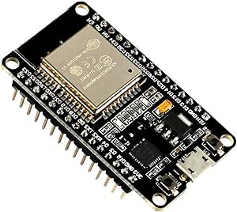

# ESP-WROOM-32 ESP32 ESP-32S Development Board

## Details

- **Location**: Cabinet-1, Bin 31
- **Category**: Development Boards
- **Type**: ESP32 Development Board
- **Microcontroller**: ESP32 (Dual Xtensa LX6 @ 240MHz)
- **Brand**: AITRIP
- **Part Number**: B07WCG1PLV
- **Quantity**: 2
- **Product URL**: https://a.co/d/ciKueeW

## Description

The ESP-WROOM-32 ESP32 ESP-32S Development Board is a 2.4GHz dual-mode WiFi + Bluetooth development board featuring dual cores microcontroller processor integrated with antenna RF AMP filter. It supports AP, STA, and AP+STA modes with ultra-low power consumption and is compatible with Arduino IDE.

## Specifications

- **Microcontroller**: ESP32 dual-core Xtensa LX6 @ up to 240MHz
- **Memory**: 520KB SRAM, 4MB Flash
- **WiFi**: 802.11 b/g/n with integrated antenna
- **Bluetooth**: Bluetooth Classic and BLE (Bluetooth Low Energy)
- **GPIO Pins**: 30 total programmable pins
- **ADC**: 12x 12-bit analog inputs
- **DAC**: 2x 8-bit digital-to-analog converters
- **Touch**: Capacitive touch GPIO pins
- **Peripherals**: I2C, SPI, UART, I2S interfaces
- **USB**: USB-Micro connector for programming and power
- **Power**: 3.3V operating voltage
- **Antenna**: Integrated PCB antenna

## Dimensions

- **Board Size**: 55mm x 28mm (2.17" x 1.10")
- **Weight**: ~10g
- **Form Factor**: Standard ESP32 DevKit compatible

## Image



## Features

- **ESP-WROOM-32 Module**: Certified wireless module with 4MB Flash
- **Dual-Core Performance**: Two Xtensa LX6 cores for multitasking
- **Dual-Mode Connectivity**: WiFi 802.11 b/g/n and Bluetooth Classic/LE
- **Integrated Antenna**: PCB antenna with RF amplifier and filter
- **Multiple Operating Modes**: AP (Access Point), STA (Station), AP+STA
- **Rich Peripherals**: Multiple communication interfaces and GPIO pins
- **Touch Interface**: Capacitive touch-enabled GPIO pins
- **Low Power**: Ultra-low power consumption with multiple sleep modes
- **Arduino Compatible**: Works with Arduino IDE and ESP-IDF

## Connectivity

- **WiFi**: 802.11 b/g/n 2.4GHz with WPA/WPA2 security
- **Bluetooth**: Bluetooth Classic and Low Energy support
- **Antenna**: Integrated PCB antenna with RF amplifier
- **Range**: Good RF performance for IoT applications

## Programming Support

- **Arduino IDE**: Full Arduino support with ESP32 core
- **ESP-IDF**: Official Espressif development framework
- **PlatformIO**: Professional IDE support
- **MicroPython**: Community support available
- **LWIP Protocol**: TCP/IP stack support
- **FreeRTOS**: Real-time operating system support

## Power Management

- **Operating Voltage**: 3.3V
- **Input Voltage**: 5V via USB-Micro
- **Power Consumption**: Ultra-low power with sleep modes
- **Sleep Modes**: Multiple low-power modes available

## Development Features

- **Boot/Reset Buttons**: Easy programming and reset functionality
- **LED Indicators**: Power and user-programmable LEDs
- **Pin Headers**: Standard 2.54mm pitch for breadboard compatibility
- **Compact Design**: Optimized for prototyping and development

## Supported Protocols

- **LWIP**: Lightweight TCP/IP stack
- **FreeRTOS**: Real-time operating system
- **WiFi Protocols**: WPA/WPA2 security
- **Bluetooth Protocols**: Classic and Low Energy profiles

## Pinout Diagram

```
                    ESP32 Development Board Pinout

                    +-----+
         +----------| USB |----------+
         |          +-----+          |
         | [ ]3V3                EN[ ] |
         | [ ]GND               VP[ ] |
         | [ ]D15               VN[ ] |
         | [ ]D2                D34[ ] |
         | [ ]D4                D35[ ] |
         | [ ]D16               D32[ ] |
         | [ ]D17               D33[ ] |
         | [ ]D5                D25[ ] |
         | [ ]D18               D26[ ] |
         | [ ]D19               D27[ ] |
         | [ ]GND               D14[ ] |
         | [ ]D21               D12[ ] |
         | [ ]RX                D13[ ] |
         | [ ]TX                GND[ ] |
         | [ ]D22               VIN[ ] |
         | [ ]D23                     |
         |                           |
         |    [BOOT]  [EN]            |
         +---------------------------+

Note: GPIO pins are 3.3V logic level only
```

## Basic Wiring Examples

### LED Blink Circuit

```
ESP32 GPIO2 → LED Anode (long leg)
LED Cathode (short leg) → 220Ω Resistor → ESP32 GND

Note: GPIO2 has built-in LED on most ESP32 boards
```

### Button Input Circuit

```
ESP32 3V3 → 10kΩ Pull-up Resistor → ESP32 GPIO0
ESP32 GPIO0 → Button → ESP32 GND

Code: digitalRead(0) returns HIGH when not pressed, LOW when pressed
```

### I2C Device Connection

```
ESP32 3V3 → Device VCC
ESP32 GND → Device GND
ESP32 GPIO21 (SDA) → Device SDA
ESP32 GPIO22 (SCL) → Device SCL
Add 4.7kΩ pull-up resistors on SDA and SCL lines
```

### SPI Device Connection

```
ESP32 3V3 → Device VCC
ESP32 GND → Device GND
ESP32 GPIO18 (SCK) → Device SCK
ESP32 GPIO19 (MISO) → Device MISO
ESP32 GPIO23 (MOSI) → Device MOSI
ESP32 GPIO5 (CS) → Device CS/SS
```

### Analog Reading

```
Sensor Output → ESP32 GPIO36 (VP), GPIO39 (VN), or other ADC pins
Code: analogRead(A0) returns 0-4095 (0-3.3V)
```

## Programming Setup Guide

### Arduino IDE Setup

1. Install Arduino IDE 1.8.13 or later
2. Add ESP32 board package URL in preferences:
   `https://dl.espressif.com/dl/package_esp32_index.json`
3. Install "ESP32 by Espressif Systems" from Board Manager
4. Select "ESP32 Dev Module" from Tools → Board
5. Select correct COM port from Tools → Port
6. Upload code via USB

### ESP-IDF Setup

1. Install ESP-IDF development framework
2. Set up toolchain and environment variables
3. Use `idf.py` commands for building and flashing
4. More advanced development with full ESP32 features

## Programming Examples

### Arduino WiFi Connection

```cpp
#include <WiFi.h>

const char* ssid = "your_wifi_name";
const char* password = "your_wifi_password";

void setup() {
  Serial.begin(115200);
  WiFi.begin(ssid, password);

  while (WiFi.status() != WL_CONNECTED) {
    delay(1000);
    Serial.println("Connecting to WiFi...");
  }

  Serial.println("Connected to WiFi");
  Serial.print("IP address: ");
  Serial.println(WiFi.localIP());
}

void loop() {
  // Your code here
}
```

### Arduino Bluetooth Example

```cpp
#include "BluetoothSerial.h"

BluetoothSerial SerialBT;

void setup() {
  Serial.begin(115200);
  SerialBT.begin("ESP32test"); // Bluetooth device name
  Serial.println("The device started, now you can pair it with bluetooth!");
}

void loop() {
  if (Serial.available()) {
    SerialBT.write(Serial.read());
  }
  if (SerialBT.available()) {
    Serial.write(SerialBT.read());
  }
  delay(20);
}
```

### Arduino Web Server Example

```cpp
#include <WiFi.h>
#include <WebServer.h>

const char* ssid = "your_wifi_name";
const char* password = "your_wifi_password";

WebServer server(80);

void handleRoot() {
  server.send(200, "text/html", "<h1>ESP32 Web Server</h1>");
}

void setup() {
  Serial.begin(115200);
  WiFi.begin(ssid, password);

  while (WiFi.status() != WL_CONNECTED) {
    delay(1000);
    Serial.println("Connecting to WiFi...");
  }

  server.on("/", handleRoot);
  server.begin();
  Serial.println("HTTP server started");
}

void loop() {
  server.handleClient();
}
```

## Important Notes

### Voltage Levels

- **GPIO Voltage**: 3.3V logic level only
- **Not 5V Tolerant**: Do not connect 5V signals directly
- **Power Supply**: 3.3V regulated output available
- **Input Voltage**: 5V via USB or VIN pin

### GPIO Limitations

- **Input Only**: GPIO34, GPIO35, GPIO36, GPIO39 are input only
- **Boot Pins**: GPIO0, GPIO2, GPIO12, GPIO15 affect boot mode
- **ADC2**: Cannot use ADC2 pins when WiFi is active
- **Touch Pins**: GPIO0, GPIO2, GPIO4, GPIO12-15, GPIO27, GPIO32-33

## Tags

microcontroller, esp32, esp-wroom-32, wifi, bluetooth-le, bluetooth-classic, aitrip, arduino, esp-idf, dual-core, iot, development-board

## Notes

This development board is perfect for IoT projects requiring WiFi and Bluetooth connectivity. The ESP32 offers excellent performance with dual-core processing and comprehensive wireless capabilities. The integrated antenna eliminates the need for external antenna connections. Ideal for Arduino IDE development and prototyping of wireless applications. **Important: All GPIO pins are 3.3V logic level only - not 5V tolerant!**
