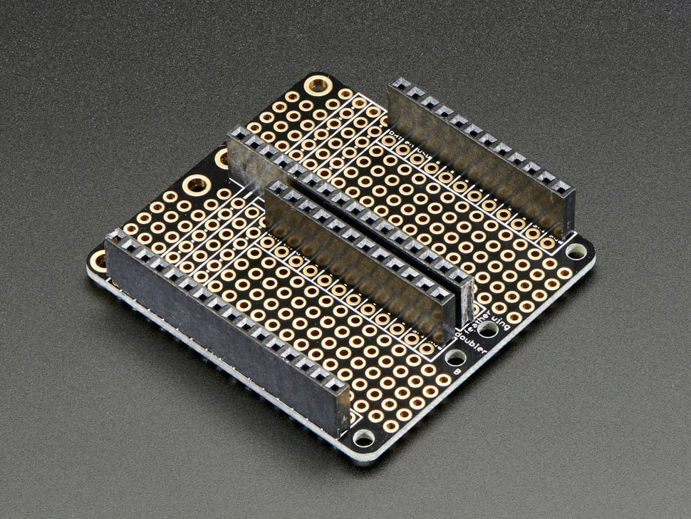

# FeatherWing Doubler - Prototyping Add-on For All Feather Boards

## Details
- **Location**: Cabinet-1, Bin 22
- **Category**: FeatherWings
- **Type**: Prototyping Board / Doubler
- **Size**: 50.9mm x 47mm x 1.6mm
- **Quantity**: 2
- **Product URL**: https://www.adafruit.com/product/2890

## Description
FeatherWing Doubler is a prototyping add-on that allows you to work with two Feather boards simultaneously side-by-side. Features duplicate breakouts for each Feather pin, prototyping grid holes, and cross-connected pins for easy development and testing.

## Specifications
- **PCB Dimensions**: 50.9mm x 47mm x 1.6mm (2" x 1.85" x 0.06")
- **Weight**: 6.7g
- **Material**: FR4 PCB with HASL finish
- **Color**: Green solder mask
- **Thickness**: Standard 1.6mm PCB
- **Mounting**: Feather-compatible header spacing
- **Prototyping Area**: Grid pattern holes for custom circuits

## Image

## Features
- **Dual Feather Support**: Mount two Feather boards side-by-side
- **Duplicate Breakouts**: Each Feather pin broken out twice
- **Cross-Connected Pins**: Pins are connected between both sides
- **Power Rails**: Full strips for GND and 3.3V connections
- **Prototyping Grid**: Plain grid holes for custom circuits
- **Compact Design**: Efficient use of space for development
- **Kit Format**: Comes with headers for custom assembly

## Included Components
- 1x FeatherWing Doubler PCB
- 1x Set of Feather Stacking Headers (12-pin and 16-pin)
- 1x Set of Feather Female Headers (12-pin and 16-pin)

## Pinout & Connections
- **Left Side**: Standard Feather pinout (12-pin + 16-pin)
- **Right Side**: Duplicate Feather pinout (12-pin + 16-pin)
- **Cross-Connected**: All corresponding pins connected between sides
- **Power Rails**: GND and 3.3V have full strip connections
- **Prototyping Area**: Standard 0.1" grid pattern

## Applications
- Feather board development and testing
- Prototyping custom FeatherWing designs
- Connecting multiple Feather boards
- Educational electronics projects
- Rapid prototyping platforms
- Custom sensor integration
- IoT device development
- Breadboard alternative for Feather projects

## Compatibility
- **All Feather Boards**: Universal Feather compatibility
- **FeatherWings**: Can stack with other FeatherWings
- **Headers**: Compatible with standard 0.1" headers
- **Breadboards**: Can be used with breadboard connections
- **Stacking**: Supports stacking header configurations

## Assembly Options
- **Stacking Headers**: For multi-level builds
- **Female Headers**: For socketed Feather mounting
- **Mixed Configuration**: Combine header types as needed
- **Low Profile**: Cut stacking headers for slimmer builds
- **Custom Wiring**: Use prototyping area for custom circuits

## Interface Requirements
- **Soldering**: Headers require soldering to PCB
- **Power**: Powered through connected Feather boards
- **No External Power**: Uses Feather board power rails
- **Signal Levels**: Matches connected Feather specifications

## Notes
- **Kit Format**: Requires assembly (soldering headers)
- **Cross-Connected**: Pins are electrically connected between sides
- **Power Distribution**: GND and 3.3V have full strip connections
- **Prototyping Space**: Additional grid holes for custom circuits
- **Stackable**: Can be used in stacking configurations
- **RoHS Compliant**: Meets environmental standards

## Usage Tips
- Solder headers according to your specific needs
- Use stacking headers for multi-level builds
- Cut stacking headers for lower profile if needed
- Utilize prototyping grid for custom connections
- Test connections before final assembly

## Assembly Instructions
1. Plan your header configuration (stacking vs. female)
2. Insert headers into PCB holes
3. Solder all header pins securely
4. Test connections with multimeter
5. Mount Feather boards as needed

## Design Files
- Eagle CAD PCB files available
- Fritzing files available
- Available in product tutorial on Adafruit Learn

## Comparison with FeatherWing Proto
- **Doubler**: Two Feather mounting positions
- **Proto**: Single Feather with more prototyping space
- **Use Case**: Doubler for multi-board projects, Proto for single board

## Tags
featherwing, prototyping, doubler, adafruit, feather, breadboard, headers
