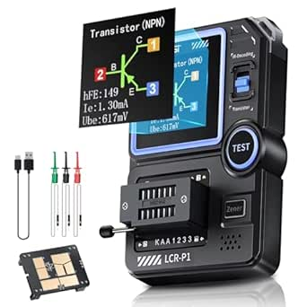

# FNRSI LCR-P1 Transistor Meter

## Overview

The FNRSI LCR-P1 is a multifunctional electronic component tester capable of analyzing and measuring various semiconductor components including transistors, diodes, capacitors, inductors, and resistors. This professional-grade instrument features intelligent component recognition with one-button operation and includes advanced features like SMD testing and infrared signal decoding.

## Key Features

### Component Testing Capabilities

- **Transistors**: Automatic detection of NPN/PNP bipolar transistors with β measurement (10-600 range)
- **Field-Effect Transistors**: Supports JFET, IGBT, and MOSFET testing
- **Diodes**: Forward voltage drop measurement (<4.5V)
- **Voltage Regulator Diodes**: Zener voltage testing (0.01-4.5V, 0.01-32V)
- **Passive Components**: Resistance (0.010-50MΩ), Capacitance (25pF-100mF), Inductance (10uH-1000uH)

### Advanced Features

- **SMD Testing**: Dedicated adapter for surface-mount device testing
- **Anti-burn Protection**: Built-in safety mechanism prevents component damage
- **NEC Infrared Decoding**: Remote control signal analysis capability
- **Data Export**: USB connectivity for PC data transfer and Excel export
- **Replaceable Test Boards**: Modular design for different testing scenarios

### Hardware Design

- **Display**: Color LCD screen with backlight for easy reading
- **Power**: 300mAh rechargeable battery for portable operation
- **Test Socket**: Zero insertion force (ZIF) socket for easy component insertion
- **Build Quality**: Professional-level construction with replaceable components

## Testing Specifications

| Parameter     | Range         | Notes                                 |
| ------------- | ------------- | ------------------------------------- |
| Resistance    | 0.010Ω - 50MΩ | Wide range for various resistor types |
| Capacitance   | 25pF - 100mF  | Covers most common capacitor values   |
| Inductance    | 10µH - 1000µH | Suitable for coils and inductors      |
| Transistor β  | 10 - 600      | Current gain measurement              |
| Diode Vf      | < 4.5V        | Forward voltage drop                  |
| Zener Voltage | 0.01V - 32V   | Voltage regulator testing             |

## Usage Instructions

1. **Power On**: Press power button to activate the device
2. **Component Insertion**: Place component in ZIF socket or use test clips
3. **Auto-Test**: Press test button for automatic component identification
4. **Results**: View component type, pinout, and measured values on display
5. **Data Export**: Connect via USB to transfer results to PC

## SMD Testing

The LCR-P1 includes a specialized SMD adapter that replaces the standard ZIF socket:

1. Remove the ZIF socket module by pulling upward
2. Install the SMD adapter in its place
3. Place SMD components on the test platform
4. Use the same one-button testing procedure

## Applications

- **Component Sorting**: Organize loose components by type and value
- **Quality Control**: Verify component specifications before use
- **Circuit Debugging**: Test components in-circuit (power off)
- **Education**: Learn component characteristics and behavior
- **Repair Work**: Identify faulty components in electronic devices

## Location

**Cabinet**: 4  
**Bin**: 7  
**Quantity**: 1

## Purchase Information

- **Source**: Amazon
- **Price**: $29.99 (List: $39.99, 25% savings)
- **Purchase Date**: January 13, 2025
- **Product URL**: [Amazon Link](https://a.co/d/j7nKifA)

## Notes

This is an excellent value for a multifunctional component tester. The device provides professional-level testing capabilities at a fraction of the cost of traditional LCR meters. The SMD testing capability and data export features make it particularly useful for modern electronics work.

The anti-burn protection and one-button operation make it safe and easy to use, while the color display and component pinout diagrams provide clear, informative results.

## Pinout/Connection Information

### Test Socket Connections

The LCR-P1 uses a Zero Insertion Force (ZIF) socket with the following pin assignments:

- **Pin 1**: Test Point A (left side when facing display)
- **Pin 2**: Test Point B (center)
- **Pin 3**: Test Point C (right side when facing display)

### SMD Test Platform

When using the SMD adapter, components are placed directly on the test platform pads which correspond to the same electrical connections as the ZIF socket pins.

### USB Connection

- **USB Type**: Mini-USB connector on side of device
- **Function**: Data transfer and firmware updates
- **Cable**: Standard Mini-USB cable (not included)

## Circuit Integration Notes

### In-Circuit Testing

- **IMPORTANT**: Always power off circuits before testing components in-circuit
- Can test components with one leg lifted from circuit
- Anti-burn protection helps prevent damage to sensitive components
- Test clips can be used for accessing components without desoldering

### Component Handling

- Use anti-static precautions when handling sensitive components
- Clean component leads before testing for accurate readings
- Store in anti-static environment when not in use

## Technical Specifications

### Measurement Accuracy

- **Resistance**: ±1% + 3 digits (typical)
- **Capacitance**: ±2% + 5 digits (typical)
- **Inductance**: ±3% + 5 digits (typical)
- **Voltage**: ±1% + 2 digits (typical)

### Environmental Specifications

- **Operating Temperature**: 0°C to 40°C
- **Storage Temperature**: -10°C to 60°C
- **Humidity**: 80% RH max (non-condensing)
- **Altitude**: Up to 2000m

## Troubleshooting

### Common Issues

1. **Inaccurate Readings**: Clean component leads, check for proper insertion
2. **No Display**: Check battery charge, press power button
3. **Component Not Detected**: Verify component is functional, try different orientation
4. **SMD Testing Issues**: Ensure SMD adapter is properly seated, clean test pads

### Calibration

- Device includes internal calibration routines
- Periodic calibration recommended for precision measurements
- Contact manufacturer for calibration procedures if needed

## Firmware Updates

The LCR-P1 supports firmware updates via USB connection:

1. Download latest firmware from FNRSI website
2. Connect device to PC via USB cable
3. Follow manufacturer's update procedure
4. Verify firmware version after update

## Related Components

- [[test-equipment]] - Other testing and measurement tools
- [[multimeters]] - Basic electrical measurement tools
- [[oscilloscopes]] - Waveform analysis equipment
- [[component-testers]] - Similar component testing devices
