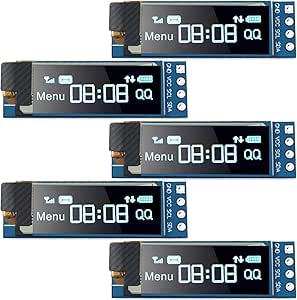

# Frienda 0.91" I2C OLED Display Module

## Details

- **Location**: Cabinet-1, Bin 21
- **Category**: OLED Displays
- **Type**: I2C OLED Display Module
- **Size**: 0.91 inch diagonal
- **Resolution**: 128x32 pixels
- **Quantity**: 5
- **Product URL**: https://www.amazon.com/Pieces-Display-Module-SSD1306-3-3V-5V/dp/B08CDN5PSJ

## Description

Frienda 5 pieces I2C OLED display module with 0.91 inch screen size and 128x32 pixel resolution. Features SSD1306 driver chip with I2C interface for easy connection to microcontrollers. Self-illuminated OLED technology provides excellent contrast and visibility.

## Specifications

- **Display Size**: 0.91 inch diagonal
- **Resolution**: 128x32 pixels
- **Driver IC**: SSD1306
- **Interface**: I2C (SDA, SCL)
- **Display Color**: Blue
- **Operating Voltage**: 3.3V to 5V
- **Current Consumption**: ~20mA (typical)
- **Viewing Angle**: >160°
- **Operating Temperature**: -40°C to +85°C
- **Package**: PCB module without pin headers

## Image



## Features

- **Self-Illuminated**: No backlight required, each pixel emits light
- **High Contrast**: Excellent visibility in various lighting conditions
- **Low Power**: Efficient OLED technology with low current consumption
- **Wide Voltage Range**: Compatible with 3.3V and 5V systems
- **I2C Interface**: Simple 2-wire communication (SDA, SCL)
- **Compact Size**: Small form factor perfect for portable projects
- **No Pin Headers**: Requires soldering of header pins for breadboard use

## Pinout

- **VCC**: Power supply (3.3V to 5V)
- **GND**: Ground
- **SDA**: I2C data line
- **SCL**: I2C clock line

## Wiring Diagrams

### Arduino Uno Connection

```
OLED Display    Arduino Uno
------------    -----------
VCC        →    5V or 3.3V
GND        →    GND
SDA        →    A4 (SDA)
SCL        →    A5 (SCL)

Note: Arduino Uno has built-in I2C pull-up resistors
```

### Raspberry Pi Pico Connection

```
OLED Display    Pico
------------    ----
VCC        →    3V3
GND        →    GND
SDA        →    GP4 (I2C0 SDA)
SCL        →    GP5 (I2C0 SCL)

Note: Add 4.7kΩ pull-up resistors on SDA and SCL if needed
```

### ESP32 Connection

```
OLED Display    ESP32
------------    -----
VCC        →    3.3V
GND        →    GND
SDA        →    GPIO21 (SDA)
SCL        →    GPIO22 (SCL)

Note: ESP32 has built-in I2C pull-up resistors
```

## Programming Examples

### Arduino Code Example

```cpp
#include <Wire.h>
#include <Adafruit_GFX.h>
#include <Adafruit_SSD1306.h>

#define SCREEN_WIDTH 128
#define SCREEN_HEIGHT 32
#define OLED_RESET -1
#define SCREEN_ADDRESS 0x3C

Adafruit_SSD1306 display(SCREEN_WIDTH, SCREEN_HEIGHT, &Wire, OLED_RESET);

void setup() {
  Serial.begin(9600);

  if(!display.begin(SSD1306_SWITCHCAPVCC, SCREEN_ADDRESS)) {
    Serial.println(F("SSD1306 allocation failed"));
    for(;;);
  }

  display.clearDisplay();
  display.setTextSize(1);
  display.setTextColor(SSD1306_WHITE);
  display.setCursor(0,0);
  display.println(F("Hello, World!"));
  display.display();
}

void loop() {
  // Your code here
}
```

### CircuitPython Code Example

```python
import board
import busio
import displayio
import adafruit_displayio_ssd1306
import terminalio
from adafruit_display_text import label

# Initialize I2C
i2c = busio.I2C(board.SCL, board.SDA)

# Initialize display
display_bus = displayio.I2CDisplay(i2c, device_address=0x3C)
display = adafruit_displayio_ssd1306.SSD1306(display_bus, width=128, height=32)

# Create text label
text = "Hello World!"
text_area = label.Label(terminalio.FONT, text=text, color=0xFFFFFF, x=28, y=15)

# Show on display
splash = displayio.Group()
splash.append(text_area)
display.show(splash)

while True:
    pass
```

## Applications

- Arduino and microcontroller projects
- Raspberry Pi displays
- IoT device status displays
- Portable instruments
- Data loggers
- Weather stations
- Digital clocks
- Menu systems
- Status indicators
- Wearable electronics

## Compatibility

- **Arduino**: All Arduino boards (Uno, Nano, ESP32, etc.)
- **Raspberry Pi**: All models (requires I2C enable)
- **ESP8266/ESP32**: Native I2C support
- **STM32**: Compatible with HAL I2C libraries
- **Microcontrollers**: Any MCU with I2C capability

## Libraries & Resources

- **Arduino**: Adafruit SSD1306 library
- **CircuitPython**: adafruit_ssd1306
- **Raspberry Pi**: luma.oled library
- **Documentation**: SSD1306 datasheet available online
- **I2C Address**: Typically 0x3C or 0x3D

## Interface Requirements

- **Power Supply**: 3.3V or 5V regulated
- **I2C Pullups**: Usually built-in on development boards
- **Pin Headers**: Requires soldering for breadboard connections
- **Current**: Ensure adequate power supply capacity

## Notes

- **No Pin Headers**: Displays come without headers, soldering required
- **I2C Address**: Check address with I2C scanner if multiple devices
- **Power Consumption**: Lower when fewer pixels are lit
- **Lifespan**: OLED displays may dim over extended continuous use
- **Fragile**: Handle carefully, OLED screens can crack easily
- **Static Sensitive**: Use anti-static precautions during handling

## Usage Tips

- Solder 4-pin header for easy breadboard prototyping
- Use pull-up resistors if not present on your development board
- Start with lower brightness settings to extend display life
- Consider sleep modes for battery-powered applications
- Test I2C address before connecting multiple I2C devices

## Programming Examples

- Display text and graphics
- Real-time sensor data visualization
- Menu navigation systems
- Progress bars and status indicators
- Simple animations and scrolling text

## Tags

oled-display, i2c, ssd1306, blue, 128x32, frienda, arduino, raspberry-pi
