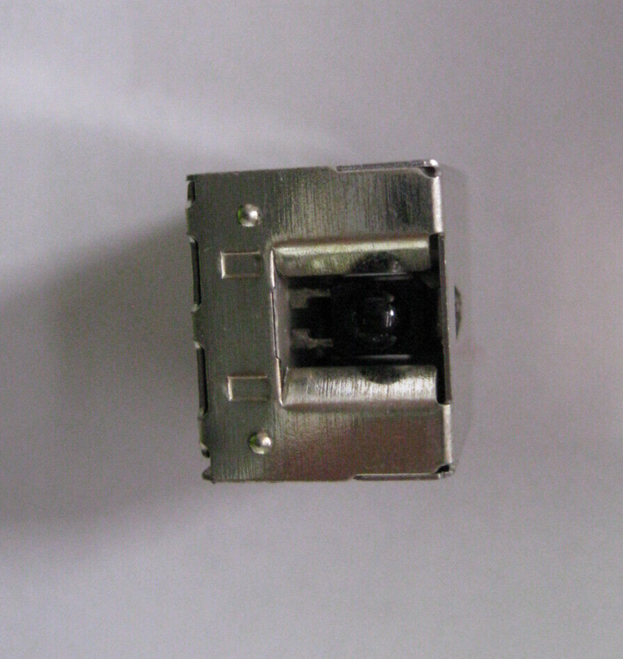

# GP1U5 SHARP IR Detector Block

## Details

- **Location**: Cabinet-5, Bin 32
- **Category**: Sensors & Transducers
- **Brand**: Sharp Corporation
- **Part Number**: GP1U5 / GP1U521x series
- **Package**: DIP-3 / Block Module
- **Quantity**: 1
- **Status**: Available
- **Price Range**: $40-50
- **Product URL**: https://www.ebay.com/itm/156148297589

## Description

The GP1U5 is a Sharp-manufactured integrated infrared receiver module commonly used in consumer electronics such as TVs and VCRs. This module combines a photodiode, preamplifier, and demodulator in a single compact package, designed specifically for detecting modulated infrared signals from remote controls. It's particularly well-suited for Sony equipment but is compatible with other brands using similar IR modulation schemes.

## Specifications

### Electrical Characteristics

- **Supply Voltage**: 4.5V - 5V typical operation
- **Detection Wavelength**: ~940nm (infrared)
- **Modulation Frequency**: 38KHz carrier frequency (standard for remote controls)
- **Output Type**: Digital output signal, active low when IR detected
- **Power Consumption**: Low power consumption design
- **Sensitivity**: High sensitivity with ambient light rejection
- **Output Logic**: TTL/CMOS compatible

### Physical Characteristics

- **Package**: Compact block or DIP-3 style module
- **Mounting**: PCB mount with 3-pin configuration
- **Pin Count**: 3 pins (VCC, GND, OUT)
- **Size**: Compact form factor suitable for consumer electronics
- **Color**: Typically black plastic housing with IR-transparent window

### Key Features

- Integrated photodiode + preamplifier + demodulator
- Built-in automatic gain control (AGC)
- Noise suppression against sunlight and indoor lighting
- High immunity to ambient light interference
- Designed for Sony remote control protocols
- Compatible with standard 38KHz modulated IR signals
- Low power consumption for battery-powered applications

## Image



**Visual Description**: The GP1U5 IR detector appears as a compact black plastic module with three pins for mounting. The front face has a dark IR-transparent window that allows infrared light to reach the internal photodiode. The module is designed for through-hole PCB mounting and is commonly found in TV and VCR applications.

## Applications

Common use cases and applications for this component:

- Television IR remote control receivers
- VCR and DVD player remote interfaces
- Sony equipment IR detection systems
- Consumer electronics remote control applications
- IR communication systems operating at 38KHz
- Replacement parts for vintage electronics
- Custom IR receiver projects
- Home automation IR control systems
- Educational electronics demonstrations
- Repair of legacy audio/video equipment

## Circuit Examples

### Basic IR Receiver Circuit

```
GP1U5 Pin Configuration:
Pin 1: VCC (4.5V - 5V)
Pin 2: GND (Ground)
Pin 3: OUT (Digital Output, Active Low)

Basic Connection:
VCC ---- 4.7µF capacitor ---- GND (power supply filtering)
OUT ---- Pull-up resistor (10kΩ) ---- VCC
OUT ---- To microcontroller digital input pin
```

### Arduino Integration

```cpp
const int IR_PIN = 2;
bool irSignalDetected = false;

void setup() {
  pinMode(IR_PIN, INPUT);
  Serial.begin(9600);
  Serial.println("GP1U5 IR Detector Ready");
}

void loop() {
  // GP1U5 output is active LOW
  if (digitalRead(IR_PIN) == LOW) {
    if (!irSignalDetected) {
      Serial.println("IR Signal Detected!");
      irSignalDetected = true;
    }
  } else {
    if (irSignalDetected) {
      Serial.println("IR Signal Ended");
      irSignalDetected = false;
    }
  }
  delay(10);
}
```

## Technical Notes

Important technical considerations and usage tips:

- **Active Low Output**: Output goes LOW when IR signal is detected
- **Power Supply**: Requires clean 5V supply with proper decoupling
- **Ambient Light**: Built-in filtering rejects sunlight and fluorescent lights
- **Modulation**: Optimized for 38KHz carrier frequency
- **Sony Compatibility**: Originally designed for Sony remote protocols
- **Mounting**: Ensure IR window has clear line of sight to remote
- **Replacement**: Common replacement for vintage TV/VCR IR receivers
- **Sensitivity**: High sensitivity may require shielding in bright environments
- **Timing**: Fast response time suitable for remote control applications
- **Compatibility**: Works with most standard IR remote controls

## Tags

infrared-receiver, ir-detector, sharp, gp1u5, gp1u521x, sony-compatible, tv-vcr, remote-control, 38khz #cabinet-5 #bin-32 #status-available

## Notes

This GP1U5 SHARP IR detector block is a valuable component for vintage electronics repair and custom IR receiver projects. Originally designed for Sony TV and VCR applications, it provides reliable infrared signal detection with excellent ambient light rejection. The integrated design combines all necessary components (photodiode, amplifier, and demodulator) in a single compact package, making it ideal for space-constrained applications. Having this component available is particularly useful for repairing older consumer electronics where original parts may be difficult to source. The 38KHz modulation frequency makes it compatible with most standard remote controls, not just Sony devices. Perfect for electronics restoration projects, educational demonstrations, or custom IR control systems.
