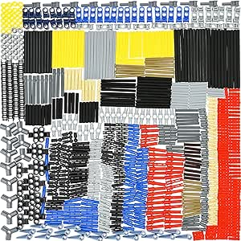

# Habow 882pcs Technic Parts Set

## Details

- **Location**: Cabinet 4, Bins 1 and 2 (distributed across both bins)
- **Category**: Building Components
- **Manufacturer**: Habow
- **Part Number**: 882pcs-technic-set
- **Total Pieces**: 882
- **Quantity**: 882 pieces
- **Status**: Available
- **Price**: $24.08 (6% savings from $25.69)
- **Source**: Amazon
- **Product URL**: [Amazon Link](https://a.co/d/4ANsvue)

## Description

The Habow 882-piece Technic Parts Set is a comprehensive collection of Lego Technic-compatible mechanical components designed for building and repairing advanced mechanical models. This extensive kit includes essential Technic elements like axles, pins, connectors, bushes, chain links, and gears, making it perfect for MOC (My Own Creation) builders and robotics enthusiasts.

## Image

## Specifications

### Material Properties

- **Plastic Type**: High-quality ABS (Acrylonitrile Butadiene Styrene)
- **Compatibility**: Fully compatible with major brand building blocks (Lego Technic)
- **Color Scheme**: Random colors (multi-color assortment)
- **Build Quality**: Durable construction with excellent building experience

### Included Components

- **Technic Axles**: Various lengths for different mechanical applications
- **Technic Pins**: Both friction and frictionless variants
- **Technic Axle Pin Connectors**: Hybrid connectors combining axle and pin functionality
- **Technic Chain Links**: For creating flexible drive systems and mechanical linkages
- **Technic Bushes**: Spacing and bearing elements for smooth axle operation
- **Teeth/Gears**: Various gear types for mechanical advantage and power transmission
- **Technic Joint Connectors**: Articulated connections for complex mechanical systems
- **Beams and Liftarms**: Structural framework elements
- **Connectors and Adapters**: Specialized joining pieces
- **Rubber Bands**: Elastic elements for spring mechanisms and tensioning

## Key Features

### Complete Technic Arsenal

- **882 Total Pieces**: Extensive variety of essential Technic components
- **Universal Compatibility**: Fully compatible with major brand building blocks including Lego Technic
- **High-Quality Materials**: Durable ABS plastic construction for reliable performance
- **Multi-Color Assortment**: Random color selection provides variety for creative builds

### Essential Components Included

#### Axles and Pins

- **Technic Axles**: Various lengths for different mechanical applications
- **Technic Pins**: Both friction and frictionless variants for different connection needs
- **Axle Pin Connectors**: Hybrid connectors combining axle and pin functionality

#### Mechanical Elements

- **Chain Links**: For creating flexible drive systems and mechanical linkages
- **Bushes**: Spacing and bearing elements for smooth axle operation
- **Teeth/Gears**: Various gear types for mechanical advantage and power transmission
- **Joint Connectors**: Articulated connections for complex mechanical systems

#### Structural Components

- **Beams and Liftarms**: Structural framework elements
- **Connectors and Adapters**: Specialized joining pieces
- **Rubber Bands**: Elastic elements for spring mechanisms and tensioning

## Pinout/Connection Information

### Technic Pin Standards

- **Standard Pins**: 4.8mm diameter, friction fit connections
- **Frictionless Pins**: Smooth rotation for moving joints
- **Pin Length**: Standard 18.8mm length for most applications

### Axle Specifications

- **Cross-Section**: Standard Technic cross-axle profile
- **Diameters**: 4.8mm cross-axle standard
- **Lengths**: Multiple lengths from 2-stud to 12-stud variants

### Chain Link Compatibility

- **Pitch**: Standard Technic chain pitch (8mm)
- **Connection**: Compatible with Technic sprockets and gears
- **Flexibility**: Allows for complex drive train routing

## Circuit Integration Notes

### Robotics Applications

- **EV3 Mindstorms**: Perfect for repairing and expanding robotics kits
- **Motor Integration**: Compatible with Technic motors and power functions
- **Sensor Mounting**: Provides structural support for sensor placement

### Mechanical Systems

- **Gear Trains**: Create complex gear reduction systems
- **Linkages**: Build four-bar linkages and mechanical advantage systems
- **Suspension**: Construct shock absorber and suspension mechanisms

## Technical Specifications

### Material Properties

- **Plastic Type**: High-quality ABS (Acrylonitrile Butadiene Styrene)
- **Durability**: Excellent impact resistance and long-term stability
- **Precision**: Tight tolerances for reliable connections
- **Color Stability**: UV-resistant formulation prevents fading

### Dimensional Standards

- **Stud Spacing**: Standard 8mm grid compatibility
- **Pin Holes**: 4.8mm diameter for standard Technic pins
- **Axle Holes**: Cross-shaped holes for Technic axles
- **Beam Heights**: Standard 7.2mm beam height

### Performance Characteristics

- **Connection Strength**: Reliable friction fit connections
- **Wear Resistance**: Designed for repeated assembly/disassembly
- **Temperature Range**: Stable from -10°C to 60°C
- **Chemical Resistance**: Resistant to common household chemicals

## Applications and Use Cases

### MOC Building

- **Custom Vehicles**: Cars, trucks, motorcycles, and aircraft
- **Industrial Models**: Cranes, excavators, and construction equipment
- **Mechanical Demonstrations**: Working models of engines and transmissions

### Educational Projects

- **STEM Learning**: Hands-on mechanical engineering concepts
- **Physics Demonstrations**: Gear ratios, mechanical advantage, and motion
- **Problem Solving**: Engineering challenges and design thinking

### Repair and Maintenance

- **Replacement Parts**: Common wear items for existing Technic sets
- **Upgrades**: Enhance existing models with additional functionality
- **Modifications**: Customize official sets with improved mechanisms

## Troubleshooting

### Common Issues

1. **Loose Connections**: Ensure pins are fully inserted and not worn
2. **Binding Mechanisms**: Check for proper alignment and lubrication needs
3. **Color Matching**: Random colors may not match existing sets
4. **Missing Pieces**: Verify all components against included inventory

### Best Practices

- **Organization**: Sort pieces by type and size for easy access
- **Storage**: Use compartmentalized containers to prevent loss
- **Cleaning**: Wash with mild soap and water when needed
- **Inspection**: Check for stress cracks or wear before use

## Compatibility Notes

### Brand Compatibility

- **Lego Technic**: 100% compatible with all Technic elements
- **Third-Party**: Works with most Technic-compatible building systems
- **Mixing**: Can be safely combined with original Lego parts

### System Integration

- **Power Functions**: Compatible with Lego Power Functions motors
- **Mindstorms**: Integrates with EV3 and NXT robotics systems
- **Pneumatics**: Works with Technic pneumatic components

## Purchase Information

- **Source**: Amazon
- **Price**: $24.08 (6% savings)
- **List Price**: $25.69
- **Purchase Date**: January 13, 2025
- **Product URL**: [Amazon Link](https://a.co/d/4ANsvue)
- **Seller**: Habow US (Amazon Fulfillment)

## Notes

This comprehensive parts collection is excellent value for Technic builders and robotics enthusiasts. The variety of components makes it suitable for both repair work and original creations. The random color assortment adds visual interest to builds while maintaining full functional compatibility.

The kit is particularly valuable for educational settings where students need access to a wide variety of mechanical components for engineering projects and STEM learning activities.

## Related Components

- [[fnrsi-lcr-p1-transistor-meter]] - Test equipment for electronic components
- [[building-components]] - Other construction and building parts
- [[mechanical-parts]] - Additional mechanical components and hardware
- [[robotics-components]] - Sensors, motors, and control systems
