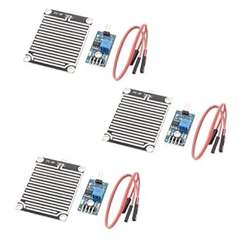

# HiLetgo LM393 Rain Drops Sensor Weather Moisture Monitor (3pcs)

## Details

- **Location**: Cabinet 4, Bin 10
- **Category**: Sensors
- **Brand**: HiLetgo
- **Part Number**: LM393-RAIN-3PCS
- **Package**: 3-piece kit
- **Quantity**: 3 kits (9 sensors total)
- **Status**: Available
- **Price Range**: $6.49 per kit
- **Product URL**: https://a.co/d/dsFHUuD

## Description

Professional rain detection sensor designed for weather monitoring and automatic rain-responsive systems. Features separate control and sensor boards connected by cable for flexible installation, with both analog and digital outputs for comprehensive rain detection capabilities.

## Image



## Specifications

### Electrical Characteristics
- **Operating Voltage**: 3.3V - 5V DC
- **Output Current**: >15mA (digital output)
- **Comparator IC**: LM393 dual differential comparator
- **Output Types**: Digital (TTL) and Analog
- **Sensitivity**: Adjustable via onboard potentiometer
- **Drive Capability**: >100mA, can drive relays, buzzers, fans directly

### Physical Characteristics
- **Control Board**: 3.0 x 1.6 cm
- **Sensor Board**: 5.4 x 4.0 cm (large detection area)
- **Material**: High-quality FR-04 double-sided PCB
- **Surface**: Nickel-plated for oxidation resistance and conductivity
- **Connection**: Separate boards with connecting cable
- **Mounting**: Positioning holes for easy installation

### Key Features
- **Separate Boards**: Control and sensor boards for flexible placement
- **Large Detection Area**: 5.4 x 4.0 cm sensor for reliable rain detection
- **Dual Output**: Both digital and analog rain intensity measurement
- **Weather Resistant**: Nickel-plated surface for outdoor durability
- **LED Indicators**: Power and detection status indicators
- **High Drive Current**: Direct relay/actuator control capability

## Pinout/Connection Information

### Pin Configuration
- **VCC**: Power supply positive (3.3V - 5V)
- **GND**: Power supply ground/negative
- **DO**: Digital output (TTL level, LOW when rain detected)
- **AO**: Analog output (voltage varies with rain intensity)

### Connection Diagram
```
Control Board    Arduino/MCU
VCC         -->  3.3V or 5V
GND         -->  GND
DO          -->  Digital Pin (e.g., D2)
AO          -->  Analog Pin (e.g., A0)

Control Board <--> Sensor Board (via included cable)
```

### Output Characteristics
- **Digital Output**: HIGH when dry, LOW when rain detected
- **Analog Output**: Higher voltage = more rain, Lower voltage = less rain
- **TTL Compatible**: Standard logic level outputs
- **High Current**: Can directly drive 100mA loads

## Circuit Integration Notes

### Weather Station Integration
- **Rain Detection**: Binary rain/no-rain detection via digital output
- **Intensity Measurement**: Analog output for rain intensity quantification
- **Data Logging**: Interface with SD cards or cloud services for weather data
- **Alert Systems**: Trigger notifications when rain is detected

### Automatic Control Systems
- **Window Control**: Automatically close windows when rain starts
- **Irrigation Shutoff**: Disable sprinkler systems during rainfall
- **Awning Control**: Retract awnings to prevent water damage
- **Ventilation**: Close vents and air intakes during rain

### Installation Considerations
- **Sensor Placement**: Mount sensor board in exposed location for rain contact
- **Control Board**: Keep control electronics in protected enclosure
- **Cable Management**: Use weatherproof connections for outdoor installations
- **Calibration**: Adjust sensitivity for local rainfall patterns

## Technical Specifications

### Detection Performance
- **Response Time**: Fast response to water droplet contact
- **Sensitivity Range**: Adjustable from light mist to heavy rain
- **Detection Area**: Large 5.4 x 4.0 cm sensing surface
- **Repeatability**: Consistent detection across temperature ranges
- **Recovery Time**: Quick return to dry state when rain stops

### Environmental Specifications
- **Operating Temperature**: -10°C to 60°C
- **Storage Temperature**: -20°C to 70°C
- **Humidity Range**: 0% to 95% RH (non-condensing)
- **Weather Resistance**: Designed for outdoor exposure
- **UV Resistance**: Stable performance under sunlight exposure

### Electrical Performance
- **Supply Current**: <20mA typical operation
- **Output Voltage**: 0V to VCC range (analog), 0V/VCC (digital)
- **Input Impedance**: High impedance for minimal loading
- **Output Impedance**: Low impedance for reliable signal transmission
- **Noise Immunity**: Good rejection of electrical interference

## Applications

### Weather Monitoring
- **Home Weather Stations**: Comprehensive weather data collection
- **Agricultural Monitoring**: Farm and greenhouse rain detection
- **Research Applications**: Meteorological data collection systems
- **Environmental Monitoring**: Ecosystem and climate studies

### Automation Systems
- **Smart Home**: Automated window and skylight control
- **Irrigation Control**: Water-saving automatic sprinkler systems
- **HVAC Systems**: Climate control based on weather conditions
- **Security Systems**: Weather-aware outdoor equipment protection

### Educational Projects
- **STEM Education**: Weather monitoring and data collection projects
- **Arduino Learning**: Sensor interfacing and automation concepts
- **Science Fair**: Environmental monitoring demonstrations
- **Maker Projects**: DIY weather station construction

## Troubleshooting

### Common Issues
1. **False Positives**: Adjust sensitivity potentiometer for local conditions
2. **No Detection**: Check sensor board connections and cleanliness
3. **Intermittent Operation**: Verify cable connections between boards
4. **Slow Response**: Clean sensor surface of dirt or debris

### Maintenance Procedures
- **Regular Cleaning**: Remove leaves, dirt, and debris from sensor surface
- **Connection Check**: Inspect cable connections for corrosion or damage
- **Calibration**: Periodically test and adjust sensitivity settings
- **Weather Protection**: Ensure control board remains dry and protected

### Optimization Tips
- **Mounting Angle**: Slight tilt helps water runoff and prevents pooling
- **Height Placement**: Mount high enough to avoid splash-back
- **Shelter Control**: Protect control board while exposing sensor
- **Sensitivity Tuning**: Adjust for local rainfall characteristics

## Compatibility Notes

### Microcontroller Platforms
- **Arduino**: Full compatibility with all Arduino variants
- **Raspberry Pi**: Works with GPIO and ADC interfaces
- **ESP32/ESP8266**: Ideal for WiFi-enabled weather monitoring
- **PIC/AVR**: Standard sensor interface compatibility

### System Integration
- **Relay Modules**: Direct drive capability for high-power switching
- **Display Systems**: Interface with weather display panels
- **Wireless Modules**: Easy integration with IoT platforms
- **Data Loggers**: Compatible with various data acquisition systems

### Communication Protocols
- **I2C/SPI**: Can be interfaced through ADC modules
- **WiFi/Bluetooth**: Integration with wireless communication modules
- **LoRa/Zigbee**: Long-range weather monitoring networks
- **Cellular**: Remote weather station applications

## Notes

This rain sensor provides reliable weather detection for both hobbyist and professional applications. The separate control and sensor board design allows for optimal placement - keeping electronics protected while exposing the sensor to weather conditions.

**Installation Tip**: Mount the sensor board at a slight angle to promote water runoff and prevent false readings from standing water. The large detection area provides excellent sensitivity to even light rainfall.

The high current drive capability makes this sensor ideal for directly controlling relays, solenoids, and other actuators without additional driver circuits, simplifying system design for automated weather-responsive applications.

## Related Components

- [[hiletgo-lm393-soil-moisture-sensor-5pcs]] - Complementary soil moisture sensors
- [[weather-monitoring-sensors]] - Other meteorological sensors
- [[relay-modules]] - For controlling automated systems
- [[arduino-weather-shields]] - Complete weather monitoring platforms
