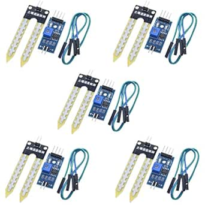

# HiLetgo LM393 3.3V-5V Soil Moisture Detect Sensor (5pcs)

## Details

- **Location**: Cabinet 4, Bin 10
- **Category**: Sensors
- **Brand**: HiLetgo
- **Part Number**: LM393-SOIL-5PCS
- **Package**: 5-piece kit
- **Quantity**: 4 kits (20 sensors total)
- **Status**: Available
- **Price Range**: $7.89 per kit
- **Product URL**: https://a.co/d/dCR5WP7

## Description

Simple and effective soil moisture detection sensor designed for automatic watering systems and plant monitoring applications. Features the LM393 comparator for stable digital output and includes both analog and digital outputs for versatile integration with microcontroller projects.

## Image



## Specifications

### Electrical Characteristics
- **Operating Voltage**: 3.3V - 5V DC
- **Output Current**: >15mA (digital output)
- **Comparator IC**: LM393 dual differential comparator
- **Output Types**: Digital (TTL) and Analog
- **Sensitivity**: Adjustable via blue potentiometer
- **Response Time**: Fast response to moisture changes

### Physical Characteristics
- **Sensor Board Size**: 5.0 x 4.0 cm
- **Material**: High-quality FR-04 double-sided PCB
- **Probe Material**: Nickel-plated for corrosion resistance
- **Connection**: 4-pin interface (VCC, GND, DO, AO)
- **Mounting**: PCB mounting holes available

### Key Features
- **Dual Output**: Both digital and analog outputs available
- **Adjustable Sensitivity**: Blue potentiometer for threshold adjustment
- **Clean Signal**: LM393 comparator provides stable digital output
- **Corrosion Resistant**: Nickel-plated probes for longevity
- **LED Indicators**: Power and output status LEDs
- **Wide Compatibility**: Works with Arduino, Raspberry Pi, ESP32

## Pinout/Connection Information

### Pin Configuration
- **VCC**: Power supply positive (3.3V - 5V)
- **GND**: Power supply ground/negative
- **DO**: Digital output (TTL level, active low when wet)
- **AO**: Analog output (voltage varies with moisture level)

### Connection Diagram
```
Sensor Module    Arduino/MCU
VCC         -->  3.3V or 5V
GND         -->  GND
DO          -->  Digital Pin (e.g., D2)
AO          -->  Analog Pin (e.g., A0)
```

### Output Characteristics
- **Digital Output**: HIGH when dry, LOW when moisture detected
- **Analog Output**: Higher voltage = drier soil, Lower voltage = wetter soil
- **Threshold**: Adjustable via onboard potentiometer
- **Drive Capability**: Can directly drive relays, buzzers, small fans

## Circuit Integration Notes

### Arduino Integration
- **Digital Mode**: Use digitalRead() to detect moisture presence
- **Analog Mode**: Use analogRead() for moisture level measurement
- **Calibration**: Adjust potentiometer for desired sensitivity
- **Power Management**: Can be powered directly from Arduino 5V/3.3V

### Automatic Watering Systems
- **Relay Control**: Digital output can drive relay modules directly
- **Pump Control**: Interface with water pumps for automatic irrigation
- **Multiple Sensors**: Use multiple sensors for different plant zones
- **Threshold Setting**: Adjust sensitivity for different soil types

### Important Considerations
- **Corrosion**: Minimize continuous power to reduce electrolytic corrosion
- **Calibration**: Test in actual soil conditions for accurate readings
- **Placement**: Insert probes to appropriate depth for root zone monitoring
- **Maintenance**: Clean probes periodically for consistent readings

## Technical Specifications

### Performance Parameters
- **Detection Range**: Dry to saturated soil conditions
- **Accuracy**: Consistent readings within calibrated range
- **Repeatability**: Good consistency across multiple sensors
- **Temperature Range**: 0°C to 50°C operating temperature
- **Humidity Range**: 10% to 90% RH (non-condensing)

### Electrical Specifications
- **Supply Current**: <20mA typical
- **Output Voltage**: 0V to VCC (analog), 0V/VCC (digital)
- **Input Impedance**: High impedance analog input compatible
- **Output Impedance**: Low impedance for reliable signal transmission

### Mechanical Specifications
- **Probe Length**: Approximately 6cm insertion depth
- **Board Thickness**: Standard PCB thickness (1.6mm)
- **Weight**: Lightweight design for easy installation
- **Durability**: Designed for outdoor/greenhouse use

## Applications

### Agricultural Monitoring
- **Greenhouse Automation**: Monitor soil moisture in greenhouse environments
- **Garden Irrigation**: Automatic watering for home gardens
- **Hydroponic Systems**: Monitor growing medium moisture levels
- **Plant Care**: Individual plant monitoring for optimal growth

### Educational Projects
- **STEM Learning**: Teach sensor interfacing and automation concepts
- **Arduino Projects**: Beginner-friendly sensor for learning
- **Science Fair**: Environmental monitoring project demonstrations
- **Maker Education**: Hands-on experience with analog/digital sensors

### Commercial Applications
- **Smart Agriculture**: Large-scale farm monitoring systems
- **Landscape Irrigation**: Commercial landscape watering control
- **Research**: Agricultural research and development projects
- **IoT Applications**: Internet-connected plant monitoring systems

## Troubleshooting

### Common Issues
1. **Inconsistent Readings**: Clean sensor probes, check connections
2. **No Response**: Verify power supply and wiring connections
3. **False Triggers**: Adjust sensitivity potentiometer
4. **Corrosion**: Use intermittent power to reduce electrolytic damage

### Best Practices
- **Intermittent Power**: Power sensor only during readings to prevent corrosion
- **Calibration**: Test in dry and wet conditions to set proper thresholds
- **Protection**: Use in weatherproof enclosures for outdoor applications
- **Maintenance**: Regular cleaning and inspection of sensor probes

### Calibration Procedure
1. **Dry Calibration**: Test sensor in completely dry soil
2. **Wet Calibration**: Test sensor in saturated soil
3. **Threshold Setting**: Adjust potentiometer for desired trigger point
4. **Verification**: Test with various moisture levels to confirm operation

## Compatibility Notes

### Microcontroller Compatibility
- **Arduino**: All Arduino boards (Uno, Nano, ESP32, etc.)
- **Raspberry Pi**: Compatible with GPIO and ADC interfaces
- **ESP32/ESP8266**: Direct compatibility with WiFi-enabled projects
- **PIC/AVR**: Standard sensor interface compatible

### System Integration
- **Relay Modules**: Direct drive capability for switching applications
- **Display Systems**: Interface with LCD/OLED displays for readings
- **Data Logging**: Compatible with SD card modules and cloud logging
- **Wireless**: Easy integration with WiFi, Bluetooth, LoRa modules

## Notes

These sensors provide an excellent entry point into automated plant care and agricultural monitoring. The dual output design offers flexibility for both simple on/off control and sophisticated analog monitoring applications.

**Important**: For long-term outdoor use, implement intermittent power control to minimize sensor corrosion. The sensors work best when powered only during measurement periods rather than continuously.

The LM393 comparator ensures clean digital switching, making these sensors reliable for triggering irrigation systems and other automated responses to soil moisture conditions.

## Related Components

- [[hiletgo-lm393-rain-sensor-3pcs]] - Complementary rain detection sensors
- [[relay-modules]] - For controlling pumps and valves
- [[arduino-boards]] - Compatible microcontroller platforms
- [[moisture-sensors]] - Other soil and humidity monitoring sensors
