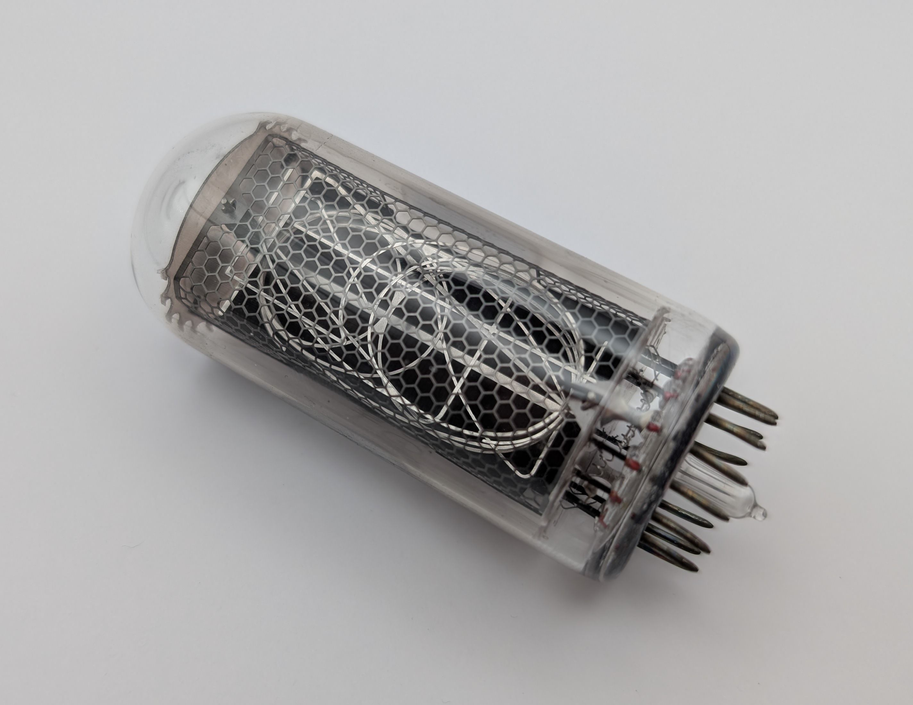

# IN-18 Large Nixie Tubes

## Details

- **Location**: Cabinet-4, Bin 22
- **Category**: Display
- **Brand**: Soviet/Russian
- **Part Number**: IN-18
- **Package**: Glass tube with multi-pin base
- **Quantity**: 6
- **Status**: available
- **Price Range**: $15-30 each
- **Datasheet**: Soviet-era tube specifications

## Description

The IN-18 is a large Soviet-era numeric nixie display tube featuring impressive 40mm tall digits that glow with the characteristic warm orange light. These tubes were manufactured in the Soviet Union and are highly sought after for nixie clock projects due to their large, easily readable digits. The IN-18 represents one of the larger nixie tubes available, making it perfect for prominent display applications where visibility is important.

## Specifications

### Electrical Characteristics

- **Operating Voltage**: ~170V DC for digit illumination
- **Current per Digit**: 2.5-3mA when lit
- **Power Consumption**: Low power, only a few milliamps per active digit
- **Cathode**: Common cathode configuration
- **Anodes**: Individual anodes for digits 0-9

### Physical Characteristics

- **Digit Height**: ~40mm (approximately 1.6 inches)
- **Package**: Glass envelope with multi-pin base
- **Pin Count**: Typically 11 pins
- **Base Type**: Multi-pin tube socket required
- **Glow Color**: Warm orange characteristic of nixie tubes
- **Operating Temperature**: Standard tube operating range

### Key Features

- Large 40mm digit height for excellent visibility
- Classic Soviet-era construction and reliability
- Warm orange glow characteristic of nixie tubes
- Individual digit control via separate anodes
- Common cathode simplifies driving circuitry
- Vintage aesthetic perfect for retro projects

## Image

## Pinout

The IN-18 typically uses an 11-pin base configuration:

- **Common Cathode**: Shared cathode connection for all digits
- **Digit Anodes**: Individual anode pins for digits 0 through 9
- **Pin Assignment**: Exact pinout may vary by manufacturer batch

_Note: Always verify pinout with tube tester or datasheet before use, as Soviet-era tubes may have manufacturing variations._

## Applications

Common uses for IN-18 nixie tubes:

- Large nixie clocks for prominent display
- Vintage-style digital counters and timers
- Retro electronics projects and displays
- Educational demonstrations of tube technology
- Art installations requiring large glowing numbers
- Replacement tubes for vintage Soviet equipment

## Circuit Requirements

### Power Supply

- **High Voltage**: Requires ~170V DC regulated supply
- **Current Limiting**: Use appropriate current limiting resistors (~100kΩ typical)
- **Regulation**: Stable voltage regulation important for consistent brightness

### Driving Circuit

- **Decoder**: BCD to decimal decoder (like K155ID1 or 74141)
- **Current Limiting**: Individual current limiting resistors for each digit
- **Switching**: High voltage switching capability required

## Technical Notes

Important considerations for IN-18 tubes:

- Requires high voltage power supply (~170V DC)
- Current limiting resistors essential to prevent tube damage
- Socket required for proper mounting and connections
- Tube warm-up time may be needed for stable operation
- Handle with care due to glass construction and high voltages
- Vintage tubes may have varying characteristics between units

## Safety Considerations

**HIGH VOLTAGE WARNING**: These tubes operate at 170V DC which can be dangerous:

- Always use proper high voltage safety practices
- Ensure power is disconnected before handling
- Use appropriate current limiting to prevent tube damage
- Proper enclosure required to prevent accidental contact
- Follow all electrical safety guidelines when working with high voltage

## Tags

nixie, display, tube, soviet, vintage, large-digits #cabinet-4 #bin-22 #status-available

## Notes

These IN-18 nixie tubes are excellent for projects requiring large, highly visible numeric displays. Their 40mm digit height makes them among the largest commonly available nixie tubes. The Soviet manufacturing heritage adds to their vintage appeal. Perfect for prominent nixie clock displays or any application where large, glowing numbers are desired. Ensure proper high voltage power supply and safety precautions when using these tubes.
