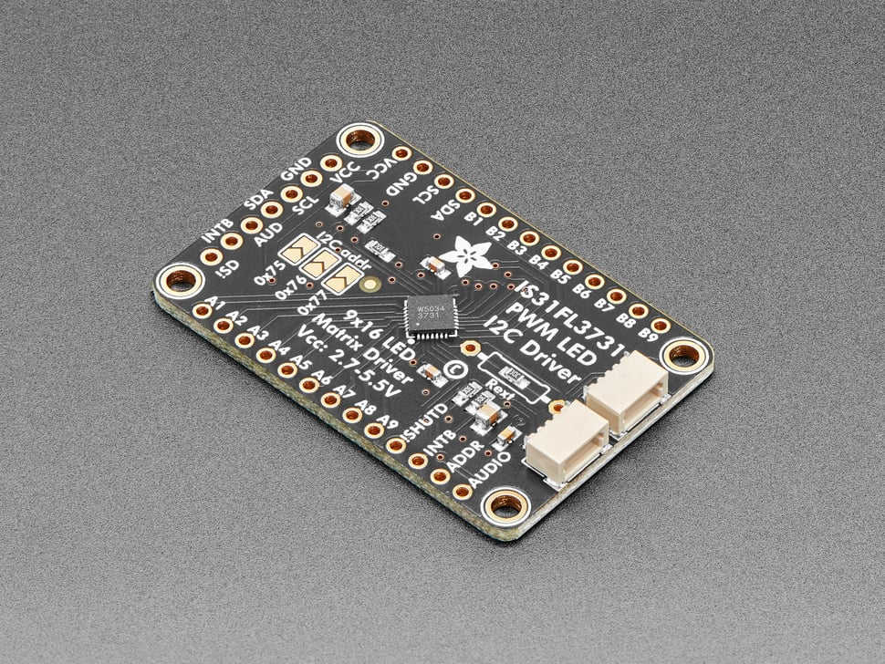

# Adafruit 16x9 Charlieplexed PWM LED Matrix Driver - IS31FL3731

## Details

- **Location**: Cabinet-1, Bin 23
- **Category**: LED Backpacks
- **Type**: 16x9 Charlieplexed PWM LED Matrix Driver
- **Driver Chip**: IS31FL3731
- **Interface**: I2C with STEMMA QT / Qwiic connectors
- **Quantity**: 3
- **Product URL**: https://www.adafruit.com/product/2946

## Description

I2C LED matrix driver breakout featuring the IS31FL3731 chip with STEMMA QT / Qwiic connectors for easy plug-and-play connections. Drives up to 144 LEDs in a 16x9 charlieplexed configuration with individual PWM control for each LED. Perfect for creating LED matrix displays with minimal pin usage.

## Specifications

- **Part Number**: 2946
- **Driver Chip**: IS31FL3731
- **Matrix Configuration**: 16x9 (144 LEDs max)
- **Technology**: Charlieplexed PWM control
- **Interface**: I2C (address selectable)
- **Connectors**: 2x STEMMA QT / Qwiic (JST SH 4-pin)
- **Voltage**: 2.7V - 5.5V (power and logic)
- **PWM Resolution**: 8-bit (256 levels) per LED
- **Frame Memory**: 8 separate frames for animations
- **Dimensions**: 43.2mm x 28.0mm x 4.7mm (1.7" x 1.1" x 0.2")
- **Weight**: 4.4g (0.2oz)

## Image

## Features

- **Individual LED Control**: Each of 144 LEDs independently controllable
- **8-bit PWM Dimming**: 256 brightness levels per LED
- **Charlieplexed Design**: Maximum LEDs with minimal pins
- **I2C Interface**: Simple 2-wire control
- **STEMMA QT / Qwiic**: Plug-and-play connectors
- **Multiple Addresses**: Up to 4 drivers on same I2C bus
- **Frame Buffer**: 8 frames of display memory for animations
- **Wide Voltage Range**: 2.7V - 5.5V compatible

## Driver Capabilities

- **IS31FL3731**: Advanced charlieplex LED driver
- **144 LED Support**: Full 16x9 matrix capability
- **Animation Support**: Hardware frame switching
- **Address Selection**: Multiple drivers on one bus
- **Low Power**: Efficient operation
- **Graphics Compatible**: Adafruit_GFX library support

## Applications

- LED matrix displays
- Scrolling text signs
- Animation displays
- Status indicators
- Art installations
- Educational projects
- Custom LED grids
- Wearable displays

## Compatible LED Matrices

- 9x16 LED Charlieplexed Matrix (various colors)
- Custom LED arrangements
- DIY LED grids following IS31FL3731 schematic
- Any charlieplexed LED configuration up to 16x9

## Interface

- **Communication**: I2C (TWI)
- **Addresses**: Selectable (up to 4 on same bus)
- **Voltage**: 2.7V - 5.5V compatible
- **Connectors**: STEMMA QT / Qwiic for easy chaining
- **Libraries**: Arduino, CircuitPython, Python

## Programming

- **Arduino Library**: Adafruit_IS31FL3731
- **CircuitPython**: Built-in support
- **Graphics**: Adafruit_GFX compatible
- **Functions**: Lines, circles, text, bitmaps
- **Animations**: Frame-based animation system

## Notes

- Driver board only - LED matrix sold separately
- Designed to sandwich with Adafruit LED matrices
- STEMMA QT connectors compatible with SparkFun Qwiic
- Requires basic soldering for LED matrix attachment
- Can drive custom LED arrangements following datasheet
- Multiple drivers can be chained on same I2C bus
- Perfect companion for 9x16 LED matrices

## Tags

led-driver, is31fl3731, charlieplexed, i2c, stemma-qt, qwiic, matrix, adafruit
