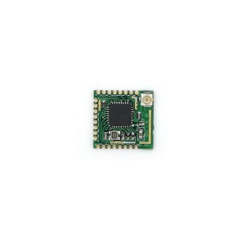
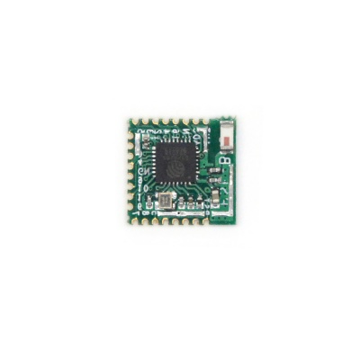

# ITEAD PSF WiFi Modules Collection

## Details

- **Location**: Cabinet-3, Bin 17
- **Category**: Wireless Modules
- **Brand**: ITEAD Studio
- **Chip**: ESP8285 (ESP8266 with integrated 1MB flash)
- **Total Quantity**: 10 modules
- **Models**: PSF-A85 and PSF-B85

## Description

Collection of ITEAD PSF (Personal Smart Firmware) WiFi modules based on the ESP8285 chip. These ultra low-power modules are designed for IoT applications, providing WiFi connectivity with built-in microcontroller capabilities. Perfect for serial-to-WiFi bridges, IoT devices, and wireless control applications.

## Module Variants

### PSF-A85 - Stamp Hole Interface
- **Quantity**: 5 modules
- **Package**: 13.5mm × 13.7mm × 1mm
- **Antenna**: Dual interface (IPEX connector + stamp hole)
- **Features**:
  - Stamp hole antenna interface for custom PCB antennas
  - IPEX connector for external antennas
  - Ultra-compact form factor
  - All GPIO pins accessible

### PSF-B85 - Onboard Ceramic Antenna
- **Quantity**: 5 modules
- **Package**: Similar compact size
- **Antenna**: Onboard ceramic antenna
- **Features**:
  - Built-in ceramic antenna (no external antenna needed)
  - Ready-to-use design
  - Optimized for space-constrained applications
  - No antenna design required

## Images





## Technical Specifications

### Core Processor
- **Chip**: ESP8285 (ESP8266 + 1MB integrated flash)
- **Architecture**: 32-bit Tensilica L106 RISC processor
- **Clock Speed**: 80MHz (can be overclocked to 160MHz)
- **Flash Memory**: 1MB integrated flash memory
- **RAM**: 96KB data RAM, 64KB instruction RAM

### WiFi Specifications
- **Standard**: IEEE 802.11 b/g/n/d/e/i/k/r
- **Frequency**: 2.412GHz - 2.484GHz
- **Modes**: STA/AP/STA+AP
- **Security**: WEP/WPA-PSK/WPA2-PSK
- **Encryption**: WEP64/WEP128/TKIP/AES

### Power Specifications
- **Operating Voltage**: 3.3V
- **Operating Current**: 
  - Active: ~70mA average, 200mA peak
  - Standby: <200µA
  - Deep Sleep: 0.5µA
- **Transmit Power**: 
  - 802.11b: +20dBm ±2dBm
  - 802.11g: +17dBm ±2dBm
  - 802.11n: +14dBm ±2dBm

### Interface Capabilities
- **GPIO Pins**: 9 available GPIO pins
- **UART**: Full duplex, up to 921600 bps
- **SPI**: Master/Slave mode
- **I2C**: Master/Slave mode
- **PWM**: Software PWM on any GPIO
- **ADC**: 1 channel, 0-1V input range

## Applications

### IoT Applications
- **Smart Home**: Light switches, sensors, thermostats
- **Industrial IoT**: Remote monitoring and control
- **Agricultural**: Soil moisture, weather stations
- **Security**: Door sensors, motion detectors
- **Energy**: Smart meters, power monitoring

### Communication Applications
- **Serial-to-WiFi**: Convert UART devices to WiFi
- **Wireless Bridge**: Connect legacy devices to WiFi
- **Data Logger**: Remote data collection and transmission
- **Remote Control**: WiFi-enabled device control
- **Telemetry**: Sensor data transmission

### Development Applications
- **Prototyping**: Quick WiFi connectivity for projects
- **Educational**: Learning IoT and WiFi programming
- **Maker Projects**: DIY smart devices
- **Research**: Wireless sensor networks
- **Testing**: WiFi protocol development

## Programming and Development

### Firmware Options
- **AT Commands**: Default firmware with AT command set
- **Arduino IDE**: Program using Arduino-style code
- **ESP-IDF**: Espressif's official development framework
- **MicroPython**: Python-based firmware
- **NodeMCU**: Lua-based firmware

### Development Tools
- **Arduino IDE**: Popular choice for beginners
- **PlatformIO**: Professional IDE with advanced features
- **ESP Flash Tool**: Official flashing utility
- **esptool.py**: Command-line flashing tool

### Programming Interface
- **UART Programming**: Standard method using RX/TX pins
- **OTA Updates**: Over-the-air firmware updates
- **Debug Interface**: Serial debugging capabilities
- **GPIO Programming**: Direct pin control

## Pin Configuration

### Standard GPIO Pins
- **GPIO0**: Boot mode selection, general I/O
- **GPIO2**: UART1_TX, general I/O (boot strapping)
- **GPIO4**: General I/O
- **GPIO5**: General I/O
- **GPIO12-16**: General I/O pins
- **ADC**: Analog input (0-1V)

### Special Function Pins
- **EN**: Chip enable (active high)
- **RST**: Reset pin (active low)
- **RX/TX**: UART communication
- **VCC**: 3.3V power supply
- **GND**: Ground connections

## Advantages

### Design Benefits
- **Integrated Flash**: No external flash memory required
- **Compact Size**: Minimal PCB footprint
- **Low Power**: Excellent for battery-powered applications
- **Cost Effective**: Affordable WiFi connectivity solution

### Technical Benefits
- **Dual Core**: WiFi and application processing
- **Rich Interfaces**: Multiple communication protocols
- **Flexible Antenna**: Multiple antenna options
- **Robust Protocol**: Industrial-grade WiFi implementation

## Development Considerations

### Power Management
- **3.3V Supply**: Requires regulated 3.3V power
- **Current Spikes**: Handle 200mA peak current
- **Sleep Modes**: Utilize deep sleep for battery applications
- **Power Sequencing**: Proper startup sequence required

### RF Considerations
- **Antenna Placement**: Keep antenna clear of metal
- **Ground Plane**: Proper PCB ground plane design
- **Impedance Matching**: 50Ω antenna traces
- **Certification**: Consider regulatory requirements

### Programming Tips
- **Boot Mode**: GPIO0 and GPIO2 control boot mode
- **Flash Size**: 1MB flash limits application size
- **Memory Management**: Efficient use of limited RAM
- **Watchdog**: Implement proper watchdog handling

## Common Applications Examples

### Smart Switch
```cpp
// Basic WiFi switch control
#include <ESP8266WiFi.h>
#include <ESP8266WebServer.h>

const int relayPin = 5;
ESP8266WebServer server(80);

void setup() {
  pinMode(relayPin, OUTPUT);
  WiFi.begin("SSID", "password");
  server.on("/on", []() {
    digitalWrite(relayPin, HIGH);
    server.send(200, "text/plain", "ON");
  });
  server.begin();
}
```

### Sensor Data Logger
```cpp
// Temperature sensor with WiFi reporting
#include <ESP8266WiFi.h>
#include <ESP8266HTTPClient.h>

void setup() {
  WiFi.begin("SSID", "password");
}

void loop() {
  float temp = readTemperature();
  sendToServer(temp);
  ESP.deepSleep(60e6); // Sleep 1 minute
}
```

## Tags

itead, psf, esp8285, wifi, iot, wireless, uart, gpio, pwm

## Notes

These ITEAD PSF modules provide an excellent entry point into ESP8285-based IoT development. The integrated flash memory eliminates the need for external storage, while the compact form factor makes them ideal for space-constrained applications. The choice between PSF-A85 (flexible antenna options) and PSF-B85 (built-in antenna) depends on specific application requirements and PCB design constraints.
