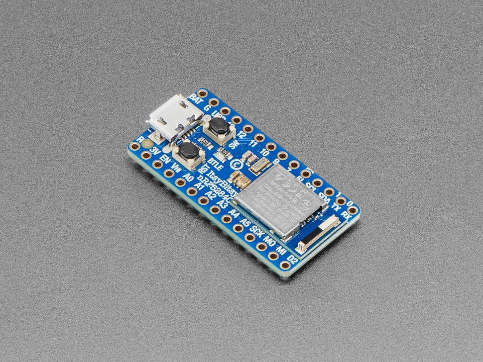
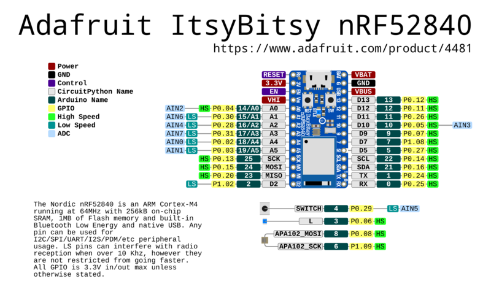

# Adafruit ItsyBitsy nRF52840 Express - Bluetooth LE

## Details

- **Location**: Cabinet-1, Bin 28
- **Category**: Microcontroller Boards
- **Type**: Bluetooth LE Development Board
- **Microcontroller**: Nordic nRF52840
- **Brand**: Adafruit
- **Part Number**: 4481
- **Quantity**: 1
- **Product URL**: https://www.adafruit.com/product/4481

## Description

Compact Bluetooth LE development board featuring the Nordic nRF52840 processor in the popular ItsyBitsy form factor. Combines powerful ARM Cortex-M4F processing with built-in Bluetooth LE radio, making it perfect for wireless IoT projects, wearables, and connected devices. Supports both Arduino IDE and CircuitPython for easy development.

## Specifications

- **Part Number**: 4481
- **Microcontroller**: Nordic nRF52840
- **Architecture**: 32-bit ARM Cortex-M4F with FPU
- **Clock Speed**: 64MHz
- **Operating Voltage**: 3.3V
- **Input Voltage**: 3.3V-5.5V (via USB or VIN)
- **Flash Memory**: 1024KB (1MB)
- **RAM**: 256KB
- **QSPI Flash**: 2MB for file storage and CircuitPython code
- **Dimensions**: 36.0mm × 17.6mm × 5.3mm
- **Weight**: 3.0g

## Image



## Features

- **Bluetooth LE**: Built-in 2.4GHz radio with +8dBm output power
- **ARM Cortex-M4F**: High-performance processor with floating-point unit
- **USB Native**: Built-in USB support with UF2 bootloader
- **CircuitPython**: Drag-and-drop programming support
- **Arduino Compatible**: Full Arduino IDE support
- **Compact Size**: ItsyBitsy form factor (1.4" × 0.7")
- **Rich I/O**: 21 GPIO pins with multiple functions

## Bluetooth Capabilities

- **Protocol**: Bluetooth Low Energy (BLE) 5.0
- **Frequency**: 2.4GHz ISM band
- **Output Power**: Up to +8dBm
- **Range**: Typical 10-100m depending on environment
- **Modes**: Central and Peripheral operation
- **Certification**: FCC/IC/TELEC certified module
- **Profiles**: HID, UART, custom profiles supported

## Pin Configuration

- **Digital I/O**: 21 pins
- **Analog Inputs**: 6 pins (12-bit ADC)
- **PWM Outputs**: Up to 12 pins (3 PWM modules × 4 outputs each)
- **Communication**:
  - Hardware SPI, UART, I2C on any pins
  - I2S digital audio support
- **Special Pins**:
  - Vhigh output pin for 5V logic devices
  - Digital 5 level-shifted output
  - Built-in LED (pin 13)
  - DotStar RGB LED for status indication

## Programming & Software

- **Arduino IDE**: Full support with Adafruit board package
- **CircuitPython**: Drag-and-drop Python programming
- **UF2 Bootloader**: Appears as USB drive for easy programming
- **USB Modes**: Serial, HID (Keyboard/Mouse), Mass Storage
- **Libraries**: Extensive Bluetooth and sensor libraries available
- **Development**: Web-based and desktop IDEs supported

## Memory & Storage

- **Program Flash**: 1MB for application code
- **RAM**: 256KB for variables and buffers
- **QSPI Flash**: 2MB for:
  - CircuitPython filesystem
  - Data logging
  - Audio/image files
  - User data storage

## Power Management

- **USB Power**: 5V via micro-USB connector
- **Battery Power**: 3.3V-5.5V via VIN pin or JST connector
- **Low Power**: Hardware sleep modes for battery operation
- **Power LED**: Indicates power status
- **Current Draw**: Varies by application and radio usage

## Communication Interfaces

- **USB**: Native USB 2.0 Full Speed (12 Mbps)
- **Bluetooth LE**: 2.4GHz wireless communication
- **UART**: Multiple hardware serial ports
- **I2C**: Hardware I2C with clock stretching
- **SPI**: High-speed serial peripheral interface
- **I2S**: Digital audio interface

## Applications

- **IoT Devices**: Wireless sensors and actuators
- **Wearables**: Smart clothing and accessories
- **Home Automation**: Bluetooth-connected home devices
- **Health Monitoring**: Fitness trackers and medical devices
- **Asset Tracking**: Location and movement monitoring
- **Audio Projects**: Bluetooth audio streaming and processing
- **Educational**: Learning Bluetooth and embedded programming

## Advantages

- **Wireless Connectivity**: Built-in Bluetooth LE radio
- **Easy Programming**: CircuitPython and Arduino support
- **Compact Size**: Perfect for space-constrained projects
- **Low Power**: Optimized for battery-powered applications
- **Rich Peripherals**: Multiple communication interfaces
- **Community Support**: Extensive documentation and examples
- **Professional Grade**: FCC certified for commercial use

## Development Tools

- **Arduino IDE**: Traditional C/C++ development
- **CircuitPython**: Python-based development
- **Visual Studio Code**: Advanced IDE with extensions
- **Mu Editor**: Simple Python editor for beginners
- **Web-based IDEs**: Browser-based development options

## Kit Contents

- ItsyBitsy nRF52840 Express board
- Headers (not pre-soldered)
- Quick start documentation

## Pinout Diagram

### Official Adafruit ItsyBitsy nRF52840 Express Pinout



## Basic Wiring Examples

### LED Blink Circuit

```
LED Anode (long leg) → 220Ω Resistor → ItsyBitsy Pin 13
LED Cathode (short leg) → ItsyBitsy GND

Note: Pin 13 has built-in LED, Pin 3 has blue LED
```

### Button Input Circuit

```
ItsyBitsy 3V → 10kΩ Pull-up Resistor → ItsyBitsy Pin 7
ItsyBitsy Pin 7 → Button → ItsyBitsy GND

Code: pinMode(7, INPUT_PULLUP); digitalRead(7);
```

### I2C Sensor Connection

```
I2C Sensor VCC → ItsyBitsy 3V
I2C Sensor GND → ItsyBitsy GND
I2C Sensor SDA → ItsyBitsy SDA (requires 2.2kΩ-10kΩ pullup to 3V)
I2C Sensor SCL → ItsyBitsy SCL (requires 2.2kΩ-10kΩ pullup to 3V)

Note: External pullups required for I2C operation
```

### NeoPixel Strip Connection

```
NeoPixel Strip VCC → ItsyBitsy Vhi (5V when USB powered)
NeoPixel Strip GND → ItsyBitsy GND
NeoPixel Strip DIN → ItsyBitsy Pin 5 (level-shifted to Vhi)

Code: #include <Adafruit_NeoPixel.h>; Adafruit_NeoPixel strip(30, 5);
```

### Servo Motor Connection

```
Servo Red Wire → ItsyBitsy Vhi (5V)
Servo Black Wire → ItsyBitsy GND
Servo White Wire → ItsyBitsy Pin 9 (PWM capable)

Code: #include <Servo.h>; Servo myservo; myservo.attach(9);
```

### Battery Power Connection

```
3.7V LiPo Battery + → ItsyBitsy BAT
3.7V LiPo Battery - → ItsyBitsy GND

Note: Automatic switching between USB and battery power
```

### UART Communication

```
Device TX → ItsyBitsy Pin 0 (RX)
Device RX → ItsyBitsy Pin 1 (TX)
Device VCC → ItsyBitsy 3V
Device GND → ItsyBitsy GND

Code: Serial1.begin(9600); // Hardware UART on pins 0,1
```

## Programming Setup Guide

### Arduino IDE Setup

1. Install Arduino IDE 1.8.19 or later
2. Add Adafruit board package URL in preferences:
   `https://adafruit.github.io/arduino-board-index/package_adafruit_index.json`
3. Install "Adafruit nRF52 by Adafruit" boards package
4. Install required libraries:
   - Bluefruit nRF52 Libraries
   - Adafruit NeoPixel
   - Adafruit DotStar
   - Adafruit Sensor libraries
5. Select "Adafruit ItsyBitsy nRF52840 Express" from Tools → Board

### CircuitPython Setup

1. Download CircuitPython UF2 for ItsyBitsy nRF52840 from circuitpython.org
2. Double-click RESET button to enter bootloader (red LED pulses)
3. Drag UF2 file to ITSYBOOT drive
4. Board reboots as CIRCUITPY drive
5. Install required libraries in lib folder

### Bluetooth Development Setup

1. Install Nordic nRF Connect app on mobile device
2. Install Bluefruit Connect app for testing
3. Use Nordic nRF52 SDK for advanced development
4. Consider using Web Bluetooth for browser integration

## Programming Examples

### Arduino - Basic Bluetooth LE Beacon

```cpp
#include <bluefruit.h>

void setup() {
  Serial.begin(115200);

  // Initialize Bluefruit
  Bluefruit.begin();
  Bluefruit.setTxPower(4);    // Check bluefruit.h for supported values
  Bluefruit.setName("ItsyBitsy-Beacon");

  // Set up advertising packet
  Bluefruit.Advertising.addFlags(BLE_GAP_ADV_FLAGS_LE_ONLY_GENERAL_DISC_MODE);
  Bluefruit.Advertising.addTxPower();
  Bluefruit.Advertising.addName();

  // Start advertising
  Bluefruit.Advertising.restartOnDisconnect(true);
  Bluefruit.Advertising.setInterval(32, 244);    // in unit of 0.625 ms
  Bluefruit.Advertising.setFastTimeout(30);      // number of seconds in fast mode
  Bluefruit.Advertising.start(0);                // 0 = Don't stop advertising after n seconds

  Serial.println("Bluetooth LE Beacon started");
}

void loop() {
  // Toggle built-in LED to show activity
  digitalToggle(LED_BUILTIN);
  delay(1000);
}
```

## Notes

- Headers require soldering for breadboard use
- Compatible with ItsyBitsy form factor accessories
- Bluetooth range depends on antenna design and environment
- Low power modes require careful programming
- CircuitPython provides beginner-friendly development
- Arduino libraries provide advanced functionality
