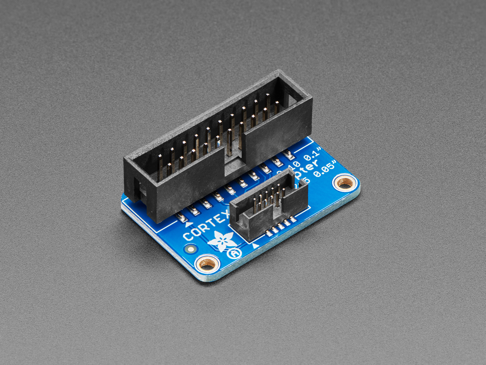

# JTAG to SWD Cable Adapter Board

## Details

- **Location**: Cabinet-1, Bin 5
- **Category**: Programming / Debugging Tools
- **Product URL**: https://www.adafruit.com/product/2094

## Description

JTAG (2x10 2.54mm) to SWD (2x5 1.27mm) Cable Adapter Board for connecting JTAG debuggers to SWD targets.

## Image

## Tags

#jtag #swd #adapter #debugging #adafruit
