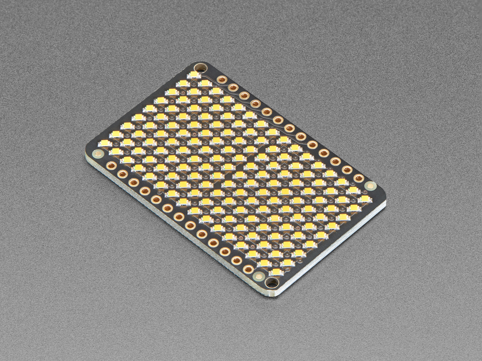

# LED Charlieplexed Matrix - 9x16 LEDs - Warm White

## Details

- **Location**: Cabinet-1, Bin 23
- **Category**: LED Displays
- **Type**: 9x16 Charlieplexed LED Matrix
- **Color**: Warm White
- **LEDs**: 144 individually addressable
- **Quantity**: 3
- **Product URL**: https://www.adafruit.com/product/3162

## Description

9x16 Charlieplexed LED matrix with 144 warm white LEDs designed to work with the Adafruit IS31FL3731 PWM LED Matrix Driver. This is just the LED matrix board - no driver chip or resistors included. Perfect for creating scrolling text displays, animations, or other LED matrix projects.

## Specifications

- **Part Number**: 3162
- **LED Count**: 144 (9x16 matrix)
- **LED Color**: Warm White
- **Technology**: Charlieplexed arrangement
- **Dimensions**: 43.3mm x 28.1mm x 2.4mm (1.7" x 1.1" x 0.1")
- **Weight**: 5.7g (0.2oz)
- **Interface**: Requires IS31FL3731 driver board
- **RoHS Compliant**: Yes

## Image

## Features

- **144 Individual LEDs**: Each LED can be controlled independently
- **Charlieplexed Design**: Efficient pin usage for maximum LED count
- **Warm White Color**: ~3000K color temperature for pleasant lighting
- **Compact Size**: Small form factor for embedded projects
- **IS31FL3731 Compatible**: Designed to work with Adafruit's PWM driver
- **RoHS Compliant**: Environmental compliance

## Applications

- Scrolling text displays
- LED animations and effects
- Status indicators
- Decorative lighting
- Wearable projects
- Interactive art installations
- Educational LED matrix projects

## Interface Requirements

- **Driver**: Adafruit IS31FL3731 16x9 Charlieplexed PWM LED Matrix Driver
- **Communication**: I2C via driver board
- **Power**: 3.3V or 5V (via driver)
- **Current**: Varies based on number of LEDs lit

## Notes

- This is just the LED matrix - driver board sold separately
- Requires IS31FL3731 driver for operation
- Charlieplexed arrangement allows 144 LEDs with minimal pins
- Warm white provides pleasant, eye-friendly illumination
- Can be daisy-chained with multiple matrices
- Arduino and CircuitPython libraries available

## Tags

led-display, matrix, charlieplexed, warm-white, adafruit, 9x16
