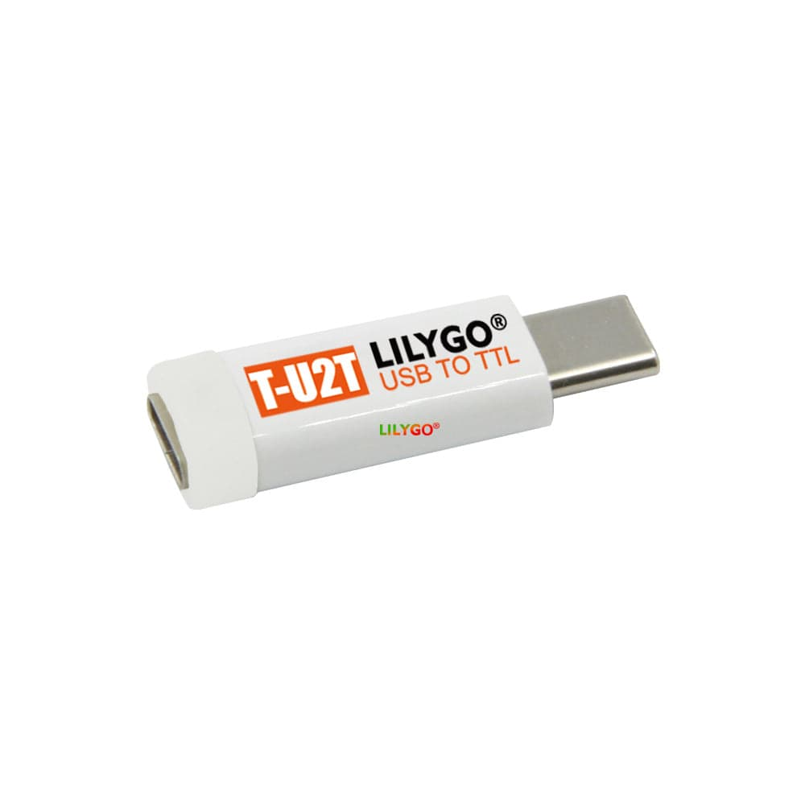

# LILYGO T-U2T USB to TTL Programmer

## Overview

The LILYGO T-U2T (USB To TTL) is a compact programming adapter designed specifically for LILYGO ESP32 development boards. It combines a CH9102 USB-to-serial converter with an automatic download circuit in a space-saving USB-C adapter form factor. This innovative design eliminates the need for duplicate USB-to-TTL circuits on individual development boards, reducing cost and board size.

## Location

**Cabinet-1, Bin 5** - Programming / Debugging Tools

## Images



## Specifications

### Hardware Features
- **USB Chip**: CH9102 high-speed USB-to-serial converter
- **Transfer Speed**: Up to 4Mbps maximum read/write speed
- **Form Factor**: USB-C male to USB-C female adapter
- **Auto-Download**: Built-in automatic download circuit
- **Boot Button**: Manual boot/reset control
- **Power Indicator**: LED status indication
- **Voltage Levels**: 3.3V TTL compatible

### Physical Specifications
- **Connector Type**: USB-C male input, USB-C female output
- **Size**: Compact adapter form factor
- **Weight**: Lightweight design
- **Color**: Black PCB with component markings

## Pin Configuration

### TTL Serial Pins (Internal)
- **VCC**: 3.3V power output
- **GND**: Ground reference
- **TX**: Transmit data (from CH9102 to target)
- **RX**: Receive data (from target to CH9102)
- **DTR**: Data Terminal Ready (auto-download control)
- **RTS**: Request to Send (auto-download control)

### Auto-Download Circuit
- **GPIO0 Control**: Automatic boot mode selection
- **EN/Reset Control**: Automatic reset timing
- **Boot Button**: Manual override capability

## Supported Devices

### LILYGO ESP32 Boards
- **T-Display Series**: E-paper and LCD variants
- **T-Camera Series**: Camera development boards
- **T-Beam Series**: LoRa GPS tracker boards
- **T-Call Series**: GSM/cellular boards
- **T-Watch Series**: Smartwatch development platforms
- **Custom ESP32 Boards**: Any LILYGO board with T-U2T compatibility

### ESP32 Variants
- **ESP32**: Original dual-core variant
- **ESP32-S2**: Single-core with native USB
- **ESP32-S3**: Dual-core with AI acceleration
- **ESP32-C3**: RISC-V single-core variant

## Software Support

### Development Environments
- **Arduino IDE**: Full support with ESP32 board package
- **PlatformIO**: Native ESP32 platform support
- **ESP-IDF**: Espressif official development framework
- **MicroPython**: Serial programming support

### Operating Systems
- **Windows**: CH9102 driver support
- **macOS**: Native driver support (macOS 10.9+)
- **Linux**: Built-in kernel driver support

### Programming Tools
- **esptool.py**: ESP32 flash programming utility
- **Arduino IDE**: Integrated upload and monitor
- **PlatformIO**: Advanced project management
- **Serial Monitors**: Any standard serial terminal

## Usage Instructions

### Basic Setup
1. **Install Drivers**: Install CH9102 drivers if needed (Windows)
2. **Connect Adapter**: Plug T-U2T into USB port on computer
3. **Connect Target**: Connect T-U2T to LILYGO development board
4. **Select Port**: Choose correct COM/serial port in IDE
5. **Upload Code**: Use normal upload process - auto-download handles timing

### Arduino IDE Configuration
```
Board: ESP32 Dev Module (or specific LILYGO board)
Upload Speed: 921600 (or lower if issues)
CPU Frequency: 240MHz
Flash Mode: QIO
Flash Size: 4MB (or board-specific)
Port: COM# (Windows) or /dev/ttyUSB# (Linux)
```

### PlatformIO Configuration
```ini
[env:esp32dev]
platform = espressif32
board = esp32dev
framework = arduino
upload_speed = 921600
monitor_speed = 115200
upload_port = COM# ; or /dev/ttyUSB#
monitor_port = COM# ; or /dev/ttyUSB#
```

## Advantages

### Design Benefits
- **Space Saving**: Eliminates USB-to-TTL circuits on target boards
- **Cost Effective**: Reduces component count on development boards
- **Reusable**: One adapter works with multiple LILYGO boards
- **Compact**: Minimal footprint USB-C adapter design

### Technical Benefits
- **High Speed**: 4Mbps transfer rate for fast uploads
- **Auto-Download**: No manual boot button pressing required
- **Reliable**: CH9102 chip provides stable communication
- **Compatible**: Works with standard ESP32 development tools

### Practical Benefits
- **Easy to Use**: Plug-and-play operation
- **Portable**: Small size for mobile development
- **Versatile**: Works with multiple board types
- **Future-Proof**: USB-C connector standard

## Applications

### Development Workflows
- **Firmware Upload**: Programming ESP32 flash memory
- **Serial Debugging**: Real-time serial monitor output
- **REPL Access**: MicroPython interactive programming
- **Log Monitoring**: Application debug output capture

### Project Types
- **IoT Prototyping**: WiFi and Bluetooth projects
- **Sensor Networks**: Environmental monitoring systems
- **Display Projects**: E-paper and LCD applications
- **Communication Devices**: LoRa, GSM, and WiFi projects

## Troubleshooting

### Common Issues
- **Driver Problems**: Install latest CH9102 drivers
- **Port Detection**: Check Device Manager (Windows) or dmesg (Linux)
- **Upload Failures**: Try lower upload speeds (115200)
- **Connection Issues**: Verify USB-C cable quality

### Solutions
- **Reset Sequence**: Use boot button if auto-download fails
- **Cable Check**: Ensure USB-C cable supports data transfer
- **Port Conflicts**: Close other serial applications
- **Power Issues**: Verify target board power requirements

## Compatibility Notes

### LILYGO Board Compatibility
- **Native Support**: Designed specifically for LILYGO boards
- **Pin Mapping**: Matches LILYGO board USB-C connector pinout
- **Auto-Download**: Optimized for ESP32 boot sequence timing

### Third-Party Boards
- **Limited Support**: May work with other ESP32 boards
- **Pin Verification**: Check USB-C connector pinout compatibility
- **Manual Mode**: May require manual boot button operation

## Package Contents

- 1x LILYGO T-U2T USB to TTL Programmer Adapter
- Documentation and driver links

## Technical Resources

### Documentation
- **Product Page**: https://lilygo.cc/products/t-u2t
- **GitHub Repository**: LILYGO official repositories
- **Driver Downloads**: CH9102 driver packages
- **User Manual**: Setup and usage instructions

### Community Support
- **LILYGO Discord**: Community support channel
- **GitHub Issues**: Bug reports and feature requests
- **Arduino Forums**: ESP32 development discussions
- **Reddit Communities**: r/esp32 and maker communities

## Tags

usb-ttl, programmer, lilygo, esp32, ch9102, auto-download, usb-c, serial-converter #cabinet-1 #status-available

## Notes

The T-U2T represents an innovative approach to ESP32 development board design by separating the USB-to-TTL functionality into a reusable adapter. This reduces the cost and complexity of individual development boards while providing a high-quality programming interface. The CH9102 chip offers excellent compatibility and performance for ESP32 development. Store with other programming tools in Cabinet-1, Bin 5 for easy access during development projects. The compact USB-C form factor makes it ideal for portable development setups.
