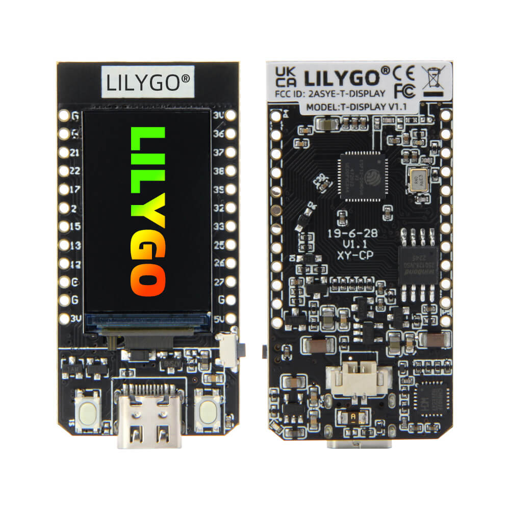

# LILYGO TTGO T-Display - ESP32 with 1.14" LCD

## Details

- **Location**: Cabinet-1, Bin 27
- **Category**: Microcontroller Boards
- **Type**: LCD Display Development Board
- **Microcontroller**: ESP32 (Xtensa LX6 dual-core)
- **Brand**: LILYGO
- **Model**: TTGO T-Display
- **Quantity**: 4
- **Product URL**: https://lilygo.cc/products/lilygo®-ttgo-t-display-1-14-inch-lcd-esp32-control-board

## Description

LILYGO TTGO T-Display is a compact development board featuring an ESP32 microcontroller with integrated WiFi and Bluetooth capabilities, combined with a vibrant 1.14-inch TFT LCD display. Perfect for IoT projects requiring visual feedback, data visualization, or user interfaces. The board includes two programmable buttons and battery management for portable applications.

## Specifications

- **Microcontroller**: ESP32 (Xtensa LX6 dual-core)
- **Architecture**: 32-bit dual-core @ 240MHz
- **Operating Voltage**: 3.3V
- **Flash Memory**: 4MB
- **PSRAM**: 4MB (optional)
- **Serial Chip**: CH9102
- **Dimensions**: 51.52mm x 25.04mm
- **Weight**: ~8g

## Image

## Display Specifications

- **Type**: TFT LCD
- **Size**: 1.14 inches diagonal
- **Resolution**: 135 x 240 pixels
- **Driver**: ST7789V
- **Colors**: 65K (16-bit)
- **Interface**: 4-wire SPI
- **Density**: 260 PPI (high density)
- **Backlight**: LED backlight with PWM control

## Features

- **Dual-Core ESP32**: 240MHz Tensilica processor with dual cores
- **Wireless Connectivity**: WiFi 802.11 b/g/n + Bluetooth 4.2 + BLE
- **Vibrant Display**: 1.14" full-color TFT LCD with ST7789 driver
- **User Interface**: Two programmable buttons (IO0 + IO35)
- **USB-C Connector**: Modern connector for programming and power
- **Battery Support**: Built-in battery management and charging
- **Compact Design**: Small form factor perfect for portable projects
- **Rich Memory**: 4MB Flash + optional 4MB PSRAM

## Pin Configuration

- **Digital I/O**: 21 GPIO pins
- **Analog Inputs**: 6 pins (12-bit ADC)
- **PWM**: 14 pins support PWM
- **I2C**: SDA (GPIO21), SCL (GPIO22)
- **SPI**: Multiple SPI interfaces available
- **UART**: Hardware UART support
- **Display Pins**: Dedicated SPI pins for LCD

## Display Pin Mapping

- **TFT_MOSI**: GPIO19
- **TFT_SCLK**: GPIO18
- **TFT_CS**: GPIO5
- **TFT_DC**: GPIO16
- **TFT_RST**: N/A (shared with ESP32 reset)
- **TFT_BL**: GPIO4 (backlight control)

## Power Specifications

- **Operating Voltage**: 3.3V
- **Input Voltage**: 5V (USB-C) or 3.7V (battery)
- **Current Consumption**:
  - Active (WiFi + Display): ~150-200mA
  - Light Sleep: ~10-20mA
  - Deep Sleep: ~10μA (display off)
- **Battery Charging**: Built-in lithium battery charging circuit
- **Power Management**: Advanced power management with sleep modes

## Wireless Capabilities

### WiFi
- **Standards**: 802.11 b/g/n (2.4GHz)
- **Modes**: Station, Access Point, Station+AP
- **Security**: WEP, WPA, WPA2
- **Range**: Standard WiFi range

### Bluetooth
- **Version**: Bluetooth 4.2 + BLE
- **Protocols**: Classic Bluetooth, BLE
- **Range**: Up to 10m
- **Power**: Low power BLE support

## Applications

- IoT dashboards and monitoring displays
- Weather stations with visual output
- Data loggers with real-time display
- Portable instruments and meters
- Smart home control panels
- Digital clocks and timers
- Sensor data visualization
- Menu-driven embedded systems

## Programming

- **Arduino IDE**: Full support with ESP32 board package
- **ESP-IDF**: Espressif development framework
- **MicroPython**: Native support
- **Display Library**: TFT_eSPI library for graphics
- **USB Programming**: CH9102 USB-to-serial converter

## Display Programming

- **TFT_eSPI Library**: Optimized graphics library
- **Adafruit_GFX**: Compatible graphics functions
- **LVGL**: Advanced GUI framework support
- **Custom Graphics**: Bitmap, text, shapes, animations
- **Color Support**: 16-bit color (65K colors)

## Advantages

- **All-in-One**: ESP32 + Display in compact package
- **Rich Graphics**: Full-color TFT display with high resolution
- **Dual Connectivity**: WiFi + Bluetooth for versatile projects
- **User Interface**: Built-in buttons for interaction
- **Battery Ready**: Integrated charging and power management
- **Easy Development**: Arduino IDE and library support
- **Compact Size**: Perfect for portable and embedded applications

## Hardware Features

- **USB-C**: Modern connector for programming and power
- **Two Buttons**: IO0 (boot) and IO35 (user) buttons
- **Battery Connector**: JST connector for lithium battery
- **Power LED**: Status indicator
- **Charging LED**: Battery charging indicator
- **Reset Button**: Program restart capability

## Comparison with Other Display Boards

- **vs OLED displays**: Full color vs monochrome, larger size
- **vs E-paper**: Fast refresh vs ultra-low power
- **vs Larger TFTs**: Compact size vs bigger display area

## Notes

- Perfect for projects requiring visual feedback and wireless connectivity
- ST7789 driver provides excellent color reproduction and viewing angles
- Dual-core ESP32 allows multitasking (display + networking)
- 4MB Flash + 4MB PSRAM enables complex graphical applications
- Built-in battery management makes it ideal for portable projects
- TFT_eSPI library provides optimized graphics performance
- Two programmable buttons enable user interaction
- Excellent for learning embedded GUI development

## Tags

microcontroller, esp32, wifi, bluetooth, lcd, display, st7789, ttgo, lilygo, tft, iot
