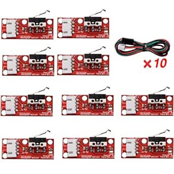
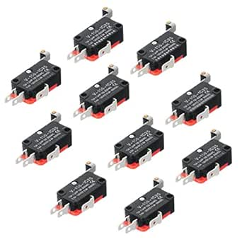

# Limit Switch Collection

## Details

- **Location**: Cabinet-4, Bin 24
- **Category**: Switching
- **Brand**: Various (R REIFENG, HiLetgo, others)
- **Part Number**: Mixed
- **Package**: Mixed packages
- **Quantity**: ~30 total (~10 each of 3 types)
- **Status**: available
- **Price Range**: $5-15 per pack
- **Datasheet**: Various manufacturer datasheets

## Description

This collection contains approximately 30 mechanical limit switches of various types, primarily designed for 3D printers, CNC machines, and automation applications. The collection includes R REIFENG mechanical endstop switches with cables, HiLetgo V-156-1C25 SPDT switches with roller actuators, and other types of limit switches for position sensing and safety applications.

## Switch Types in Collection

### R REIFENG Mechanical Endstop Switches (~10 units)
- **Model**: 10x Mechanical Endstop Limit Switch
- **Voltage**: 300V operating voltage
- **Current**: 2A rating
- **Features**: 22AWG cable included, 3-pin connector
- **Applications**: 3D printer endstops, CNC homing
- **Actuator**: Mechanical lever with roller
- **Mounting**: PCB module with mounting holes

### HiLetgo V-156-1C25 SPDT Switches (~10 units)
- **Model**: V-156-1C25 Lead Limit Switch
- **Voltage**: 125V/250V AC/DC
- **Current**: 15A rating
- **Contact**: SPDT (Single Pole Double Throw)
- **Features**: Silver base contact, roller swing actuator
- **Applications**: Industrial switching, position detection
- **Actuator**: Hinge roller lever arm
- **Mounting**: Panel mount with fixing holes

### Other Limit Switch Types (~10 units)
- **Various Models**: Mixed collection of different limit switch types
- **Applications**: General purpose position sensing and safety
- **Features**: Different actuator types and mounting options
- **Voltage/Current**: Various ratings suitable for different applications

## Images

## Specifications

### Electrical Characteristics
- **Operating Voltage**: 125V to 300V AC/DC
- **Current Rating**: 2A to 15A (varies by type)
- **Contact Configuration**: SPDT, normally open/closed options
- **Contact Material**: Silver contacts for reliable switching
- **Insulation**: High voltage insulation between contacts

### Mechanical Characteristics
- **Actuator Types**: Roller levers, straight levers, button actuators
- **Operating Force**: Low force mechanical actuation
- **Travel Distance**: Short travel distance for precise switching
- **Mounting**: Various mounting options (PCB, panel, bracket)
- **Durability**: High cycle life for repeated operations

### Key Features
- Precise mechanical switching for position detection
- Multiple actuator styles for different applications
- High current handling capability
- Reliable contact materials for long life
- Compact designs suitable for tight spaces
- Easy integration into automation systems

## Applications

### 3D Printer Applications
- **Endstop Switches**: X, Y, Z axis homing and limit detection
- **Bed Leveling**: Mechanical bed leveling sensors
- **Filament Detection**: Filament runout sensors
- **Safety Stops**: Emergency stop and safety interlocks

### CNC Machine Applications
- **Axis Limits**: Travel limit detection for all axes
- **Homing Switches**: Reference position detection
- **Tool Detection**: Tool presence and position sensing
- **Safety Systems**: Emergency stops and protective interlocks

### General Automation
- **Position Sensing**: Mechanical position feedback
- **Door/Gate Switches**: Open/close detection
- **Conveyor Systems**: Product detection and positioning
- **Robotic Applications**: Joint limits and position feedback

## Circuit Integration

### Wiring Considerations
- **Power Supply**: Match voltage rating to circuit requirements
- **Current Limiting**: Ensure current rating exceeds load requirements
- **Contact Protection**: Use appropriate contact protection for inductive loads
- **Debouncing**: Consider switch debouncing for digital applications

### Microcontroller Interface
- **Digital Inputs**: Direct connection to microcontroller GPIO pins
- **Pull-up Resistors**: Use internal or external pull-up resistors
- **Interrupt Capability**: Can be used for interrupt-driven position detection
- **Logic Levels**: Compatible with 3.3V and 5V logic systems

## Installation Notes

### Mounting Considerations
- **Mechanical Alignment**: Ensure proper actuator alignment with moving parts
- **Repeatability**: Mount securely for consistent switching points
- **Environmental Protection**: Consider enclosure for harsh environments
- **Accessibility**: Mount for easy maintenance and adjustment

### Adjustment and Calibration
- **Switch Point**: Adjust mechanical position for desired switching point
- **Hysteresis**: Account for switch hysteresis in system design
- **Preload**: Avoid excessive preload on actuator mechanisms
- **Testing**: Test operation through full range of motion

## Safety Considerations

**Important Safety Notes:**
- Verify voltage and current ratings before use
- Use appropriate fusing and overcurrent protection
- Ensure proper isolation for high voltage applications
- Follow electrical codes for safety-critical applications
- Test thoroughly before deploying in safety systems

## Tags

limit-switch, endstop, mechanical, 3d-printer, cnc, automation, position-sensing #cabinet-4 #bin-24 #status-available

## Notes

This diverse collection of limit switches provides excellent flexibility for various automation and position sensing applications. The R REIFENG switches are particularly well-suited for 3D printer applications with their included cables and PCB modules. The HiLetgo V-156 switches offer higher current ratings for industrial applications. The mixed collection ensures availability of different actuator types and mounting options for various project requirements. Always verify specifications and test thoroughly before use in critical applications.
