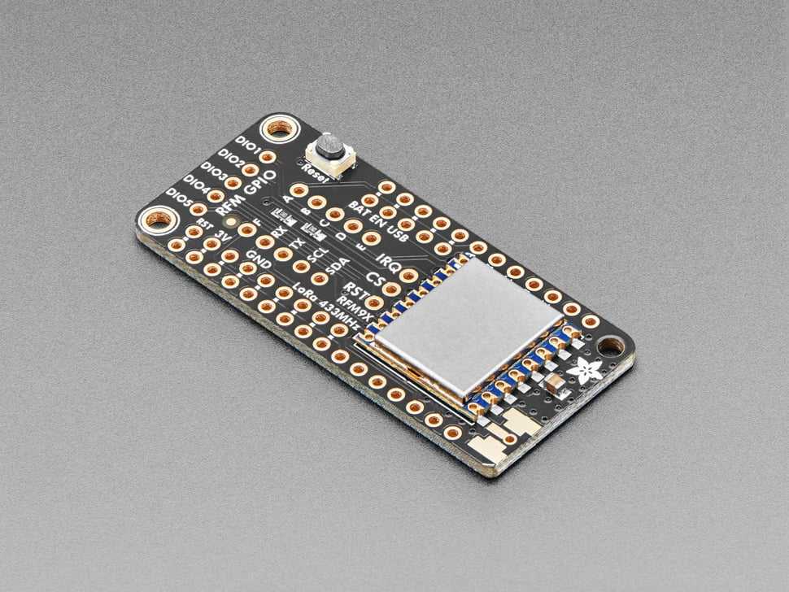

# Adafruit LoRa Radio FeatherWing - RFM95W 433 MHz - RadioFruit

## Details

- **Location**: Cabinet-1, Bin 24
- **Category**: FeatherWings
- **Type**: LoRa Radio FeatherWing
- **Radio**: RFM95W LoRa transceiver
- **Frequency**: 433MHz
- **Form Factor**: Feather-compatible wing
- **Quantity**: 2
- **Product URL**: https://www.adafruit.com/product/3232

## Description

LoRa Radio FeatherWing featuring the RFM95W transceiver for 433MHz long-range wireless communication. Adds LoRa packet radio capability to any Feather board, enabling kilometer-range wireless communication with excellent penetration through obstacles. Perfect for IoT, telemetry, and remote monitoring applications.

## Specifications

- **Part Number**: 3232
- **Radio Module**: RFM95W (SX127x-based)
- **Frequency**: 433MHz (ITU Region 1)
- **Modulation**: LoRa (Long Range)
- **Power Output**: +5 to +20 dBm (up to 100mW)
- **Range**: 2+ km line-of-sight with simple antennas
- **Extended Range**: Up to 20km with directional antennas
- **Interface**: SPI to Feather board
- **Form Factor**: Standard FeatherWing (51.0mm x 22.8mm)
- **Weight**: 4.8g (0.2oz)

## Image

## Features

- **Long Range LoRa**: Superior range compared to WiFi/Bluetooth
- **Low Power**: ~300µA sleep, ~120mA TX, ~40mA RX
- **High Power**: Up to +20dBm (100mW) transmit power
- **Feather Compatible**: Works with all Feather boards
- **SPI Interface**: Simple connection to host microcontroller
- **Antenna Options**: Wire antenna or uFL/SMA connectors
- **Metal Shield**: Protected RFM95W module with tin cover

## Radio Specifications

- **Technology**: LoRa (Long Range) modulation
- **Frequency Band**: 433MHz ISM band
- **Sensitivity**: Down to -148dBm
- **Power Output**: Software selectable +5 to +20dBm
- **Data Rate**: 0.3 to 37.5 kbps (LoRa mode)
- **Current Consumption**: 
  - Sleep: ~300µA
  - Receive: ~40mA
  - Transmit: ~120mA (+20dBm)

## Applications

- Long-range sensor networks
- Remote telemetry systems
- Agricultural monitoring
- Environmental sensing
- Asset tracking
- Smart city applications
- Emergency communications
- Amateur radio projects

## Compatibility

- **All Feather Boards**: ESP8266, ESP32, M0, M4, RP2040, 32u4
- **Stackable**: Can be used with other FeatherWings
- **Libraries**: Arduino RadioHead, LoRa libraries
- **Protocols**: Point-to-point, mesh networks, LoRaWAN

## Interface Requirements

- **SPI Pins**: MOSI, MISO, SCK
- **Control Pins**: CS, RST, DIO0 (configurable)
- **Power**: 3.3V or 5V from Feather
- **Antenna**: Required for operation

## Kit Contents

- 1x LoRa Radio FeatherWing with RFM95W module
- 1x Set of headers (soldering required)

## Programming

- **Arduino Libraries**: RadioHead, LoRa, LMIC
- **CircuitPython**: RFM9x library support
- **Protocols**: Custom packets or LoRaWAN
- **Configuration**: Software-selectable frequency and power

## Notes

- Requires antenna for operation (wire or external)
- Some wiring/configuration needed for different Feather boards
- 433MHz version for ITU Region 1 (Europe, Africa, Asia)
- Cannot communicate with 900MHz LoRa radios
- Excellent for long-range, low-power wireless projects
- Metal shield protects RFM95W module from interference

## Tags

featherwing, lora, wireless, rfm95w, 433mhz, radiofruit, long-range, adafruit
